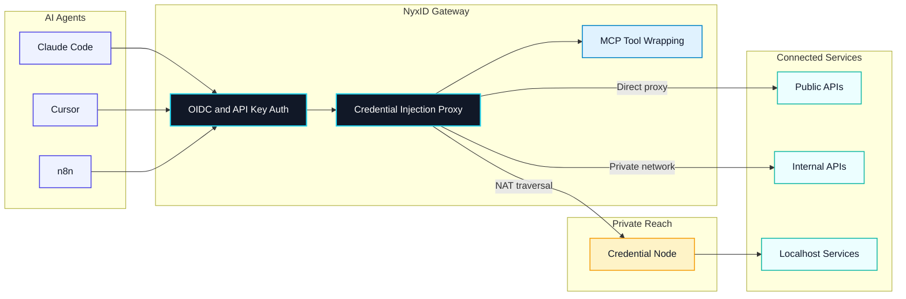

[](LICENSE)
[](https://github.com/ChronoAIProject/NyxID)
[](https://discord.gg/QMvcs8UQBW)
[](https://glama.ai/mcp/servers/ChronoAIProject/nyxid)

<p align="center">
  
</p>

**Connect AI agents to any API, anywhere. Securely.** Open-source Agent Connectivity Gateway.

NyxID lets your AI agents (Claude Code, Cursor, n8n) reach any API you have,
public or private, and handles all the credentials so your agent never sees
a raw key.



NyxID proxies requests, injects credentials automatically, punches through
NAT (Network Address Translation) to reach your local services, and wraps
any REST API as MCP (Model Context Protocol) tools.

## What NyxID Does

- **Reach anything** — public APIs, internal APIs, localhost services via credential nodes (`nyxid node`). SSH (Secure Shell) tunneling (`nyxid ssh`) reaches remote hosts. No VPN (Virtual Private Network), no port forwarding.
- **Never expose keys** — the reverse proxy injects credentials automatically. Your agent talks to NyxID; NyxID talks to the API with the real key.
- **MCP auto-wrap** — REST APIs with OpenAPI specs become [MCP](https://modelcontextprotocol.io/) (Model Context Protocol) tools. `nyxid mcp config --tool cursor` generates the config. Works with Claude Code, Cursor, VS Code, and any MCP client.
- **Per-agent isolation** — each agent gets a scoped token. Agent A accesses Slack and Gmail. Agent B only accesses your internal API. Revoke any session without touching the underlying credentials.
- **Full identity layer** — OIDC (OpenID Connect) / OAuth 2.0 with PKCE (Proof Key for Code Exchange), RBAC (Role-Based Access Control), service accounts, transaction approval (Telegram + mobile push), LLM (Large Language Model) gateway for 7 providers.

## See It in Action

The end-to-end loop is short: connect a service to NyxID once, then any AI agent pointed at your NyxID MCP endpoint can use it — without ever seeing the raw API key.

1. **Add a service** in the web console — paste your OpenAI (or Anthropic, GitHub, etc.) key once; NyxID stores it encrypted.
2. **Wire up your AI tool** — `claude mcp add --transport http --scope user nyxid http://localhost:3001/mcp` (or one-click install for Cursor in `Settings` → `MCP`).
3. **Use it** — Claude Code, Cursor, or any MCP client can now call the service through NyxID. The agent sees the response; never the key.

<p align="center">
  
</p>

<p align="center"><a href="https://cdn.godgpt-labs.workers.dev/nyx-ai-service-flow-demo.mp4" target="_blank" rel="noopener noreferrer">▶ Watch fullscreen</a></p>

## Why NyxID

Other tools solve parts of this — NyxID combines credential injection, NAT traversal, and MCP tooling in one open-source gateway:

| | NyxID | 1Password Universal Autofill | Cloudflare Tunnel | Keycloak |
|---|---|---|---|---|
| Open source | Yes | No | No | Yes |
| NAT traversal to localhost | Yes (`nyxid node`) | No | Yes (no credentials) | No |
| Credential injection | Yes (any API) | Partner integrations | No | No |
| REST to MCP auto-wrap | Yes | No | No | No |
| Per-agent isolation | Yes | No | No | No |
| OIDC / OAuth 2.0 | Yes | No | No | Yes |

## Use Cases

- Give Claude Code access to your private APIs without sharing keys
- Expose internal microservices to AI agents through a single MCP endpoint
- Secure AI agent access to self-hosted tools (Grafana, Jenkins, n8n) behind your firewall

## Getting Started

NyxID is used in two phases — install the `nyxid` CLI client, then pick a workflow. The CLI logs into either the hosted service or a self-hosted backend and can create the Agent Key your workflow needs.

### 1. Install NyxID

The default "install NyxID" path installs the lightweight `nyxid` CLI. It is user-scoped, needs no Docker, and does not start a backend server.

Just need the client? Install the CLI. Running your own backend? Self-host with Docker.

```bash
bash -c "$(curl -fsSL https://raw.githubusercontent.com/ChronoAIProject/NyxID/main/skills/nyxid/scripts/install.sh)"
```

After the CLI is installed, choose where it should log in:

| | Hosted | Self-host |
|---|---|---|
| **What it is** | We run the NyxID backend for you in the cloud | You run the NyxID backend on your own machine |
| **Best for** | Getting started quickly, no server setup | Full control, private networks, offline use |
| **Status** | Early access (invite code below) | Open — anyone can run it |

> **Driving NyxID from an AI coding agent?** Hand it this single line at any point — it tells the agent to install the `nyxid` CLI plus the Nyx skill files:
>
> ```
> Install nyx skills from https://github.com/ChronoAIProject/NyxID/blob/main/skills/INSTALL.md
> ```
>
> The agent reads [`skills/INSTALL.md`](skills/INSTALL.md) end-to-end. It should use the CLI installer by default and only run the Docker backend setup if you explicitly ask to self-host.

#### Hosted (Recommended)

Start using NyxID in under a minute — no Docker, no setup.

1. Open **[nyx.chrono-ai.fun/register](https://nyx.chrono-ai.fun/register)** in a new tab (Cmd/Ctrl-click, or right-click → Open Link in New Tab) so you can keep this checklist open.
2. Enter invite code: **`NYX-FGNY85AF`**
3. Sign in with Google, GitHub, or Apple
4. Open `AI Services`, add and connect your first external service, and run the API Usage verification curl
5. After the service is verified, wire your AI tool to NyxID's MCP endpoint

The full click-through flow is in **[Add your first AI Service](docs/connecting-services/web-ui.md)**. Early access is limited to 20 users.

#### Self-Host

Run your own NyxID backend on your machine. This is the optional server-side path and sets up three Docker containers (database, backend, frontend) — takes about 2 minutes.

**Prerequisites:** [Docker](https://docs.docker.com/get-docker/) and a bash shell. macOS and Linux already have one — Windows users, see [docs/WINDOWS_SETUP.md](docs/WINDOWS_SETUP.md) before going further. Docker is required only for this backend path. Full prereqs and disk budgets are in [SETUP.md](docs/SETUP.md).

##### AI-Assisted (Recommended)

If you have Claude Code, Cursor, or any AI coding assistant open, paste the prompt below into it only when you explicitly want a self-hosted backend. It will drive the entire self-host flow for you — preflight, clone, env generation, Docker stack, health check, CLI login, first credential, and MCP config.

<details>
<summary><strong>Click to expand the full AI-assisted self-host prompt</strong></summary>

> I want to self-host the NyxID backend on this machine (the repo is https://github.com/ChronoAIProject/NyxID). This is the Docker server path, not the default CLI install. Walk me through the full setup interactively. If anything fails or I'd prefer to follow the manual steps myself, the full step-by-step with troubleshooting is at https://github.com/ChronoAIProject/NyxID/blob/main/docs/SETUP.md. If I'm on Windows, confirm I'm running from a WSL Ubuntu shell (not native PowerShell or CMD) before proceeding — see https://github.com/ChronoAIProject/NyxID/blob/main/docs/WINDOWS_SETUP.md.
> 1. Confirm Docker is installed and running before touching anything (check `git`, `docker`, `openssl`, `curl`, `docker compose` v2, and `docker info`).
> 2. **Before cloning or generating anything, check whether NyxID install STATE is present** — look for a `./NyxID/.env.dev` file OR any Docker volume matching `nyx*_mongodb_data` (run `docker volume ls --format '{{.Name}}' | grep -E 'nyx.*_mongodb_data$'` — this catches the default `nyxid_mongodb_data` plus any variant from a renamed checkout). A bare `./NyxID` directory alone does NOT count as "installed" — `uninstall.sh` leaves the source tree in place, so the directory can exist with no state. **If install state is present, stop and tell me the quickstart is a first-time-only install.** Ask whether I want to (a) uninstall first — if `./NyxID` exists, run `cd NyxID && ./scripts/uninstall.sh --yes && cd ..`; if only the stale Docker volume is orphaned (checkout was manually deleted earlier), run `docker volume ls --format '{{.Name}}' | grep -E 'nyx.*_mongodb_data$' | xargs -r docker volume rm` directly. Either path wipes the volume, containers, and (for the script path) `.env.dev`/keys — destroys all NyxID accounts and encrypted credentials. Or (b) keep my existing install and stop here — I can verify it's still running with `curl -sf http://localhost:3001/health`. Do not proceed to step 3 until I answer.
> 3. If `./NyxID` already exists (post-uninstall reinstall), `cd` into it; otherwise clone the repo into the current directory and `cd` in. Generate `.env.dev` with a fresh `ENCRYPTION_KEY` and `MONGO_ROOT_PASSWORD` (set `ENVIRONMENT=development`, `INVITE_CODE_REQUIRED=false`, `AUTO_VERIFY_EMAIL=true`, and `EMAIL_AUTH_ENABLED=true` so I don't get stuck on email verification or a locked-down signup page), symlink it to `.env.production`, create the PKCS#1 JWT signing keys under `keys/` (with a LibreSSL fallback using `-pubout` if `-RSAPublicKey_out` isn't supported), then pull images and start the stack with `docker compose -f docker-compose.yml -f docker-compose.prod.yml --env-file .env.production up -d`. Wait up to 90 seconds for `http://localhost:3001/health` to return 200 — if it times out, tell me to run `docker logs nyxid-backend`. If the logs show `SCRAM failure: Authentication failed`, that means the MongoDB volume has a stale password from a previous install — tell me to run `./scripts/uninstall.sh --yes` (or, if the checkout is gone, `docker volume ls --format '{{.Name}}' | grep -E 'nyx.*_mongodb_data$' | xargs -r docker volume rm` to remove any nyx-flavored orphan volume) and retry. Show me the generated `ENCRYPTION_KEY` so I can back it up.
> 4. Tell me to open http://localhost:3000 and register my account (no email verification needed — accounts are auto-verified in dev mode), and wait until I confirm I've done that.
> 5. Ensure the `nyxid` CLI is available. If it is not installed, ask me whether I want to install the `nyxid` CLI plus the Nyx skill so you can drive NyxID from the terminal afterwards. Explain that the installer downloads a roughly 10 MB prebuilt binary plus a small set of skill files (no Rust toolchain required), installs the CLI into a versioned layout with rollback support, and that only unsupported OS/arch combinations fall back to a Rust source build. If I say yes, follow the install manifest at https://raw.githubusercontent.com/ChronoAIProject/NyxID/main/skills/INSTALL.md end-to-end (it installs the CLI under `~/.local/share/nyxid/`, drops the skill into your skill directory, and tells you to `export PATH="$HOME/.local/bin:$PATH"` if needed). Then verify with `nyxid doctor`, log me in with `nyxid login --base-url http://localhost:3001`, add my OpenAI key with `nyxid service add llm-openai --credential-env OPENAI_API_KEY`, and verify with `nyxid proxy request <slug> models` using the slug the previous `service add` command printed under `Slug:` (typically `llm-openai`, but suffixed if I already had a service with that slug). If I do not want the CLI, walk me through adding the same OpenAI credential in the web console instead.
> 6. Finish by connecting my AI tool to NyxID's MCP endpoint at `http://localhost:3001/mcp`. For Claude Code: `claude mcp add --transport http --scope user nyxid http://localhost:3001/mcp`. For Codex: `codex mcp add nyxid --url http://localhost:3001/mcp`. For Cursor: open `Settings` > `MCP` in the web console and click `Install to Cursor`.

</details>

<!-- AI setup-prompt maintenance: validate this prompt against actual CLI + web console on each release -->

##### Manual Setup

Prefer to run the optional backend setup yourself, or need the full troubleshooting guide? Follow **[docs/SETUP.md](docs/SETUP.md)** (macOS, Linux, or Windows via WSL).

It covers:

- System preflight check — [Step 1](docs/SETUP.md#step-1-of-3--check-your-system)
- One paste-block install — [Step 2](docs/SETUP.md#step-2-of-3--install-and-start)
- Register your account — [Step 3](docs/SETUP.md#step-3-of-3--register-and-connect)
- [CLI install or verification](docs/SETUP.md#install-or-verify-the-nyxid-cli)
- [Uninstall & reinstall](docs/SETUP.md#uninstall--reinstall), [orphan volume recovery](docs/SETUP.md#recovering-an-orphan-volume), and [SCRAM failure](docs/SETUP.md#stuck-on-scram-failure) troubleshooting

Once NyxID is running and you've registered at `http://localhost:3000`, continue to [2. Pick a workflow](#2-pick-a-workflow).

For production deployment (TLS, custom domain, email verification), see [docs/DEPLOYMENT.md](docs/DEPLOYMENT.md).

### 2. Pick a workflow

With NyxID running and an Agent Key in hand, pick the workflow that matches what you want to build. Each is a step-by-step procedure that ends with a working integration; the four are independent and can be completed in any order.

| Quickstart | Outcome | NyxID capability |
|---|---|---|
| [**n8n: Daily AI News Digest with One NyxID Credential**](docs/quickstarts/n8n.md) | An n8n workflow pulls an RSS feed, summarizes each article with Gemini, and posts to Telegram — using one `Header Auth` credential in n8n while NyxID stores the upstream Gemini and Telegram secrets. | Per-service credential injection |
| [**Per-Agent Keys for Claude Code and Codex**](docs/quickstarts/claude-code.md) | Two coding agents on one machine, each scoped to a distinct service and credential, attributed independently in the audit log. | Agent isolation, scoped Agent Keys |
| [**Reach a Localhost API from a Cloud-Hosted Agent**](docs/quickstarts/node-proxy.md) | A private-host API is reachable from a cloud agent without VPN, port forwarding, or a tunneling service. | Credential Node, outbound-only NAT traversal |
| [**Wrap a REST API as MCP Tools**](docs/quickstarts/mcp-wrapping.md) | An OpenAPI spec is exposed as typed MCP tools to Claude Code / Cursor / VS Code / Codex with no MCP server code. | OpenAPI → MCP auto-wrap |

> For a per-interface reference walkthrough that ends with `HTTP/1.1 200` from your first proxied call (Web UI · CLI · AI-driven · Direct API), see the [Connecting AI Services hub](docs/connecting-services/).

## Connecting AI Services (interface reference)

[Pick a workflow](#2-pick-a-workflow) in Getting Started is organized by use case. For an interface-oriented reference that ends with a verified proxy call (`HTTP/1.1 200`) using your preferred entry point — Web UI, CLI, AI-driven (MCP), or Direct API — see **[docs/connecting-services/](docs/connecting-services/)**. The hub distinguishes external service credentials from NyxID Agent Keys and links to one walkthrough per interface.

## Resources

| Topic | Link | Description |
|-------|------|-------------|
| Quickstarts | [docs/quickstarts/](docs/quickstarts/) | End-to-end recipes — n8n, per-agent keys, node proxy, MCP wrapping |
| Connecting AI Services | [docs/connecting-services/](docs/connecting-services/) | Add your first (or Nth) AI Service — Web UI / CLI / AI-driven / Direct API |
| Setup | [docs/SETUP.md](docs/SETUP.md) | Optional self-hosted backend + troubleshooting (macOS, Linux, Windows via WSL) |
| Deployment | [docs/DEPLOYMENT.md](docs/DEPLOYMENT.md) | Start here for production setup |
| AI Agent Playbook | [docs/AI_AGENT_PLAYBOOK.md](docs/AI_AGENT_PLAYBOOK.md) | Start here for agent integration |
| Architecture | [docs/ARCHITECTURE.md](docs/ARCHITECTURE.md) | System design and data flows |
| API Reference | [docs/API.md](docs/API.md) | Full endpoint documentation |
| Credential Nodes | [docs/NODE_PROXY.md](docs/NODE_PROXY.md) | NAT traversal setup |
| MCP Integration | [docs/MCP_DELEGATION_FLOW.md](docs/MCP_DELEGATION_FLOW.md) | MCP protocol details |
| SSH Tunneling | [docs/SSH_TUNNELING.md](docs/SSH_TUNNELING.md) | Remote host access over WebSocket |
| Security | [docs/SECURITY.md](docs/SECURITY.md) | Threat model and hardening |
| Environment Variables | [docs/ENV.md](docs/ENV.md) | Full config reference |
| Telemetry | [docs/TELEMETRY.md](docs/TELEMETRY.md) | Opt-in usage analytics — hot-swap contract, event taxonomy, consent + GDPR erasure |
| Developer Guide | [docs/DEVELOPER_GUIDE.md](docs/DEVELOPER_GUIDE.md) | Local development setup |

## Contributing

We welcome contributions. See [CONTRIBUTING.md](CONTRIBUTING.md).

## License

[Apache-2.0](LICENSE)
