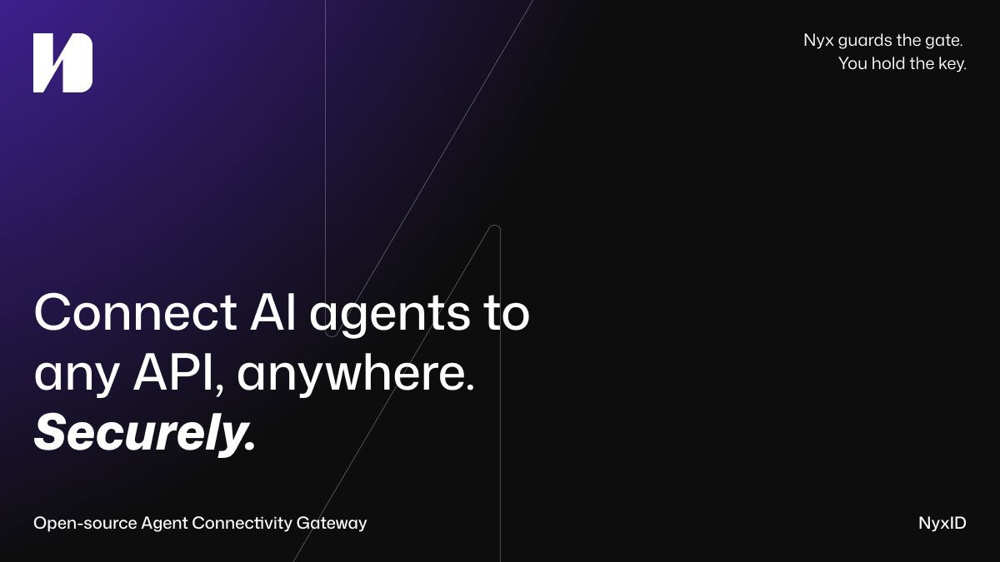
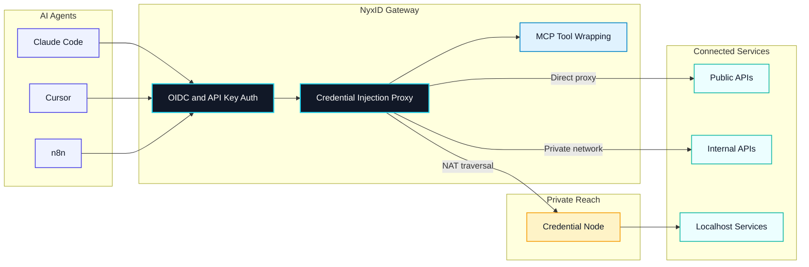
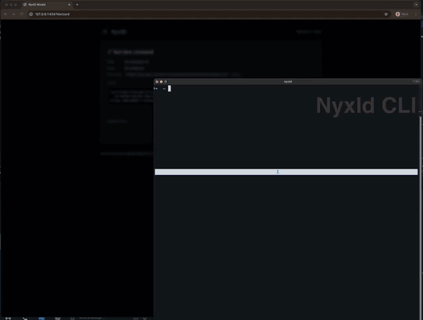

[](LICENSE)
[](https://github.com/ChronoAIProject/NyxID)
[](https://discord.gg/QMvcs8UQBW)
[](https://glama.ai/mcp/servers/ChronoAIProject/nyxid)

<p align="center">
  
</p>

**Connect AI agents to any API, anywhere. Securely.** Open-source Agent Connectivity Gateway.

NyxID lets your AI agents (Claude Code, Cursor, n8n) reach any API you have,
public or private, and handles all the credentials so your agent never sees
a raw key.



NyxID proxies requests, injects credentials automatically, punches through
NAT (Network Address Translation) to reach your local services, and wraps
any REST API as MCP (Model Context Protocol) tools.

## What NyxID Does

- **Reach anything** — public APIs, internal APIs, localhost services via credential nodes (`nyxid node`). SSH (Secure Shell) tunneling (`nyxid ssh`) reaches remote hosts. No VPN (Virtual Private Network), no port forwarding.
- **Never expose keys** — the reverse proxy injects credentials automatically. Your agent talks to NyxID; NyxID talks to the API with the real key.
- **MCP auto-wrap** — REST APIs with OpenAPI specs become [MCP](https://modelcontextprotocol.io/) (Model Context Protocol) tools. `nyxid mcp config --tool cursor` generates the config. Works with Claude Code, Cursor, VS Code, and any MCP client.
- **Per-agent isolation** — each agent gets a scoped token. Agent A accesses Slack and Gmail. Agent B only accesses your internal API. Revoke any session without touching the underlying credentials.
- **Full identity layer** — OIDC (OpenID Connect) / OAuth 2.0 with PKCE (Proof Key for Code Exchange), RBAC (Role-Based Access Control), service accounts, transaction approval (Telegram + mobile push), LLM (Large Language Model) gateway for 7 providers.

## See It in Action

The end-to-end loop is short: connect a service to NyxID once, then any AI agent pointed at your NyxID MCP endpoint can use it — without ever seeing the raw API key.

1. **Add a service** in the web console — paste your OpenAI (or Anthropic, GitHub, etc.) key once; NyxID stores it encrypted.
2. **Wire up your AI tool** — `claude mcp add --transport http --scope user nyxid http://localhost:3001/mcp` (or one-click install for Cursor in **Settings → MCP**).
3. **Use it** — Claude Code, Cursor, or any MCP client can now call the service through NyxID. The agent sees the response; never the key.

<p align="center">
  
</p>

<p align="center"><a href="https://cdn.godgpt-labs.workers.dev/nyx-ai-service-flow-demo.mp4" target="_blank" rel="noopener noreferrer">▶ Watch fullscreen</a></p>

## Why NyxID

Other tools solve parts of this — NyxID combines credential injection, NAT traversal, and MCP tooling in one open-source gateway:

| | NyxID | 1Password Universal Autofill | Cloudflare Tunnel | Keycloak |
|---|---|---|---|---|
| Open source | Yes | No | No | Yes |
| NAT traversal to localhost | Yes (`nyxid node`) | No | Yes (no credentials) | No |
| Credential injection | Yes (any API) | Partner integrations | No | No |
| REST to MCP auto-wrap | Yes | No | No | No |
| Per-agent isolation | Yes | No | No | No |
| OIDC / OAuth 2.0 | Yes | No | No | Yes |

## Use Cases

- Give Claude Code access to your private APIs without sharing keys
- Expose internal microservices to AI agents through a single MCP endpoint
- Secure AI agent access to self-hosted tools (Grafana, Jenkins, n8n) behind your firewall

## Quick Start

There are two ways to use NyxID — pick the one that fits your situation:

| | Hosted | Self-host |
|---|---|---|
| **What it is** | We run NyxID for you in the cloud | You run NyxID on your own machine |
| **Best for** | Getting started quickly, no setup | Full control, private networks, offline use |
| **Status** | Early access (invite code below) | Open — anyone can run it |

### Option A: Hosted (Recommended)

Start using NyxID in under a minute — no Docker, no setup.

1. Open **[nyx.chrono-ai.fun/register](https://nyx.chrono-ai.fun/register)** in a new tab (Cmd/Ctrl-click, or right-click → Open Link in New Tab) so you can keep this checklist open.
2. Enter invite code: **`NYX-FGNY85AF`**
3. Sign in with Google, GitHub, or Apple
4. Open `AI Services`, add and connect your first external service, and run the API Usage verification curl
5. After the service is verified, wire your AI tool to NyxID's MCP endpoint

The full click-through flow is in **[Add your first AI Service](docs/connecting-services/web-ui.md)**. Early access is limited to 20 users.

### Option B: Self-Host

Run NyxID on your own machine. This sets up three Docker containers (database, backend, frontend) — takes about 2 minutes.

**Prerequisites:** [Docker](https://docs.docker.com/get-docker/) and a bash shell. macOS and Linux already have one — Windows users, see [Windows setup](#windows-setup) below before going further. The `nyxid` CLI is optional. Full prereqs and disk budgets are in [QUICKSTART.md](docs/QUICKSTART.md).

#### Windows setup

Install WSL (Windows Subsystem for Linux) once, then run every command in the rest of this README from your Ubuntu shell:

1. Open PowerShell as Administrator and run `wsl --install`. Restart when prompted.
2. Install [Docker Desktop](https://docs.docker.com/desktop/install/windows-install/), then enable WSL integration: **Settings → Resources → WSL Integration → toggle on for your distro**.
3. Launch Ubuntu (or your installed distro). Clone and work **inside the WSL filesystem** (e.g. `~/NyxID`) — avoid `/mnt/c/...` for I/O speed and to skip permission warnings during key generation.

After that, the bash quickstart, `docker`, `nyxid`, and `curl` examples in this README run unchanged. NyxID does not support native PowerShell or CMD.

> **Can't use WSL?** If your Windows version doesn't support WSL2 (Windows 10 before version 2004) or your IT policy blocks it, [Git Bash](https://gitforwindows.org/) also runs the bash quickstart commands. Docker Desktop is still required.

#### AI-Assisted (Recommended)

If you have Claude Code, Cursor, or any AI coding assistant open, paste the prompt below into it and it will drive the entire self-host flow for you — preflight, clone, env generation, Docker stack, health check, optional CLI install, login, first credential, and MCP config.

<details>
<summary><strong>Click to expand the full AI-assisted self-host prompt</strong></summary>

> I want to self-host NyxID on this machine (the repo is https://github.com/ChronoAIProject/NyxID). Walk me through the full quickstart interactively. If anything fails or I'd prefer to follow the manual steps myself, the full step-by-step with troubleshooting is at https://github.com/ChronoAIProject/NyxID/blob/main/docs/QUICKSTART.md. If I'm on Windows, confirm I'm running from a WSL Ubuntu shell (not native PowerShell or CMD) before proceeding — see the README "Windows setup" section.
> 1. Confirm Docker is installed and running before touching anything (check `git`, `docker`, `openssl`, `curl`, `docker compose` v2, and `docker info`).
> 2. **Before cloning or generating anything, check whether NyxID install STATE is present** — look for a `./NyxID/.env.dev` file OR any Docker volume matching `nyx*_mongodb_data` (run `docker volume ls --format '{{.Name}}' | grep -E 'nyx.*_mongodb_data$'` — this catches the default `nyxid_mongodb_data` plus any variant from a renamed checkout). A bare `./NyxID` directory alone does NOT count as "installed" — `uninstall.sh` leaves the source tree in place, so the directory can exist with no state. **If install state is present, stop and tell me the quickstart is a first-time-only install.** Ask whether I want to (a) uninstall first — if `./NyxID` exists, run `cd NyxID && ./scripts/uninstall.sh --yes && cd ..`; if only the stale Docker volume is orphaned (checkout was manually deleted earlier), run `docker volume ls --format '{{.Name}}' | grep -E 'nyx.*_mongodb_data$' | xargs -r docker volume rm` directly. Either path wipes the volume, containers, and (for the script path) `.env.dev`/keys — destroys all NyxID accounts and encrypted credentials. Or (b) keep my existing install and stop here — I can verify it's still running with `curl -sf http://localhost:3001/health`. Do not proceed to step 3 until I answer.
> 3. If `./NyxID` already exists (post-uninstall reinstall), `cd` into it; otherwise clone the repo into the current directory and `cd` in. Generate `.env.dev` with a fresh `ENCRYPTION_KEY` and `MONGO_ROOT_PASSWORD` (set `ENVIRONMENT=development`, `INVITE_CODE_REQUIRED=false`, `AUTO_VERIFY_EMAIL=true`, and `EMAIL_AUTH_ENABLED=true` so I don't get stuck on email verification or a locked-down signup page), symlink it to `.env.production`, create the PKCS#1 JWT signing keys under `keys/` (with a LibreSSL fallback using `-pubout` if `-RSAPublicKey_out` isn't supported), then pull images and start the stack with `docker compose -f docker-compose.yml -f docker-compose.prod.yml --env-file .env.production up -d`. Wait up to 90 seconds for `http://localhost:3001/health` to return 200 — if it times out, tell me to run `docker logs nyxid-backend`. If the logs show `SCRAM failure: Authentication failed`, that means the MongoDB volume has a stale password from a previous install — tell me to run `./scripts/uninstall.sh --yes` (or, if the checkout is gone, `docker volume ls --format '{{.Name}}' | grep -E 'nyx.*_mongodb_data$' | xargs -r docker volume rm` to remove any nyx-flavored orphan volume) and retry. Show me the generated `ENCRYPTION_KEY` so I can back it up.
> 4. Tell me to open http://localhost:3000 and register my account (no email verification needed — accounts are auto-verified in dev mode), and wait until I confirm I've done that.
> 5. **Ask me whether I want to install the `nyxid` CLI.** Explain that it's optional, that the installer will pull the Rust toolchain (~300 MB) if I don't have it, and that the first build takes 3–10 minutes and ~1.5 GB of disk. If I say yes, install it using https://raw.githubusercontent.com/ChronoAIProject/NyxID/main/skills/nyxid/scripts/install.sh, then run `source ~/.cargo/env 2>/dev/null || export PATH="$HOME/.cargo/bin:$PATH"`, log me in with `nyxid login --base-url http://localhost:3001`, add my OpenAI key with `nyxid service add llm-openai --credential-env OPENAI_API_KEY`, and verify with `nyxid proxy request llm-openai models`. If I say no, walk me through adding the same OpenAI credential in the web console instead.
> 6. Finish by connecting my AI tool to NyxID's MCP endpoint at `http://localhost:3001/mcp`. For Claude Code: `claude mcp add --transport http --scope user nyxid http://localhost:3001/mcp`. For Codex: `codex mcp add nyxid --url http://localhost:3001/mcp`. For Cursor: open **Settings > MCP** in the web console and click **Install to Cursor**.

</details>

<!-- AI quickstart maintenance: validate this prompt against actual CLI + web console on each release -->

#### Manual Setup

Prefer to run each step yourself, or need the full troubleshooting guide? Follow **[docs/QUICKSTART.md](docs/QUICKSTART.md)** (macOS, Linux, or Windows via WSL).

It covers:

- System preflight check — [Step 1](docs/QUICKSTART.md#step-1-of-3--check-your-system)
- One paste-block install — [Step 2](docs/QUICKSTART.md#step-2-of-3--install-and-start)
- Register your account — [Step 3](docs/QUICKSTART.md#step-3-of-3--register-and-connect)
- Optional [CLI install](docs/QUICKSTART.md#optional-install-the-nyxid-cli)
- [Uninstall & reinstall](docs/QUICKSTART.md#uninstall--reinstall), [orphan volume recovery](docs/QUICKSTART.md#recovering-an-orphan-volume), and [SCRAM failure](docs/QUICKSTART.md#stuck-on-scram-failure) troubleshooting

Once NyxID is running and you've registered at `http://localhost:3000`:

**Next: [Add your first AI Service](docs/connecting-services/web-ui.md)**

For production deployment (TLS, custom domain, email verification), see [docs/DEPLOYMENT.md](docs/DEPLOYMENT.md).

## Connecting AI Services

The Quick Start above (Hosted and Self-Host) sends you to the **Web UI** walkthrough. For **CLI**, **AI-driven** (Claude Code / Codex / Cursor via MCP), or **Direct API** (curl, n8n, CI/CD), see **[docs/connecting-services/](docs/connecting-services/)**. The hub explains the deliverable (`HTTP/1.1 200` from a real downstream call), distinguishes external service credentials from NyxID Agent Keys, and links to one walkthrough per path.

## Reach Local Services (Optional)

Services behind a firewall? Deploy a credential node to punch through NAT and expose them as MCP tools.

Register and start a node. The node connects outbound over WebSocket, so it does not need port forwarding or a VPN:

```bash
nyxid node register --token <reg-token> --url wss://<your-server>/api/v1/nodes/ws
nyxid node credentials add --service my-local-api --header Authorization --secret-format bearer
nyxid node start
```

Register the service and link it to the node:

```bash
nyxid node credentials setup --service my-local-api --api-url http://localhost:8080
```

If the service has an OpenAPI spec, import endpoints as MCP tools:

```bash
nyxid catalog endpoints my-local-api
```

## Resources

| Topic | Link | Description |
|-------|------|-------------|
| Connecting AI Services | [docs/connecting-services/](docs/connecting-services/) | Add your first (or Nth) AI Service — Web UI / CLI / AI-driven / Direct API |
| Quickstart | [docs/QUICKSTART.md](docs/QUICKSTART.md) | Step-by-step self-host + troubleshooting (macOS, Linux, Windows via WSL) |
| Deployment | [docs/DEPLOYMENT.md](docs/DEPLOYMENT.md) | Start here for production setup |
| AI Agent Playbook | [docs/AI_AGENT_PLAYBOOK.md](docs/AI_AGENT_PLAYBOOK.md) | Start here for agent integration |
| Architecture | [docs/ARCHITECTURE.md](docs/ARCHITECTURE.md) | System design and data flows |
| API Reference | [docs/API.md](docs/API.md) | Full endpoint documentation |
| Credential Nodes | [docs/NODE_PROXY.md](docs/NODE_PROXY.md) | NAT traversal setup |
| MCP Integration | [docs/MCP_DELEGATION_FLOW.md](docs/MCP_DELEGATION_FLOW.md) | MCP protocol details |
| SSH Tunneling | [docs/SSH_TUNNELING.md](docs/SSH_TUNNELING.md) | Remote host access over WebSocket |
| Security | [docs/SECURITY.md](docs/SECURITY.md) | Threat model and hardening |
| Environment Variables | [docs/ENV.md](docs/ENV.md) | Full config reference |
| Telemetry | [docs/TELEMETRY.md](docs/TELEMETRY.md) | Opt-in usage analytics — hot-swap contract, event taxonomy, consent + GDPR erasure |
| Developer Guide | [docs/DEVELOPER_GUIDE.md](docs/DEVELOPER_GUIDE.md) | Local development setup |

## Contributing

We welcome contributions. See [CONTRIBUTING.md](CONTRIBUTING.md).

## License

[Apache-2.0](LICENSE)
