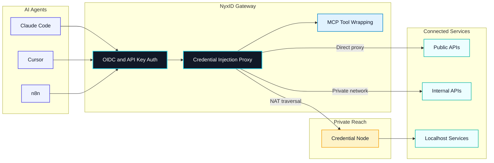
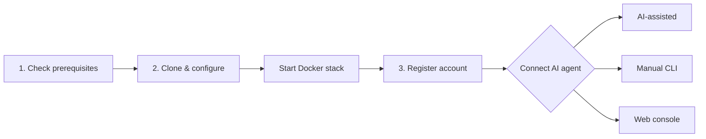

[](LICENSE)
[](https://github.com/ChronoAIProject/NyxID)

<p align="center">
  
</p>

**Connect AI agents to any API, anywhere. Securely.** Open-source Agent Connectivity Gateway.

NyxID lets your AI agents (Claude Code, Cursor, n8n) reach any API you have,
public or private, and handles all the credentials so your agent never sees
a raw key.



NyxID proxies requests, injects credentials automatically, punches through
NAT (Network Address Translation) to reach your local services, and wraps
any REST API as MCP (Model Context Protocol) tools.

## What NyxID Does

- **Reach anything** — public APIs, internal APIs, localhost services via credential nodes (`nyxid node`). SSH (Secure Shell) tunneling (`nyxid ssh`) reaches remote hosts. No VPN (Virtual Private Network), no port forwarding.
- **Never expose keys** — the reverse proxy injects credentials automatically. Your agent talks to NyxID; NyxID talks to the API with the real key.
- **MCP auto-wrap** — REST APIs with OpenAPI specs become [MCP](https://modelcontextprotocol.io/) (Model Context Protocol) tools. `nyxid mcp config --tool cursor` generates the config. Works with Claude Code, Cursor, VS Code, and any MCP client.
- **Per-agent isolation** — each agent gets a scoped token. Agent A accesses Slack and Gmail. Agent B only accesses your internal API. Revoke any session without touching the underlying credentials.
- **Full identity layer** — OIDC (OpenID Connect) / OAuth 2.0 with PKCE (Proof Key for Code Exchange), RBAC (Role-Based Access Control), service accounts, transaction approval (Telegram + mobile push), LLM (Large Language Model) gateway for 7 providers.

## Why NyxID

Other tools solve parts of this — NyxID combines credential injection, NAT traversal, and MCP tooling in one open-source gateway:

| | NyxID | 1Password Universal Autofill | Cloudflare Tunnel | Keycloak |
|---|---|---|---|---|
| Open source | Yes | No | No | Yes |
| NAT traversal to localhost | Yes (`nyxid node`) | No | Yes (no credentials) | No |
| Credential injection | Yes (any API) | Partner integrations | No | No |
| REST to MCP auto-wrap | Yes | No | No | No |
| Per-agent isolation | Yes | No | No | No |
| OIDC / OAuth 2.0 | Yes | No | No | Yes |

<!-- TODO: Demo GIF
     15-30 second terminal recording: install CLI → login → proxy a request
     Tools: https://github.com/charmbracelet/vhs or https://asciinema.org
     <p align="center">
       
     </p>
-->

## Quick Start

There are two ways to use NyxID — pick the one that fits your situation:

| | Hosted | Self-host |
|---|---|---|
| **What it is** | We run NyxID for you in the cloud | You run NyxID on your own machine |
| **Best for** | Getting started quickly, no setup | Full control, private networks, offline use |
| **Status** | Closed beta (invitation only) | Open — anyone can run it |

### Option A: Hosted (closed beta)

Sign up at the [NyxID console](https://nyx.chrono-ai.fun), then use the `nyxid` CLI — or point your AI agent at it — to connect your services. Currently invitation-only — [join the waitlist](https://nyx.chrono-ai.fun/#waitlist).

### Option B: Self-host

Run NyxID on your own machine. This sets up three Docker containers (database, backend, frontend) — takes about 2 minutes.



**Prerequisites:**

- [Docker](https://docs.docker.com/get-docker/) — required for the server stack (backend, frontend, MongoDB). ~2 GB disk for images on first pull.
- A bash-compatible terminal — macOS Terminal, Linux shell, or [WSL (Windows Subsystem for Linux)](https://learn.microsoft.com/en-us/windows/wsl/install) on Windows.
- [Rust / Cargo](https://www.rust-lang.org/tools/install) — **optional**, only needed if you install the `nyxid` CLI (see [Manual CLI](#manual-cli) below). The installer will set this up automatically if missing. Budget ~1.5 GB disk (~300 MB for the toolchain plus ~1 GB for the build cache) and 3–10 minutes for the first compile.

Total disk footprint: ~2 GB for the server only, ~3.5 GB if you also install the CLI from source.

#### AI-assisted (recommended)

If you have Claude Code, Cursor, or any AI coding assistant open, paste this prompt and it will drive the entire self-host flow for you — clone, env generation, Docker stack, health check, optional CLI install, login, first credential, and MCP config:

> I want to self-host NyxID on this machine (the repo is https://github.com/ChronoAIProject/NyxID). Walk me through the full quickstart interactively:
> 1. Confirm Docker is installed and running before touching anything (check `git`, `docker`, `openssl`, `curl`, `docker compose` v2, and `docker info`).
> 2. Clone the repo into the current directory, generate `.env.dev` with a fresh `ENCRYPTION_KEY` and `MONGO_ROOT_PASSWORD` (set `ENVIRONMENT=development`, `INVITE_CODE_REQUIRED=false`, and `AUTO_VERIFY_EMAIL=true` so I don't get stuck on email verification), symlink it to `.env.production`, create the PKCS#1 JWT signing keys under `keys/` (with a LibreSSL fallback using `-pubout` if `-RSAPublicKey_out` isn't supported), then pull images and start the stack with `docker compose -f docker-compose.yml -f docker-compose.prod.yml --env-file .env.production up -d`. Wait up to 90 seconds for `http://localhost:3001/health` to return 200 — if it times out, tell me to run `docker compose logs backend`. Show me the generated `ENCRYPTION_KEY` so I can back it up.
> 3. Tell me to open http://localhost:3000 and register my account (no email verification needed — accounts are auto-verified in dev mode), and wait until I confirm I've done that.
> 4. **Ask me whether I want to install the `nyxid` CLI.** Explain that it's optional, that the installer will pull the Rust toolchain (~300 MB) if I don't have it, and that the first build takes 3–10 minutes and ~1.5 GB of disk. If I say yes, install it using https://raw.githubusercontent.com/ChronoAIProject/NyxID/main/skills/nyxid/tools/install.sh, then `source ~/.cargo/env`, log me in with `nyxid login --base-url http://localhost:3001`, add my OpenAI key with `nyxid service add llm-openai --credential-env OPENAI_API_KEY`, and verify with `nyxid proxy request llm-openai models`. If I say no, walk me through adding the same OpenAI credential in the web console instead.
> 5. Finish by connecting my AI tool to NyxID's MCP endpoint at `http://localhost:3001/mcp`. For Claude Code: `claude mcp add --transport http nyxid http://localhost:3001/mcp`. For Codex: `codex mcp add nyxid --url http://localhost:3001/mcp`. For Cursor: open **Settings > MCP** in the web console and click **Install to Cursor**.

<!-- AI quickstart maintenance: validate this prompt against actual CLI + web console on each release -->

Prefer to run each step yourself? Follow the manual path below.

#### Manual (step-by-step)

**Step 1 of 3 — Check your system** (paste this into your terminal):

```bash
bash << 'CHECK'
err=0
for cmd in git docker openssl curl; do
  if ! command -v "$cmd" >/dev/null 2>&1; then echo "Missing: $cmd"; err=1; fi
done
if ! docker compose version >/dev/null 2>&1; then echo "Missing: docker compose (v2 plugin)"; err=1; fi
if ! docker info >/dev/null 2>&1; then echo "Docker is not running. Start Docker Desktop and re-run."; err=1; fi
if [ "$err" -eq 1 ]; then exit 1; fi
echo "All good — proceed to Step 2."
CHECK
```

**Step 2 of 3 — Install and start** (paste after Step 1 passes):

```bash
git clone https://github.com/ChronoAIProject/NyxID.git && cd NyxID

# ── Generate .env.dev (dev config) and link for Docker ──
EK=$(openssl rand -hex 32)
cat > .env.dev << EOF
MONGO_ROOT_PASSWORD=$(openssl rand -hex 24)
ENCRYPTION_KEY=$EK
BASE_URL=http://localhost:3001
FRONTEND_URL=http://localhost:3000
ENVIRONMENT=development
JWT_PRIVATE_KEY_PATH=/app/keys/private.pem
JWT_PUBLIC_KEY_PATH=/app/keys/public.pem
INVITE_CODE_REQUIRED=false
AUTO_VERIFY_EMAIL=true
RUST_LOG=nyxid=info,tower_http=info
EOF
ln -sf .env.dev .env.production

# ── Generate signing keys (LibreSSL fallback for macOS) ──
mkdir -p keys
openssl genrsa -out keys/private.pem 4096 2>/dev/null
openssl rsa -in keys/private.pem -RSAPublicKey_out -out keys/public.pem 2>/dev/null \
  || openssl rsa -in keys/private.pem -pubout -out keys/public.pem 2>/dev/null

# ── Pull images and start the stack ──
echo "Downloading NyxID (this may take a few minutes on first run)..."
docker compose -f docker-compose.yml -f docker-compose.prod.yml \
  --env-file .env.production pull &&
docker compose -f docker-compose.yml -f docker-compose.prod.yml \
  --env-file .env.production up -d

# ── Wait for the server (up to 90s) ──
echo "Waiting for NyxID to start..."
n=0
until curl -sf http://localhost:3001/health >/dev/null 2>&1; do
  n=$((n+1))
  if [ "$n" -ge 45 ]; then echo "Timed out. Run: docker compose logs backend"; break; fi
  sleep 2
done && echo "NyxID is running at http://localhost:3000" &&
echo "Save your encryption key (needed if you reset the database): $EK"
```

**Step 3 of 3 — Register and connect**

1. Open `http://localhost:3000` in your browser
2. Register with your name, email, and a password — no email verification needed (accounts are auto-verified in dev mode)
3. Log in and connect your AI agent using one of the methods below

To stop NyxID: `docker compose -f docker-compose.yml -f docker-compose.prod.yml down`

For production deployment (TLS (Transport Layer Security), custom domain, email verification), see [docs/DEPLOYMENT.md](docs/DEPLOYMENT.md).

#### Optional: Install the `nyxid` CLI

The server stack above is fully usable from the web console — the CLI (Command Line Interface) is only needed if you want to script credential setup, manage credential nodes, or drive NyxID from your terminal. Skip this section if you'd rather stay in the browser.

> **Heads-up:** the installer builds from source via Cargo. It will install Rust automatically if you don't already have it (~300 MB) and then compile the CLI (~1 GB build cache, 3–10 minutes on first run). Make sure you have ~1.5 GB free.

```bash
bash -c "$(curl -fsSL https://raw.githubusercontent.com/ChronoAIProject/NyxID/main/skills/nyxid/tools/install.sh)"
source ~/.cargo/env                               # make nyxid available in current shell
nyxid --version                                   # verify
```

Once installed, jump to [Manual CLI](#manual-cli) below for login and first-credential setup.

---

Finish the connection by picking one of these:

#### Manual CLI

```bash
# Install the CLI (installs Rust automatically if needed, takes a few minutes on first run)
bash -c "$(curl -fsSL https://raw.githubusercontent.com/ChronoAIProject/NyxID/main/skills/nyxid/tools/install.sh)"
source ~/.cargo/env                               # make nyxid available in current shell

# Log in (opens browser for authentication)
nyxid login --base-url http://localhost:3001

# Add your first API credential (e.g. OpenAI — make sure OPENAI_API_KEY is set in your shell)
nyxid service add llm-openai --credential-env OPENAI_API_KEY

# Verify — you should see a JSON response listing models
nyxid proxy request llm-openai models
```

If the proxy returns data, the full chain works: credential stored, injected, downstream accepted.

To connect your AI tool to NyxID's MCP endpoint (`http://localhost:3001/mcp`):

- **Claude Code** — `claude mcp add --transport http nyxid http://localhost:3001/mcp`
- **Codex** — `codex mcp add nyxid --url http://localhost:3001/mcp`
- **Cursor** — open **Settings > MCP** in the web console (`http://localhost:3000`) and click **Install to Cursor** for a one-click deeplink install

> Already have Rust? You can also install with: `cargo install --git https://github.com/ChronoAIProject/NyxID.git nyxid-cli`

#### Web console

Prefer a GUI (Graphical User Interface)? Everything above can also be done through the web console at `http://localhost:3000`:

- **AI Services** — add API credentials (OpenAI, Anthropic, GitHub, etc.)
- **Settings > MCP** — one-click install for Cursor, or grab the `claude mcp add` / `codex mcp add` command for Claude Code and Codex

---

### Reach local services (optional)

Services behind a firewall? Deploy a credential node to punch through NAT and expose them as MCP tools:

```bash
# Register and start a node (outbound WebSocket — no port forwarding, no VPN)
nyxid node register --token <reg-token> --url wss://<your-server>/api/v1/nodes/ws
nyxid node credentials add --service my-local-api --header Authorization --secret-format bearer
nyxid node start

# Register the service and link it to the node
nyxid node credentials setup --service my-local-api --api-url http://localhost:8080

# Import endpoints as MCP tools (if the service has an OpenAPI spec)
nyxid catalog endpoints my-local-api
```

## Use Cases

- Give Claude Code access to your private APIs without sharing keys
- Expose internal microservices to AI agents through a single MCP endpoint
- Secure AI agent access to self-hosted tools (Grafana, Jenkins, n8n) behind your firewall

## Resources

| Topic | Link | |
|-------|------|---|
| Deployment | [docs/DEPLOYMENT.md](docs/DEPLOYMENT.md) | Start here for production setup |
| AI Agent Playbook | [docs/AI_AGENT_PLAYBOOK.md](docs/AI_AGENT_PLAYBOOK.md) | Start here for agent integration |
| Architecture | [docs/ARCHITECTURE.md](docs/ARCHITECTURE.md) | System design and data flows |
| API Reference | [docs/API.md](docs/API.md) | Full endpoint documentation |
| Credential Nodes | [docs/NODE_PROXY.md](docs/NODE_PROXY.md) | NAT traversal setup |
| MCP Integration | [docs/MCP_DELEGATION_FLOW.md](docs/MCP_DELEGATION_FLOW.md) | MCP protocol details |
| SSH Tunneling | [docs/SSH_TUNNELING.md](docs/SSH_TUNNELING.md) | |
| Security | [docs/SECURITY.md](docs/SECURITY.md) | |
| Environment Variables | [docs/ENV.md](docs/ENV.md) | |
| Developer Guide | [docs/DEVELOPER_GUIDE.md](docs/DEVELOPER_GUIDE.md) | |

## Contributing

We welcome contributions. See [CONTRIBUTING.md](CONTRIBUTING.md).

## License

[Apache-2.0](LICENSE)
