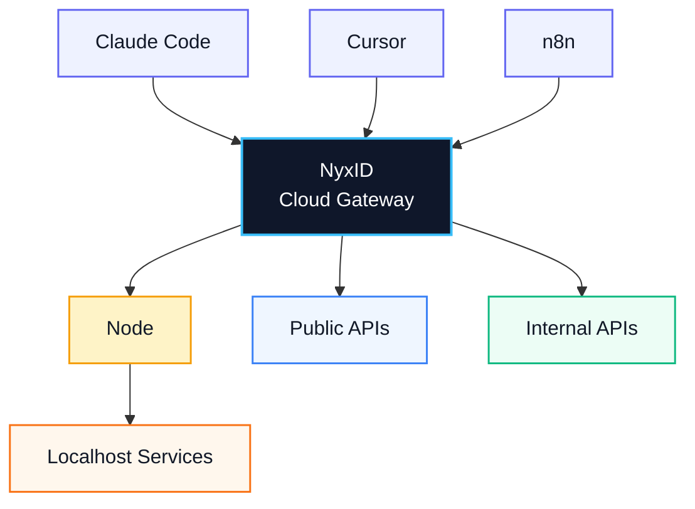

[](LICENSE)
[](https://github.com/ChronoAIProject/NyxID)

<p align="center">
  
</p>

**Connect AI agents to any API, anywhere. Securely.** Open-source Agent Connectivity Gateway.

NyxID lets your AI agents (Claude Code, Cursor, n8n) reach any API you have,
public or private, and handles all the credentials so your agent never sees
a raw key.



NyxID proxies requests, injects credentials automatically, punches through
NAT to reach your local services, and wraps any REST API as MCP tools.

<!-- TODO: Product screenshot
     Replace the ASCII diagram above with a polished architecture diagram or dashboard screenshot.
     <p align="center">
       
     </p>
-->

## What NyxID Does

- **Reach anything** — public APIs, internal APIs, localhost services via credential nodes (`nyxid node`). SSH tunneling (`nyxid ssh`) reaches remote hosts. No VPN, no port forwarding.
- **Never expose keys** — the reverse proxy injects credentials automatically. Your agent talks to NyxID; NyxID talks to the API with the real key.
- **MCP auto-wrap** — REST APIs with OpenAPI specs become [MCP](https://modelcontextprotocol.io/) (Model Context Protocol) tools. `nyxid mcp config --tool cursor` generates the config. Works with Claude Code, Cursor, VS Code, and any MCP client.
- **Per-agent isolation** — each agent gets a scoped token. Agent A accesses Slack and Gmail. Agent B only accesses your internal API. Revoke any session without touching the underlying credentials.
- **Full identity layer** — OIDC/OAuth 2.0 with PKCE, RBAC, service accounts, transaction approval (Telegram + mobile push), LLM gateway for 7 providers.

## Why NyxID

Other tools solve parts of this — NyxID combines credential injection, NAT traversal, and MCP tooling in one open-source gateway:

| | NyxID | 1Password Universal Autofill | Cloudflare Tunnel | Keycloak |
|---|---|---|---|---|
| Open source | Yes | No | No | Yes |
| NAT traversal to localhost | Yes (`nyxid node`) | No | Yes (no credentials) | No |
| Credential injection | Yes (any API) | Partner integrations | No | No |
| REST to MCP auto-wrap | Yes | No | No | No |
| Per-agent isolation | Yes | No | No | No |
| OIDC / OAuth 2.0 | Yes | No | No | Yes |

<!-- TODO: Demo GIF
     15-30 second terminal recording: install CLI → login → proxy a request
     Tools: https://github.com/charmbracelet/vhs or https://asciinema.org
     <p align="center">
       
     </p>
-->

## Quick Start

### Hosted (closed beta)

Sign up at the [NyxID console](https://nyx.chrono-ai.fun), add your API credentials through the dashboard, and copy the MCP config from **Settings > MCP** into your AI tool. Currently invitation-only — [join the waitlist](https://nyx.chrono-ai.fun/#waitlist).

### Self-host

**Prerequisites:** [Docker](https://docs.docker.com/get-docker/) installed.

```bash
git clone https://github.com/ChronoAIProject/NyxID.git && cd NyxID
cp .env.production.example .env.production

# Generate and paste these values into .env.production:
openssl rand -hex 32    # → ENCRYPTION_KEY (keep this safe)
openssl rand -hex 24    # → MONGO_ROOT_PASSWORD

# Generate JWT signing keys
mkdir -p keys
openssl genrsa -out keys/private.pem 4096 2>/dev/null
openssl rsa -in keys/private.pem -pubout -out keys/public.pem 2>/dev/null

# Start the stack
docker compose -f docker-compose.yml -f docker-compose.prod.yml \
  --env-file .env.production up -d

# Wait for the server to be ready
until curl -sf http://localhost:3001/health > /dev/null 2>&1; do sleep 2; done && echo "NyxID is running"
```

**Open `http://localhost:3000` and register your account.** For production hardening (TLS, domain), see [docs/DEPLOYMENT.md](docs/DEPLOYMENT.md).

Now connect your AI agent — pick one approach:

#### AI-assisted

Paste this into Claude Code, Cursor, or any AI coding assistant:

> I have NyxID self-hosted. The web console is at http://localhost:3000 and the backend API is at http://localhost:3001. Help me install the NyxID CLI (install script: https://raw.githubusercontent.com/ChronoAIProject/NyxID/main/skills/nyxid/tools/install.sh), then run source ~/.cargo/env to load it, log in with nyxid login --base-url http://localhost:3001, add my OpenAI API key with nyxid service add llm-openai, and verify with nyxid proxy request llm-openai models. Then help me copy the MCP config from Settings > MCP in the web console.

Your AI agent will install the CLI (including Rust if needed), walk you through login and credential setup, and verify your connection — all interactively.

<!-- AI quickstart maintenance: validate this prompt against actual CLI on each release -->

#### Manual CLI

```bash
# Install the CLI (installs Rust automatically if needed, takes a few minutes on first run)
bash -c "$(curl -fsSL https://raw.githubusercontent.com/ChronoAIProject/NyxID/main/skills/nyxid/tools/install.sh)"
source ~/.cargo/env                               # make nyxid available in current shell

# Log in (opens browser for authentication)
nyxid login --base-url http://localhost:3001

# Add your first API credential (e.g. OpenAI — make sure OPENAI_API_KEY is set in your shell)
nyxid service add llm-openai --credential-env OPENAI_API_KEY

# Verify — you should see a JSON response listing models
nyxid proxy request llm-openai models
```

If the proxy returns data, the full chain works: credential stored, injected, downstream accepted.

For MCP setup, open **Settings > MCP** in the web console (`http://localhost:3000`) to copy the correct config for Claude Code, Cursor, or VS Code.

> Already have Rust? You can also install with: `cargo install --git https://github.com/ChronoAIProject/NyxID.git nyxid-cli`

#### Web console

Prefer a GUI? Everything above can also be done through the web console at `http://localhost:3000`:

- **AI Services** — add API credentials (OpenAI, Anthropic, GitHub, etc.)
- **Settings > MCP** — copy MCP config snippets for Claude Code, Cursor, or VS Code

---

### Reach local services (optional)

Services behind a firewall? Deploy a credential node to punch through NAT and expose them as MCP tools:

```bash
# Register and start a node (outbound WebSocket — no port forwarding, no VPN)
nyxid node register --token <reg-token> --url wss://<your-server>/api/v1/nodes/ws
nyxid node credentials add --service my-local-api --header Authorization --secret-format bearer
nyxid node start

# Register the service and link it to the node
nyxid node credentials setup --service my-local-api --api-url http://localhost:8080

# Import endpoints as MCP tools (if the service has an OpenAPI spec)
nyxid catalog endpoints my-local-api
```

## Use Cases

- Give Claude Code access to your private APIs without sharing keys
- Expose internal microservices to AI agents through a single MCP endpoint
- Secure AI agent access to self-hosted tools (Grafana, Jenkins, n8n) behind your firewall

## Resources

| Topic | Link | |
|-------|------|---|
| Deployment | [docs/DEPLOYMENT.md](docs/DEPLOYMENT.md) | Start here for production setup |
| AI Agent Playbook | [docs/AI_AGENT_PLAYBOOK.md](docs/AI_AGENT_PLAYBOOK.md) | Start here for agent integration |
| Architecture | [docs/ARCHITECTURE.md](docs/ARCHITECTURE.md) | System design and data flows |
| API Reference | [docs/API.md](docs/API.md) | Full endpoint documentation |
| Credential Nodes | [docs/NODE_PROXY.md](docs/NODE_PROXY.md) | NAT traversal setup |
| MCP Integration | [docs/MCP_DELEGATION_FLOW.md](docs/MCP_DELEGATION_FLOW.md) | MCP protocol details |
| SSH Tunneling | [docs/SSH_TUNNELING.md](docs/SSH_TUNNELING.md) | |
| Security | [docs/SECURITY.md](docs/SECURITY.md) | |
| Environment Variables | [docs/ENV.md](docs/ENV.md) | |
| Developer Guide | [docs/DEVELOPER_GUIDE.md](docs/DEVELOPER_GUIDE.md) | |

## Contributing

We welcome contributions. See [CONTRIBUTING.md](CONTRIBUTING.md).

## License

[Apache-2.0](LICENSE)
