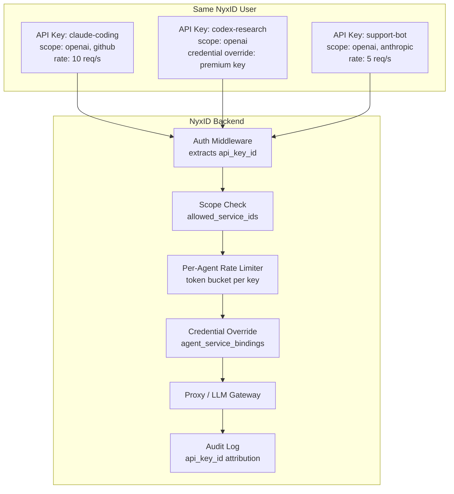
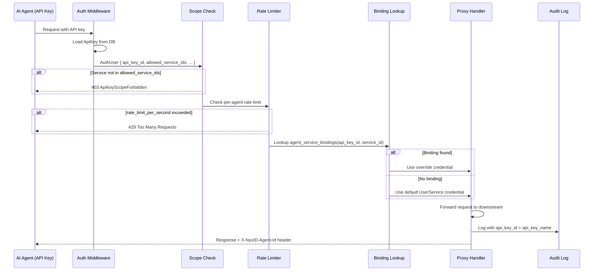
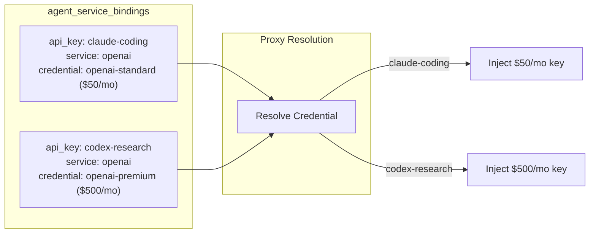
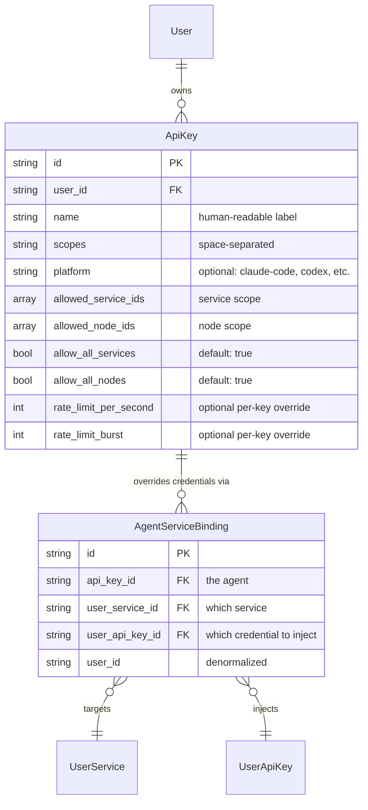
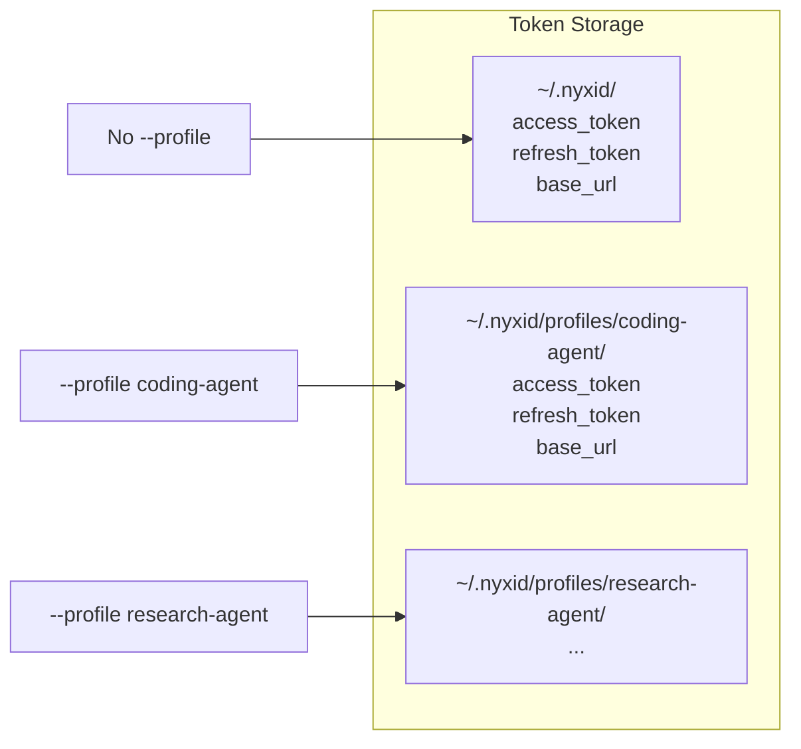
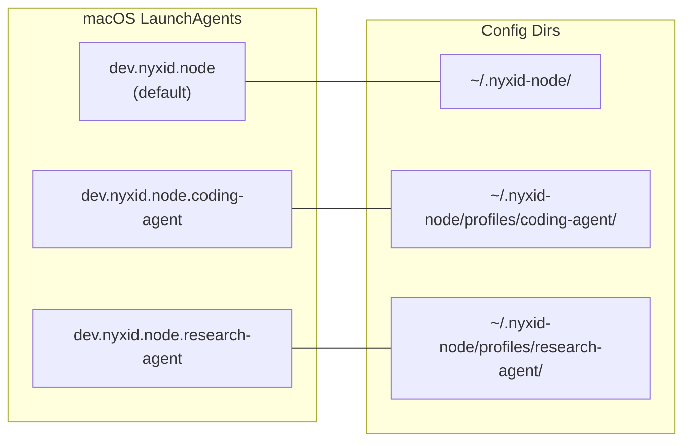
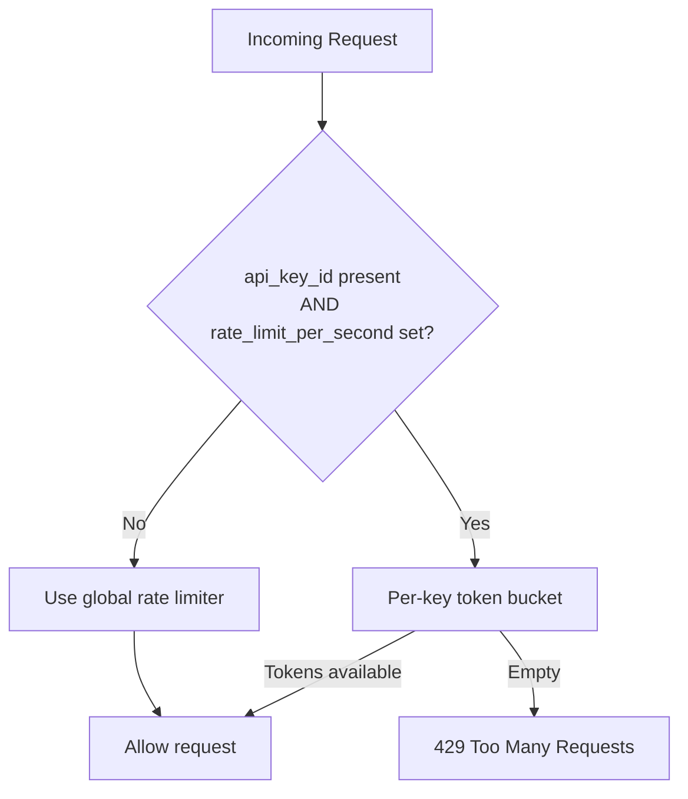

# Agent Isolation

## Overview

Agent isolation lets different AI agents (Claude Code, Codex, custom bots, etc.) belonging to the same NyxID user operate with independent credentials, rate limits, scopes, and audit trails. There is no separate "agent" model -- an **API key is the agent identity**.



## How It Works

### Proxy Request Flow



### Credential Override

The core new capability. Two agents using the same service (e.g., OpenAI) can inject different API keys:



Without a binding, the proxy falls back to the default credential on the `UserService` (existing behavior).

## Data Model



### Key fields on `ApiKey` (added by this feature)

| Field | Type | Default | Purpose |
|---|---|---|---|
| `platform` | `Option<String>` | `None` | Display label (claude-code, codex, openclaw, cursor, generic) |
| `rate_limit_per_second` | `Option<u32>` | `None` | Per-key rate limit (falls back to user-level when `None`) |
| `rate_limit_burst` | `Option<u32>` | `None` | Per-key burst capacity |

### Key fields on `AuthUser` (added by this feature)

| Field | Type | Default | Purpose |
|---|---|---|---|
| `api_key_id` | `Option<String>` | `None` | Populated when auth is via API key |
| `api_key_name` | `Option<String>` | `None` | Human-readable label for audit |
| `rate_limit_per_second` | `Option<u32>` | `None` | Copied from ApiKey for middleware |
| `rate_limit_burst` | `Option<u32>` | `None` | Copied from ApiKey for middleware |

All new fields are `Option` with `serde(default)`. Existing API keys and auth paths are unaffected.

## API Endpoints

### Credential Bindings

| Method | Path | Description |
|---|---|---|
| `POST` | `/api/v1/api-keys/{key_id}/bindings` | Create credential binding |
| `GET` | `/api/v1/api-keys/{key_id}/bindings` | List bindings for a key |
| `DELETE` | `/api/v1/api-keys/{key_id}/bindings/{id}` | Remove a binding |

### Usage

| Method | Path | Description |
|---|---|---|
| `GET` | `/api/v1/api-keys/usage` | Per-key usage stats (requests, errors, top services) |
| `GET` | `/api/v1/api-keys/{id}/usage` | Usage for a specific key |

### Existing (modified)

| Method | Path | Change |
|---|---|---|
| `POST` | `/api/v1/api-keys` | Accepts optional `platform` field |
| `PUT` | `/api/v1/api-keys/{id}` | Accepts `rate_limit_per_second`, `rate_limit_burst`, `platform` |

## CLI

### API Key Commands

```bash
# Create with optional platform label and service scope
nyxid api-key create --name "coding-agent" --platform claude-code \
  --allowed-services "svc-1,svc-2" --allow-all-services false

# Bind a specific credential to a key for a service
nyxid api-key bind <ID_OR_NAME> --service <SLUG> --credential <LABEL>

# All existing commands unchanged
nyxid api-key list / show / rotate / delete
```

### CLI Profiles

For running multiple agent identities on one machine:

```bash
nyxid login --base-url https://... --profile coding-agent
nyxid proxy request openai /chat/completions --profile coding-agent
NYXID_PROFILE=coding-agent nyxid service list
```



No `--profile` = default path (`~/.nyxid/`). Full backward compatibility.

### Node Multi-Instance

Each profile gets its own daemon process and config directory:

```bash
nyxid node register --token nyx_nreg_... --profile coding-agent
nyxid node daemon install --profile coding-agent
nyxid node daemon start --profile coding-agent
```



### Docker

```bash
# Auto-register + start (no host setup needed)
docker run --user "$(id -u):$(id -g)" \
  -v ~/.nyxid-node:/app/config \
  -e NYXID_NODE_TOKEN=nyx_nreg_... \
  -e NYXID_NODE_URL=wss://... \
  nyxid-node

# Or mount existing config
docker run --user "$(id -u):$(id -g)" \
  -v ~/.nyxid-node:/app/config \
  nyxid-node
```

Containers use the file backend (AES-GCM encrypted). OS keychain is not available in Docker.

## Frontend

- **API key detail page**: platform selector, rate limit editor, credential bindings CRUD, usage stats
- **Keys page**: per-key usage dashboard (requests, errors, error rate, top services, 7-day activity)
- **Admin audit log page**: filterable by `api_key_id`

## Per-Agent Rate Limiting



Implementation: in-memory `PerAgentRateLimiter` with token-bucket per API key. Background cleanup evicts idle buckets after 120 seconds.

When `rate_limit_per_second` is `None` on the key, the per-agent check is a no-op and the global rate limiter applies (unchanged behavior).

## Audit Attribution

Every proxy and LLM gateway request logs `api_key_id` and `api_key_name` in the audit event. This enables:
- Per-agent usage dashboards
- Admin audit log filtering by API key
- `X-NyxID-Agent-Id` response header for downstream observability

## Backward Compatibility

All changes are additive. No breaking changes for existing users:

| Area | Guarantee |
|---|---|
| Existing API keys | `allow_all_services=true`, `allow_all_nodes=true`, no rate limit override, no bindings. Behavior identical to before. |
| Existing auth paths (JWT, session, SA) | New `AuthUser` fields are `None`. No scope enforcement, no rate limit override. |
| No `--profile` flag | Reads from `~/.nyxid/` (unchanged). |
| No `agent_service_bindings` | Proxy uses default `UserService.api_key_id` (unchanged). |
| API responses | New optional fields use `skip_serializing_if`. Existing clients see no new fields unless they opt in. |

## Key Files

| File | Purpose |
|---|---|
| `backend/src/mw/auth.rs` | AuthUser with api_key_id, scopes, rate limits |
| `backend/src/mw/rate_limit.rs` | PerAgentRateLimiter (token bucket) |
| `backend/src/models/agent_service_binding.rs` | Credential override model |
| `backend/src/services/agent_binding_service.rs` | Binding CRUD + lookup |
| `backend/src/services/proxy_service.rs` | resolve_agent_credential_override() |
| `backend/src/handlers/agent_bindings.rs` | Binding REST endpoints |
| `backend/src/handlers/api_keys.rs` | Usage endpoints, bindings_count |
| `cli/src/auth.rs` | Profile-aware token storage |
| `cli/src/commands/api_key.rs` | bind command, --platform flag |
| `cli/docker-entrypoint.sh` | Auto-register in Docker |
