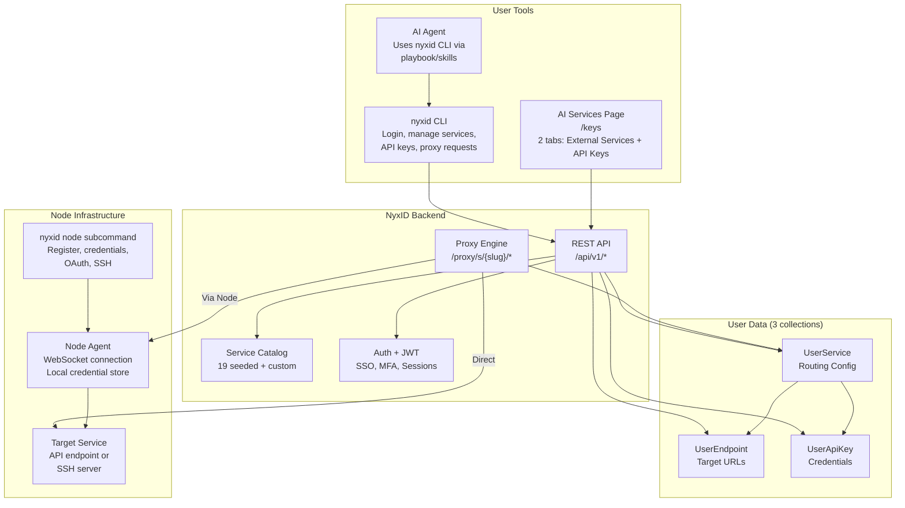
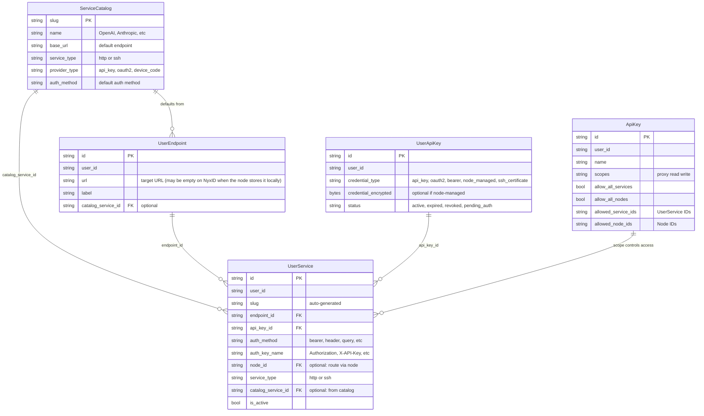
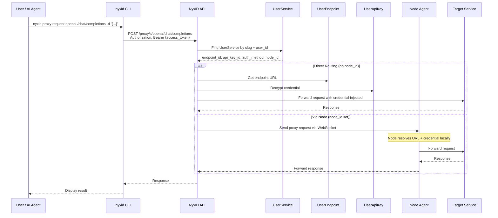
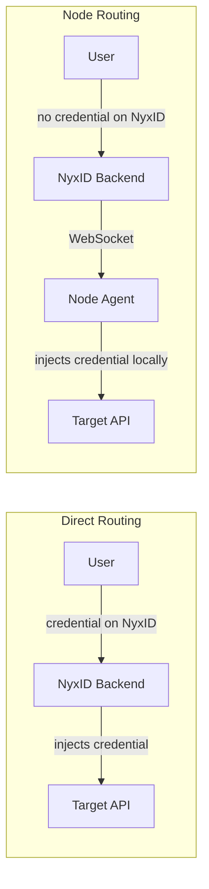
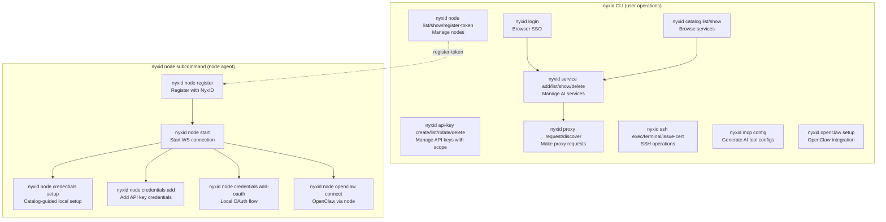
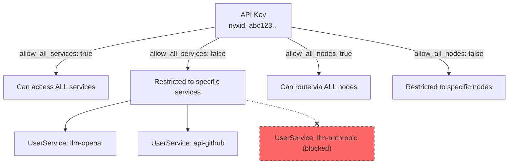
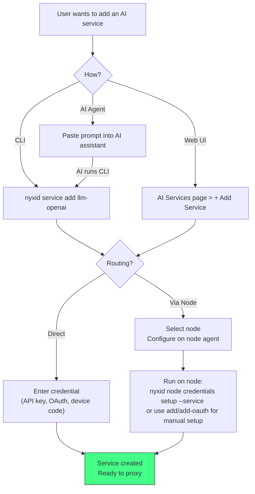

# AI Services Architecture

## Overview

NyxID's AI Services system lets users manage external API credentials, SSH services, and proxy routing through a unified interface. Users interact via the **AI Services page** (`/keys`) or the **`nyxid` CLI**.

---

## System Components

## Data Model Relationships

## Proxy Request Flow

## Two Routing Modes

| Aspect | Direct | Via Node |
|--------|--------|----------|
| Credential stored on | NyxID backend (encrypted) | Node agent (local, encrypted) |
| Endpoint URL | NyxID (UserEndpoint) | Node agent (local config) |
| OAuth refresh | NyxID backend | Node agent locally |
| Use case | Cloud services, simple setup | Self-hosted, privacy-sensitive |

## CLI Tools

## API Key Scoping

## Adding a Service: User Flows

