# Channel Bot Relay Design

## Overview

NyxID Channel Bot Relay turns NyxID into a **multi-platform messaging gateway**. Users register their own bots (Telegram, Discord, Lark, Feishu), NyxID receives messages via platform webhooks, normalizes them into a common format, routes each message to the correct AI agent's callback URL, and relays the agent's response back to the chat.

Combined with [Agent Isolation](./AGENT_ISOLATION.md), the same NyxID user can wire different messaging platforms (or even different conversations on the same platform) to different AI agents -- each with independent credentials, rate limits, and audit trails.

---

## Problem Statement

Today, connecting an AI agent to a messaging platform requires:

1. **Per-platform bot infrastructure** -- each agent team builds and hosts their own Telegram/Discord/Lark bot
2. **Platform-specific code** -- webhook verification, message parsing, reply formatting differs per platform
3. **No centralized credential management** -- bot tokens scattered across agent configs
4. **No unified audit trail** -- no visibility into which agent handled which message
5. **No agent routing** -- can't send Telegram DMs to Claude and Discord messages to GPT without separate bots

NyxID already solves the equivalent problem for API credentials (proxy gateway). Channel Bot Relay extends this to messaging.

---

## High-Level Architecture

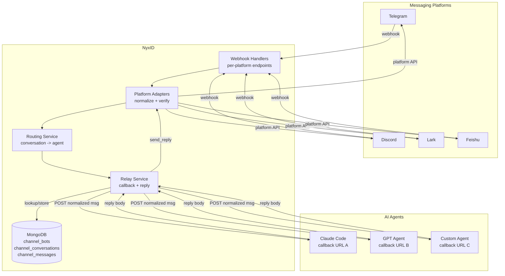

---

## Message Flow

### Inbound: Platform -> Agent

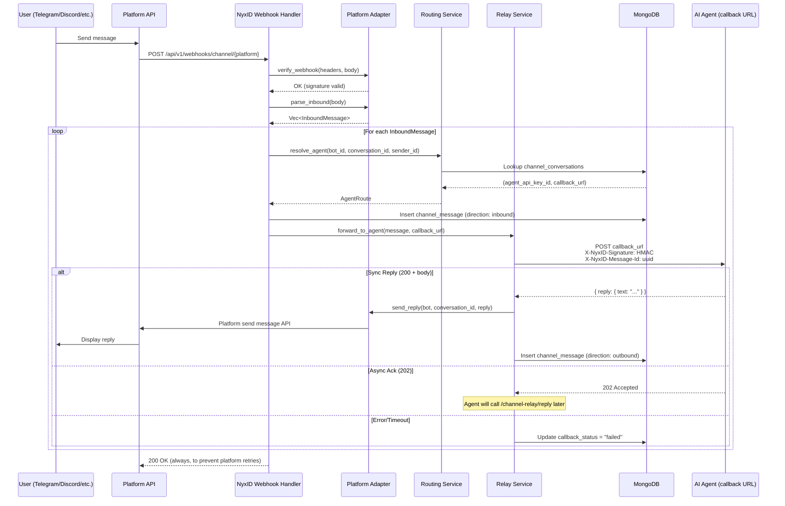

### Async Reply: Agent -> Platform

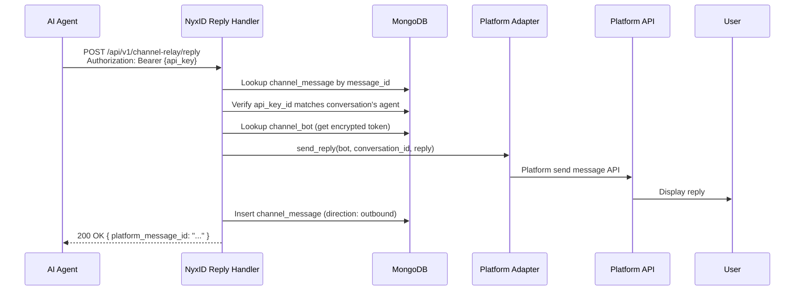

### Bot Registration

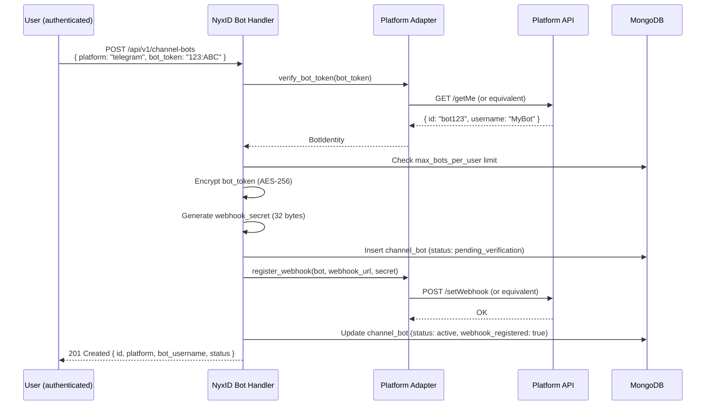

---

## Agent Routing & Isolation

### How Conversations Map to Agents

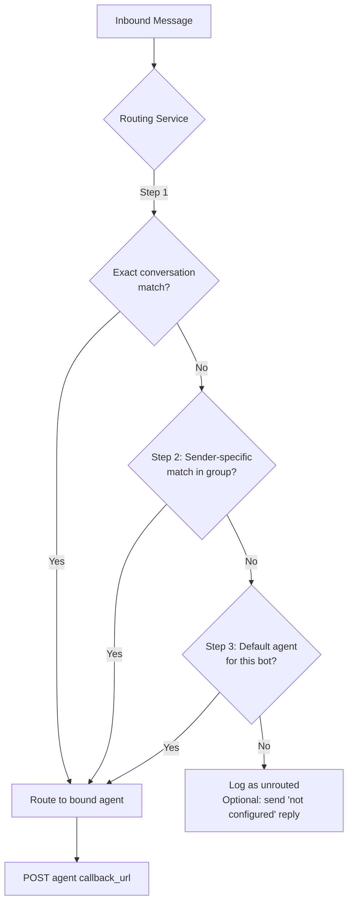

### Integration with Agent Isolation (PR #132)

The callback URL lives on the **ApiKey** (the agent), not on individual conversation routes. When a user sets up an agent on NyxID (`nyxid ai-setup agent create --platform claude-code`), they register the agent's callback URL as part of the agent configuration. Conversation routes then just say "send to this agent" -- NyxID already knows how to reach it.

This means:
- **`ApiKey.callback_url`** (new field) -- where NyxID sends channel messages for this agent
- **`ChannelConversation.agent_api_key_id`** -- which agent handles this conversation (callback URL resolved from the API key)
- No `agent_callback_url` on the conversation route -- the URL is a property of the agent, not the conversation

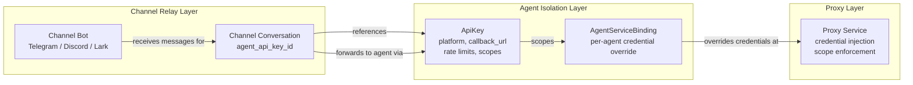

The relay and proxy are **parallel paths, not nested**:

- **Relay path**: Platform -> NyxID webhook -> agent callback URL (message forwarding)
- **Proxy path**: Agent -> NyxID proxy -> downstream API (credential injection)

An agent receiving a message via the relay can then call external APIs through NyxID's proxy using its scoped API key. The agent isolation scope enforcement applies to the proxy call, not the relay.

---

## Data Model

### Entity Relationship

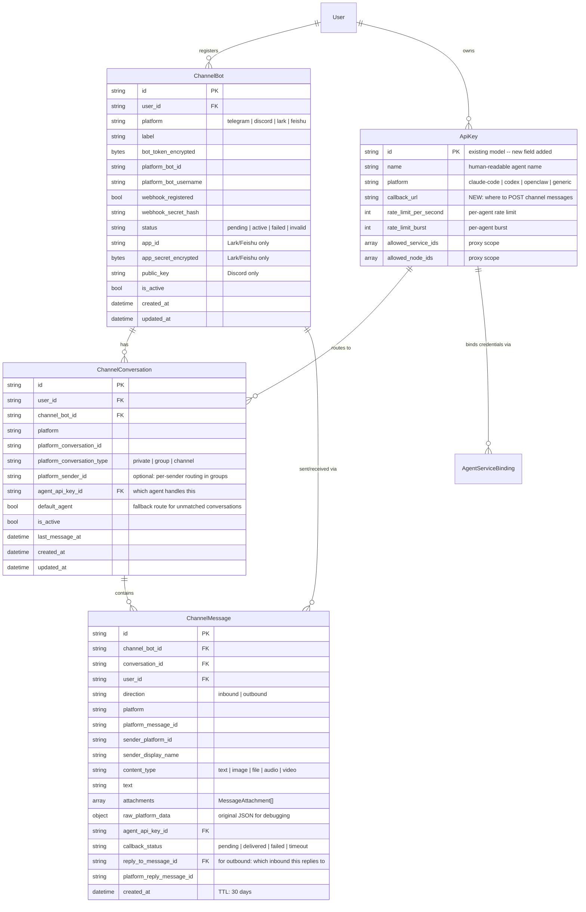

### MongoDB Indexes

| Collection | Index | Type | Purpose |
|---|---|---|---|
| `channel_bots` | `{ user_id: 1, platform: 1 }` | Unique | One bot per platform per user |
| `channel_bots` | `{ platform: 1, platform_bot_id: 1 }` | Standard | Webhook bot lookup |
| `channel_conversations` | `{ channel_bot_id: 1, platform_conversation_id: 1 }` | Unique | One mapping per conversation |
| `channel_conversations` | `{ user_id: 1, platform: 1 }` | Standard | List user's routes |
| `channel_conversations` | `{ agent_api_key_id: 1 }` | Standard | Find routes for an agent |
| `channel_messages` | `{ conversation_id: 1, created_at: -1 }` | Standard | Conversation history |
| `channel_messages` | `{ created_at: 1 }` | TTL (30d) | Auto-cleanup |

---

## Platform Adapter Trait

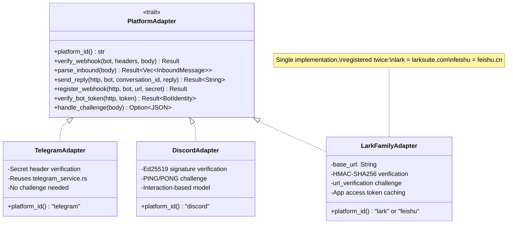

### Platform-Specific Notes

| Platform | Auth Model | Webhook Verification | Challenge | Send Reply API |
|---|---|---|---|---|
| **Telegram** | Bot token (`123:ABC...`) | `X-Telegram-Bot-Api-Secret-Token` header (constant-time) | None | `POST /bot{token}/sendMessage` |
| **Discord** | Bot token + Application ID | Ed25519 signature (`X-Signature-Ed25519` + `X-Signature-Timestamp`) | `PING` -> `PONG` interaction response | `POST /channels/{id}/messages` with `Authorization: Bot {token}` |
| **Lark** | App ID + App Secret | HMAC-SHA256 on `X-Lark-Signature` header | `url_verification` event -> echo `challenge` | `POST /im/v1/messages` with tenant access token |
| **Feishu** | App ID + App Secret (same as Lark) | Same as Lark | Same as Lark | Same as Lark, different base URL (`open.feishu.cn`) |

---

## Callback Contract

### NyxID -> Agent (Webhook POST)

NyxID sends a normalized message to the agent's callback URL.

```json
{
  "message_id": "550e8400-e29b-41d4-a716-446655440000",
  "platform": "telegram",
  "agent": {
    "api_key_id": "880e8400-e29b-41d4-a716-446655440000",
    "name": "claude-support-bot"
  },
  "conversation": {
    "id": "660e8400-e29b-41d4-a716-446655440000",
    "platform_id": "12345678",
    "type": "private"
  },
  "sender": {
    "platform_id": "87654321",
    "display_name": "John Doe"
  },
  "content": {
    "type": "text",
    "text": "What is the weather in Tokyo?",
    "attachments": []
  },
  "reply_to_message_id": null,
  "thread_id": null,
  "timestamp": "2026-03-31T12:00:00Z"
}
```

**Design rationale:**

The payload is intentionally lean -- transport identifiers only, no identity resolution on the hot path.

- **`agent.api_key_id`** is the primary agent identifier. Same `ApiKey._id` from agent isolation (PR #132). A shared callback endpoint dispatches based on this value. Use for routing/authorization.
- **`agent.name`** is the human-readable label from key creation (e.g., `"claude-support-bot"`). For logging and display only -- never use for authorization.
- **`sender.platform_id`** is the platform-native user ID. The agent is responsible for mapping this to its own users. If the agent uses NyxID OAuth, it already has `nyxid_user_id` in its user table from login time -- it can match `sender.platform_id` against platform identities it collected during onboarding. NyxID doesn't need to do this lookup because the agent already has the data.
- **No NyxID user IDs for senders** -- the agent knows the bot owner (from its API key), and knows the sender (from its own user table or the optional resolve-sender API). NyxID's job is message transport, not identity resolution.
- **No PII** -- no emails, no NyxID-stored names. `sender.display_name` is platform-provided (Telegram `first_name`, Discord `username`).

**Field Reference:**

| Field | Type | Nullable | Description |
|---|---|---|---|
| `message_id` | UUID | No | NyxID's internal ID for this message record (stored in `channel_messages`). The agent uses this to send async replies via `POST /channel-relay/reply`. |
| `platform` | string | No | Which messaging platform the message came from: `telegram`, `discord`, `lark`, or `feishu`. |
| `agent.api_key_id` | UUID | No | The `ApiKey._id` assigned to this conversation route. This is the agent's identity from agent isolation. A shared callback endpoint dispatches based on this. |
| `agent.name` | string | No | Human-readable name of the API key (e.g., `"claude-support-bot"`). For logging and display only. |
| `conversation.id` | UUID | No | NyxID's internal ID for the conversation route (from `channel_conversations`). Stable across all messages in the same chat. |
| `conversation.platform_id` | string | No | The platform's native conversation identifier (Telegram `chat_id`, Discord `channel_id`, Lark `chat_id`). |
| `conversation.type` | string | No | Conversation kind: `private` (1:1 DM), `group` (multi-user chat), or `channel` (broadcast). |
| `sender.platform_id` | string | No | The message author's ID on the platform. The agent maps this to its own users. |
| `sender.display_name` | string | Yes | Display name from the platform (Telegram `first_name`, Discord `username`). `null` if not provided. |
| `content.type` | string | No | Content kind: `text`, `image`, `file`, `audio`, `video`, `location`, `sticker`, or `unknown`. |
| `content.text` | string | Yes | Text body. Present for `text`; may contain caption for media. `null` for non-text without caption. |
| `content.attachments` | array | No | Non-text attachments: `{ type, url, filename, mime_type, size_bytes }`. Empty `[]` for plain text. |
| `reply_to_message_id` | UUID | Yes | NyxID `message_id` of the message being replied to. `null` for standalone messages. |
| `thread_id` | string | Yes | Platform-native thread ID (Discord threads, Lark threads). `null` if not in a thread. |
| `timestamp` | ISO 8601 | No | When the message was sent on the platform (not when NyxID received it). |

**Headers:**

| Header | Description |
|---|---|
| `Content-Type` | `application/json` |
| `X-NyxID-Signature` | HMAC-SHA256 of request body, signed with the API key's hash |
| `X-NyxID-Message-Id` | UUID of the `channel_message` record |
| `X-NyxID-Timestamp` | ISO 8601 timestamp (for replay protection) |
| `X-NyxID-Platform` | Platform identifier (`telegram`, `discord`, `lark`, `feishu`) |

### Identity Resolution (optional convenience API)

For agents that don't maintain their own user-to-platform mapping, NyxID provides a lookup endpoint. This is a convenience -- most agents integrated with NyxID OAuth already have this data from user onboarding.

```
GET /api/v1/channel-relay/resolve-sender?platform=telegram&platform_id=87654321
Authorization: Bearer nyxid_ag_xxxxx
```

**Response (linked):**
```json
{
  "platform": "telegram",
  "platform_id": "87654321",
  "nyxid_user_id": "770e8400-e29b-41d4-a716-446655440000",
  "linked": true
}
```

**Response (not linked):**
```json
{
  "platform": "telegram",
  "platform_id": "87654321",
  "nyxid_user_id": null,
  "linked": false
}
```

**Resolution checks** (in order):
1. `notification_channels` -- Telegram `telegram_chat_id` matched against `platform_id`
2. `user_provider_tokens` -- Telegram identity tokens with `telegram_user_id` metadata
3. Future: dedicated `channel_identity_links` collection for explicit cross-platform mapping

Scoped to the bot owner's account -- only resolves identities linked to the user who registered the bot.

### Agent -> NyxID (Sync Reply, HTTP 200)

Agent returns a reply in the callback response body:

```json
{
  "reply": {
    "text": "The weather in Tokyo is 22C and sunny.",
    "reply_to_platform_message_id": "optional, for threading",
    "metadata": null
  }
}
```

**Reply Field Reference:**

| Field | Type | Nullable | Description |
|---|---|---|---|
| `reply.text` | string | Yes | The text response to send back to the chat. Required for text replies. |
| `reply.reply_to_platform_message_id` | string | Yes | Platform-native message ID to reply to (for threading). If set, the reply will appear as a threaded response on platforms that support it (Telegram reply, Discord thread, Lark thread). |
| `reply.metadata` | object | Yes | Platform-specific extras (e.g., Telegram `parse_mode`, Discord embed objects). Passed through to the platform adapter. `null` for plain text replies. |

### Agent -> NyxID (Async, HTTP 202 then POST later)

If the agent needs more time (LLM inference, tool calls, etc.), it returns `202 Accepted` with an empty body, then calls back when ready:

```
POST /api/v1/channel-relay/reply
Authorization: Bearer nyxid_ag_xxxxx
Content-Type: application/json

{
  "message_id": "550e8400-e29b-41d4-a716-446655440000",
  "reply": {
    "text": "After checking multiple sources, the weather in Tokyo is 22C and sunny with 60% humidity.",
    "metadata": null
  }
}
```

**Async Reply Field Reference:**

| Field | Type | Nullable | Description |
|---|---|---|---|
| `message_id` | UUID | No | The `message_id` from the original inbound callback payload. Identifies which message this reply is for, so NyxID can resolve the correct conversation and platform to send the reply to. |
| `reply.text` | string | Yes | The text response to send back to the chat. |
| `reply.metadata` | object | Yes | Platform-specific extras, same as sync reply. |

### Callback Flow Decision

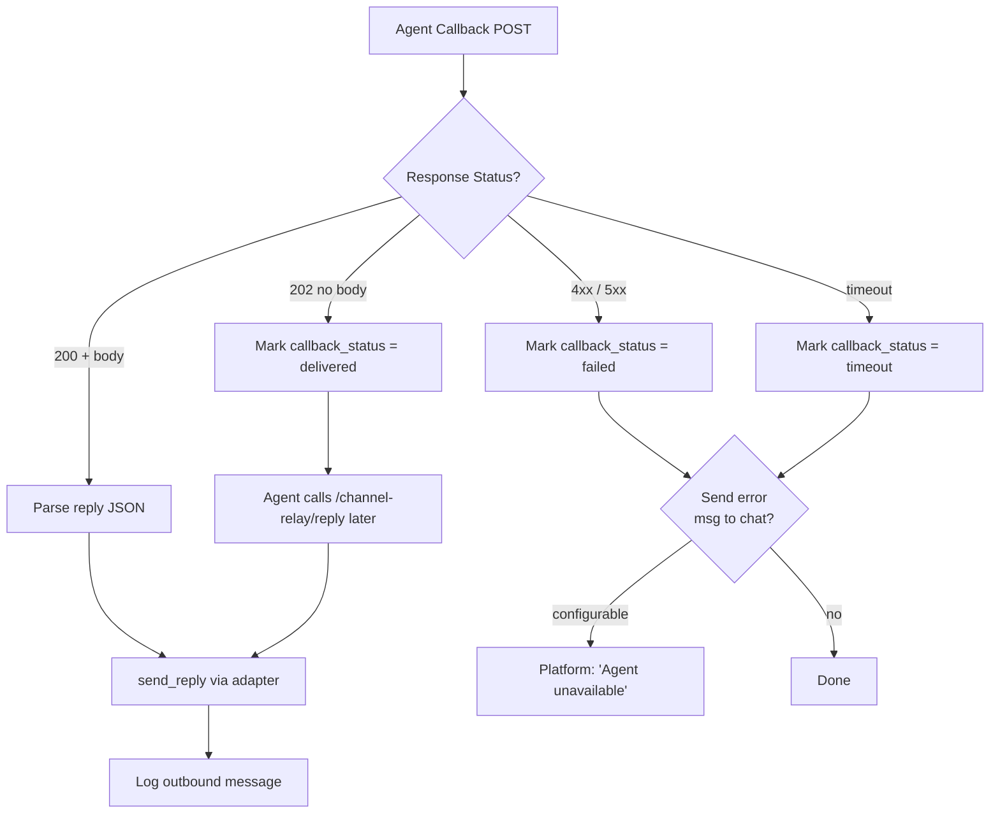

---

## API Endpoints

### Bot Management (authenticated, human-only)

| Method | Path | Description |
|---|---|---|
| `POST` | `/api/v1/channel-bots` | Register a new bot |
| `GET` | `/api/v1/channel-bots` | List user's bots |
| `GET` | `/api/v1/channel-bots/{id}` | Get bot details |
| `DELETE` | `/api/v1/channel-bots/{id}` | Delete bot (deregisters webhook) |
| `POST` | `/api/v1/channel-bots/{id}/verify` | Re-verify bot token and webhook |

### Conversation Routes (authenticated, human-only)

| Method | Path | Description |
|---|---|---|
| `POST` | `/api/v1/channel-conversations` | Create conversation -> agent route (callback URL resolved from `ApiKey.callback_url`) |
| `GET` | `/api/v1/channel-conversations` | List user's routes (filterable by bot, platform, agent) |
| `GET` | `/api/v1/channel-conversations/{id}` | Get route details |
| `PUT` | `/api/v1/channel-conversations/{id}` | Update route (change agent) |
| `DELETE` | `/api/v1/channel-conversations/{id}` | Delete route |

### Relay (API-key authenticated)

| Method | Path | Description |
|---|---|---|
| `POST` | `/api/v1/channel-relay/reply` | Agent sends async reply to a message |
| `GET` | `/api/v1/channel-relay/messages/{conversation_id}` | Get conversation message history |
| `GET` | `/api/v1/channel-relay/resolve-sender` | Resolve a platform sender to a NyxID user (query params: `platform`, `platform_id`) |

### Platform Webhooks (unauthenticated, signature-verified)

| Method | Path | Description |
|---|---|---|
| `POST` | `/api/v1/webhooks/channel/telegram` | Telegram bot webhook |
| `POST` | `/api/v1/webhooks/channel/discord` | Discord interaction webhook |
| `POST` | `/api/v1/webhooks/channel/lark` | Lark event webhook |
| `POST` | `/api/v1/webhooks/channel/feishu` | Feishu event webhook |

---

## Security

### Threat Model

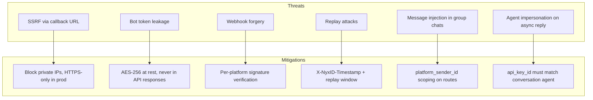

| Concern | Mitigation |
|---|---|
| **SSRF** | Callback URLs validated: HTTPS-only in production, block RFC 1918/loopback ranges, optional domain allowlist |
| **Bot token storage** | AES-256 encrypted at rest (same pattern as `UserApiKey.credential_encrypted`). Never returned in API responses. Only `platform_bot_username` is exposed. |
| **Webhook forgery** | Per-platform verification: Telegram secret header, Discord Ed25519, Lark HMAC-SHA256. All constant-time comparison. |
| **Replay attacks** | Callbacks include `X-NyxID-Timestamp`. Agents should reject messages older than 5 minutes. |
| **Callback authentication** | `X-NyxID-Signature` is HMAC-SHA256 of the request body, keyed with the API key's hash. Agents verify this to confirm the request came from NyxID. |
| **Agent impersonation** | Async reply endpoint requires the calling API key to match the conversation's `agent_api_key_id`. |
| **Rate limiting** | Per-bot rate limiting on inbound webhooks. Per-agent rate limiting on callback dispatch (reuses `PerAgentRateLimiter` from agent isolation). |

---

## Implementation Phases

### Phase 1: Foundation

Models, platform adapter trait, error codes, config.

```mermaid
gantt
    title Phase 1 - Foundation
    dateFormat  X
    axisFormat %s

    section Models
    channel_bot.rs           :a1, 0, 1
    channel_conversation.rs  :a2, 0, 1
    channel_message.rs       :a3, 0, 1
    Register in mod.rs       :a4, after a1, 1

    section Infrastructure
    Error variants (10000-10005)  :b1, 0, 1
    Config env vars               :b2, 0, 1
    DB indexes                    :b3, after a1, 1

    section Trait
    PlatformAdapter trait     :c1, 0, 1
    Normalized types          :c2, 0, 1
```

**New files:**
- `backend/src/models/channel_bot.rs`
- `backend/src/models/channel_conversation.rs`
- `backend/src/models/channel_message.rs`
- `backend/src/services/channel_platform.rs` (trait + types)

**Modified files:**
- `backend/src/models/mod.rs` -- register modules
- `backend/src/services/mod.rs` -- register module
- `backend/src/errors/mod.rs` -- new error variants
- `backend/src/config.rs` -- new env vars
- `backend/src/db.rs` -- new indexes

### Phase 2: Telegram Adapter

First platform adapter, reuses existing `telegram_service.rs`.

**New files:**
- `backend/src/services/channel_adapters/mod.rs`
- `backend/src/services/channel_adapters/telegram.rs`

### Phase 3: Core Services

Bot CRUD, conversation routing, relay orchestration.

**New files:**
- `backend/src/services/channel_bot_service.rs`
- `backend/src/services/channel_routing_service.rs`
- `backend/src/services/channel_relay_service.rs`

### Phase 4: HTTP Handlers & Routes

Wire up all endpoints.

**New files:**
- `backend/src/handlers/channel_bots.rs`
- `backend/src/handlers/channel_webhooks.rs`
- `backend/src/handlers/channel_relay.rs`

**Modified files:**
- `backend/src/handlers/mod.rs`
- `backend/src/routes.rs`
- `backend/src/main.rs` (webhook health check background task)

### Phase 5: Discord, Lark, Feishu Adapters

Remaining platform adapters.

**New files:**
- `backend/src/services/channel_adapters/discord.rs`
- `backend/src/services/channel_adapters/lark.rs`

**New dependencies:**
- `ed25519-dalek` (Discord signature verification)

### Phase 6: OpenClaw Bridge Migration

Migrate existing `openclaw_channel_mappings` to the generic relay. Backward-compatible dual-path lookup.

**New files:**
- `backend/src/services/channel_adapters/openclaw.rs`

**Modified files:**
- `backend/src/handlers/openclaw_channel.rs` (dual-path lookup)

### Phase 7: Frontend

Bot management UI, conversation route editor, message log.

**New files:**
- `frontend/src/types/channels.ts`
- `frontend/src/hooks/use-channels.ts`
- `frontend/src/schemas/channels.ts`
- `frontend/src/pages/channel-bots.tsx`
- `frontend/src/pages/channel-bot-detail.tsx`
- `frontend/src/components/dashboard/add-channel-bot-dialog.tsx`
- `frontend/src/components/dashboard/channel-route-editor.tsx`

**Modified files:**
- `frontend/src/router.tsx`
- `frontend/src/components/dashboard/sidebar.tsx`

---

## Phase Dependency Graph

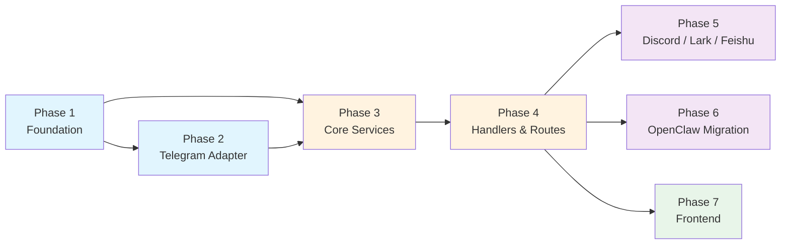

---

## Environment Variables

| Variable | Default | Description |
|---|---|---|
| `CHANNEL_RELAY_CALLBACK_TIMEOUT_SECS` | `30` | HTTP timeout for agent callback requests |
| `CHANNEL_RELAY_MAX_BOTS_PER_USER` | `5` | Maximum bots a user can register |
| `CHANNEL_RELAY_MESSAGE_TTL_DAYS` | `30` | TTL for `channel_messages` auto-cleanup |

---

## Relationship to Existing Systems

| Existing System | Relationship | Migration Path |
|---|---|---|
| **Telegram approval bot** (system-level) | Completely separate. The admin's global bot for approval notifications is untouched. | None needed |
| **Telegram Login Widget** (identity provider) | Separate. Uses Telegram for authentication, not messaging. | None needed |
| **OpenClaw channel bridge** | Superseded. The new relay is a generalized version. | Phase 6: dual-path lookup, gradual migration |
| **Agent isolation** (PR #132) | Complementary. `ApiKey.id` is the `agent_api_key_id` reference. Proxy scope enforcement applies when agents make proxy calls. | Already integrated via shared `ApiKey` model |
| **Proxy gateway** | Parallel path. Relay forwards messages; proxy forwards API calls. Agents may use both. | None needed |

---

## Example: End-to-End Scenario

### Setup (one-time)

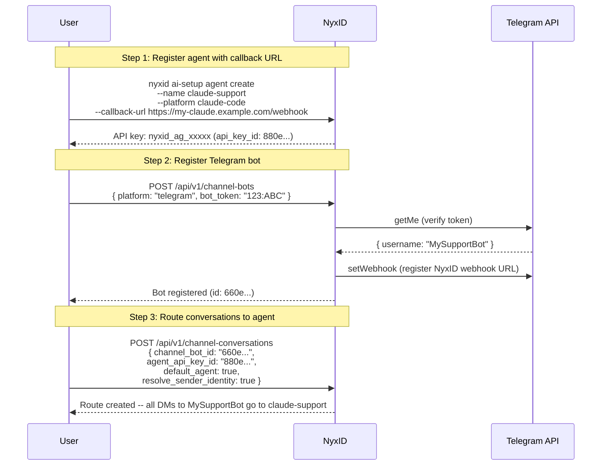

The callback URL is on the **agent** (API key), not the conversation route. If the user later creates a second agent ("gpt-research") with a different callback URL and routes a Discord bot to it, the same pattern applies.

### Runtime

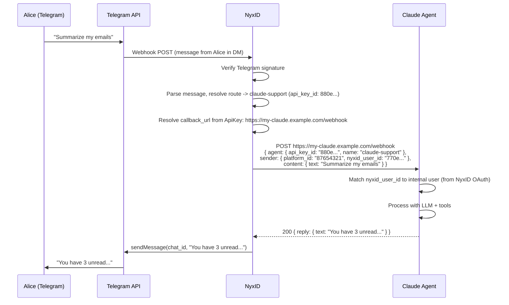

**Meanwhile, on Discord (same user, different agent):**

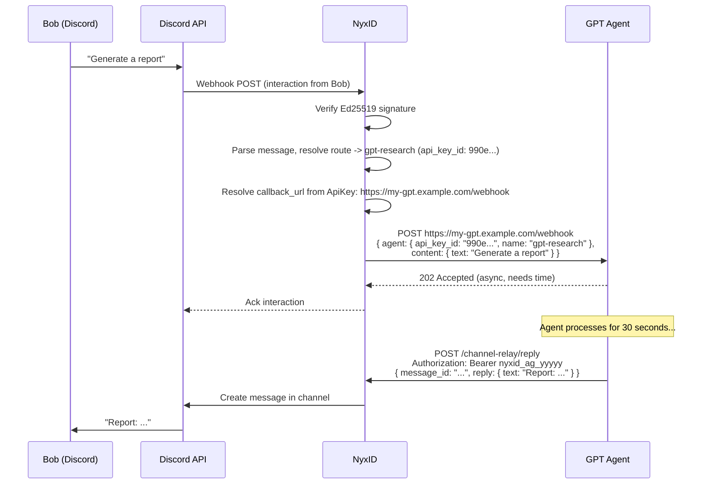
