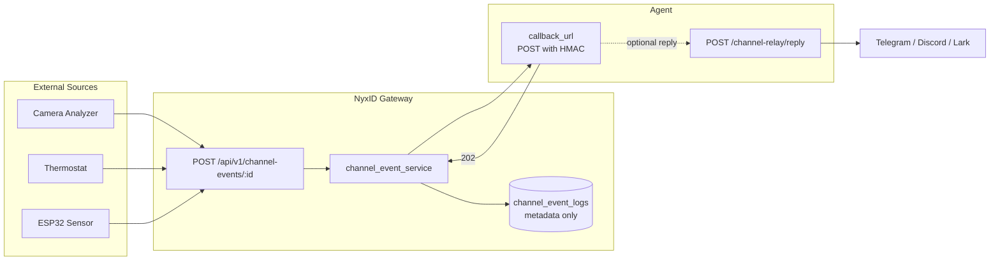
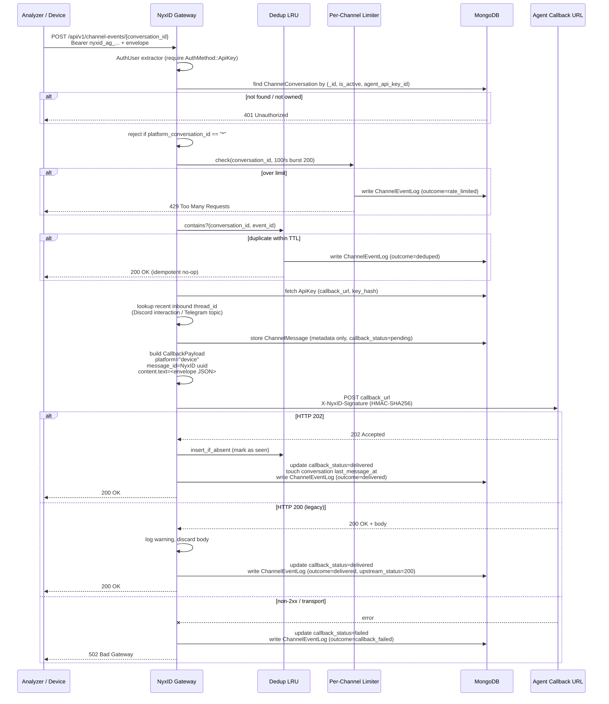
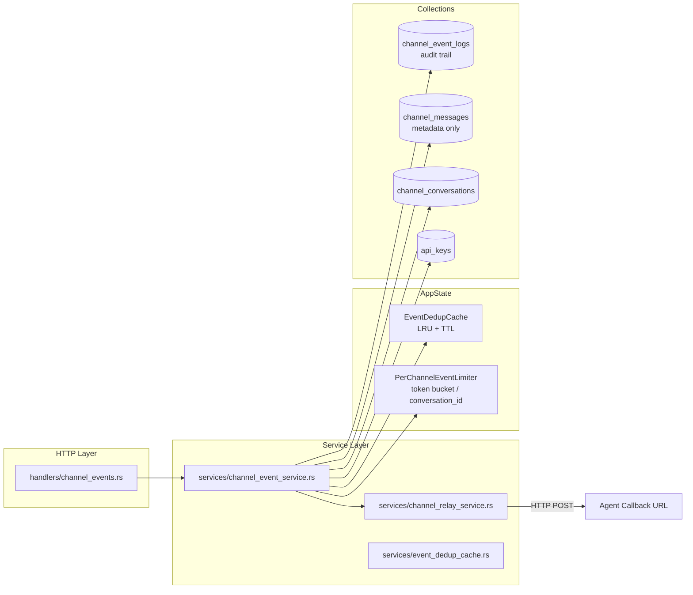

# HTTP Event Gateway

## Overview

The HTTP Event Gateway lets external devices, analyzers, and services push events into an AI agent conversation over a simple HTTP POST. It bridges the "pull mode" NyxID has always had (agents calling external APIs via `/proxy`) with a "push mode" where real-world sensors can notify an agent when something happens.

A camera analyzer detects a person entering the living room, a thermostat reports a spike, an ESP32 sensor fires an alert — all land as a `CallbackPayload` on the agent's webhook and are delivered end-to-end through the same channel relay pipeline already used for Telegram, Discord, Lark, and Feishu bots.

NyxID is a **pure passthrough gateway** for events (see [ADR-013](#adr-013-pure-passthrough)): it authenticates, rate-limits, deduplicates best-effort, and forwards once. It never retries, never queues, and never stores event payload content. The agent receives the event, acts on it, and optionally replies through the existing async reply endpoint.



## ADR-013 Pure Passthrough

Every design choice on this path follows a single rule: **NyxID is a gateway, not a message bus**.

| Principle | Implication |
|---|---|
| No retry | Forward once; on failure, return the error to the client and let them decide |
| No cache / queue | No in-memory buffer, no fan-out, no ordering guarantees |
| Metadata only | `channel_event_logs` stores `event_id`, `source`, `type`, `timestamp`, `status_code`, `latency_ms`, `outcome` — never payload content |
| Client-side retry | Producers reuse the same `event_id` on retry; dedup is best-effort, failure unlocks retries |
| Stateless | NyxID can restart without losing any data (there's nothing to lose) |

The same principle applies retroactively to `channel_messages`: the bot relay collection was refactored in this shipment to store metadata only, matching the event path.

## Architecture

### End-to-end flow



### Component layout



## MongoDB Models

### ChannelEventLog (collection: `channel_event_logs`)

Append-only audit trail for every event the gateway touches. **Metadata only** per ADR-013 — no payload, no headers, no body.

| Field | Type | Notes |
|---|---|---|
| `_id` | `String` (UUID v4) | NyxID-assigned log row id |
| `conversation_id` | `String` | Target `ChannelConversation._id` |
| `api_key_id` | `String` | Agent identity that forwarded the event |
| `event_id` | `String` | Client-supplied envelope `event_id` (UUID) |
| `source` | `String` | Logical event source (e.g. `"camera-analyzer"`) |
| `event_type` | `String` | Event type (e.g. `"person_detected"`) |
| `event_timestamp` | `DateTime<Utc>` | Envelope `timestamp` |
| `forwarded_at` | `DateTime<Utc>` | When the gateway actually forwarded |
| `upstream_status_code` | `i32` | Agent HTTP status (202 / 200 / 5xx); `0` sentinel for transport errors or events that never reached the upstream (rate-limited, deduped) |
| `latency_ms` | `i64` | Round-trip duration around `forward_to_agent()`, per ADR-013 §4 |
| `outcome` | `String` | `"delivered"` / `"deduped"` / `"rate_limited"` / `"callback_failed"` |

**Indexes** (see `db::ensure_indexes`):

- `(conversation_id: 1, event_id: 1)` — **non-unique**, explicit name `channel_event_logs_convid_eventid_lookup`. Append-only semantics: multiple rows per `event_id` reflect retry history.
- `(conversation_id: 1, forwarded_at: -1)` — operational queries
- TTL on `forwarded_at` — 30 days

Old unique-variant index is dropped defensively at startup under its legacy default name.

### ChannelMessage (collection: `channel_messages`)

Unchanged in shape from before the event gateway landed *except* that ADR-013 forced a metadata-only refactor at the same time: the `text`, `attachments`, and `raw_platform_data` fields were removed. A startup migration gated by a `schema_migrations` marker unsets those fields from any pre-existing documents exactly once per deployment.

The `thread_id` field survives because it is routing metadata, not content — it carries Discord interaction follow-up tokens (`interaction:{app}:{token}`), Telegram forum-topic ids, and similar platform routing pointers.

Device events synthesized by the gateway persist a row here too with `platform: "device"`, `direction: "inbound"`, and `platform_message_id` set to the client-supplied envelope `event_id` so operators can correlate logs by upstream id.

### ChannelConversation (collection: `channel_conversations`)

Unchanged. The gateway fetches by `{_id, is_active, agent_api_key_id}` so unknown, inactive, and foreign conversations all collapse into a single 401 response without leaking existence.

## Backend Services

### channel_event_service (`backend/src/services/channel_event_service.rs`)

Orchestration layer. Exposes a single public function `forward_event()` that ties everything together.

Execution order matters — each step is ordered to minimize wasted work on the failure paths and to prevent side-channel leaks:

1. **Auth extraction** — require `AuthMethod::ApiKey`. Relay JWTs carry an `api_key_id` too but they represent delegated access, not a real agent key; accepting them here would let a callback recipient synthesize device events. Short-circuits before any DB work.
2. **Scoped conversation lookup** — `find_one({_id, is_active, agent_api_key_id})`. Unknown / inactive / foreign → single 401. The rate-limit bucket is only consumable by legitimate owners.
3. **Wildcard reject** — `platform_conversation_id == "*"` rows are default-agent catch-all routes; async replies cannot round-trip through them. Rejected with 400 `wildcard_conversation_not_supported`. Only surfaces to owners (not a leak).
4. **Per-channel rate limit** — token bucket keyed by `conversation_id`, default 100/s burst 200.
5. **Dedup check** (read-only) — `contains(conv, event)` probes the LRU without mutating it. Hits short-circuit as `outcome=deduped`. The cache is written only after a **successful** forward, so transient failures don't lock out client retries for the full TTL.
6. **API key load** — fetch the agent key for `callback_url` + `key_hash`. Reject if `callback_url` is unset.
7. **Inherit thread_id** — `lookup_recent_inbound_thread_id()` finds the most recent webhook-driven inbound in the conversation with a non-null `thread_id`. Interaction tokens have a 2-minute age cap; Telegram topic ids have no TTL.
8. **Persist metadata** — `store_device_event_message()` writes a `ChannelMessage` row with the inherited thread_id. The stored message's UUID becomes the callback's `message_id` so async replies can look it up.
9. **Build payload** — `CallbackPayload` with `platform = "device"`, `content.text` = full envelope JSON, `conversation.type = "device"`, `sender.platform_id = envelope.source`, timestamp in RFC 3339.
10. **Forward and measure** — `channel_relay_service::forward_to_agent()` returns a `CallbackDelivery { http_status: Option<u16>, result }`. Latency captured around the call.
11. **Record outcome** — on success: insert dedup entry, touch conversation `last_message_at`, update `callback_status = "delivered"`, write `ChannelEventLog` with the real upstream status. On failure: update `callback_status = "failed"`, write log with `outcome = "callback_failed"` and the actual HTTP status (or `0` for transport errors).

### event_dedup_cache (`backend/src/services/event_dedup_cache.rs`)

Per-process LRU with per-entry TTL, keyed by `(conversation_id, event_id)`. Bounded-capacity FIFO eviction plus opportunistic TTL cleanup on insert plus a periodic background cleanup task (60s interval).

Two-phase API: `contains()` is read-only and `insert_if_absent()` is the commit. The service uses `contains()` before forwarding and `insert_if_absent()` only after success, so failed forwards don't lock out client retries.

**Known limitation:** per-process. Multi-replica deployments will see duplicates across instances. Sticky routing or Redis-backed dedup is future work; out of scope for this shipment.

### channel_relay_service (`backend/src/services/channel_relay_service.rs`)

Existing file, three changes:

**`forward_to_agent()` — 202 only.** The function now returns `CallbackDelivery` instead of `AppResult<()>`. Only HTTP 202 is a success; HTTP 200 with a body is tolerated for legacy clients (the body is discarded with a warning log) because ADR-013 and the CEO decision on #221 removed synchronous reply support. The `AgentReplyPayload` struct and its webhook-side parsing branch were deleted — there is no more dead sync-reply code.

The `http_status` field on `CallbackDelivery` records the actual agent status (`Some(202)` / `Some(200)` / `Some(5xx)`) or `None` for transport failures (connection refused, timeout, serialization error). This status flows all the way into `ChannelEventLog.upstream_status_code`.

**`store_device_event_message()` — new helper.** Persists a metadata-only `ChannelMessage` row from the gateway path. Accepts an `inherited_thread_id: Option<String>` parameter that carries forward Discord interaction tokens or Telegram topic ids from the conversation's most recent webhook-driven inbound.

**`store_inbound_message()` and `store_outbound_message()` — content stripped.** No longer write `text`, `attachments`, or `raw_platform_data`. `store_outbound_message()` lost its `text` parameter entirely — reply text goes to the platform adapter directly and is not persisted.

## Backend Handlers

### channel_events (`backend/src/handlers/channel_events.rs`)

New file. Single endpoint: `POST /api/v1/channel-events/{conversation_id}`.

Responsibilities:

- Auth gate: reject `auth_user.auth_method != AuthMethod::ApiKey` with 401. Relay tokens, session cookies, and service-account tokens are all turned away at the handler boundary.
- Envelope validation: `event_id` must be a UUID, `source` is `1..=128` ASCII in `[a-zA-Z0-9_\-./]`, `event_type` is `1..=128` ASCII in `[a-zA-Z0-9_\-.:]`, `timestamp` is RFC 3339. **No payload size limit** per ADR-013 — the router disables `DefaultBodyLimit` for this path.
- Delegation: hands the validated envelope to `channel_event_service::forward_event()`.
- Response shape: `{ "status": "accepted" | "duplicate", "event_id": "..." }`.

### channel_relay (`backend/src/handlers/channel_relay.rs`)

Modified: `async_reply` gained a platform-aware dispatch block that translates the original inbound message's `thread_id` into the outbound adapter's metadata key:

- **Discord interaction** (`thread_id` starts with `"interaction:"`): injected as `metadata.interaction_thread_id` so `discord::send_reply()` targets the follow-up webhook endpoint. Gated by a platform-specific TTL window — 14 minutes for webhook-driven originals, 12 minutes for device-event originals (source age is already capped at 2 minutes at inheritance time, so combined worst case is 14 min < Discord's 15-min TTL).
- **Telegram topic** (`conversation.platform == "telegram"`): injected as `metadata.message_thread_id` with no TTL guard (topic ids don't expire). Dispatch uses `conversation.platform`, not `original.platform`, because device events stored into Telegram conversations still carry `original.platform == "device"`.
- Other platforms: unchanged.

### channel_webhooks (`backend/src/handlers/channel_webhooks.rs`)

Modified: the sync-reply branch (previously `~70` lines handling agent 200 + body responses) was deleted. `forward_to_agent()` returning `Ok(())` now only flips the stored message to `callback_status = "delivered"`; there is no more "agent returned text inline, send it" path. Replies must flow back through `/channel-relay/reply`.

The `decrypt_bot_token()` call that fed the deleted sync path was also removed.

## Backend Middleware

### PerChannelEventLimiter (`backend/src/mw/rate_limit.rs`)

Token bucket keyed by `conversation_id`, distinct from the existing `PerAgentRateLimiter` which is keyed by API key. Rate and burst are static per instance, loaded from config at construction.

Default: 100 events/s, burst 200. Entries idle for more than 120 seconds are swept by a periodic cleanup task.

## Frontend Changes

### Types (`frontend/src/types/channels.ts`)

`ChannelMessageItem` lost `text` and `attachments` fields. `MessageAttachment` interface was deleted entirely (no other consumers). Docstring explains the ADR-013 metadata-only rule.

### Pages

**`channel-conversation-detail.tsx`** — the `MessageCard` component no longer renders message bodies. Each card shows direction, sender, content type badge, delivery status, and timestamp, plus a short italicized note: *"Content is not stored in NyxID. Ask the agent for the message body."*. The `formatBytes()` helper and attachment list rendering were deleted.

**`channel-bots.tsx`** and **`channel-bot-detail.tsx`** — the yellow `(Deprecated)` warning cards referencing NyxID#191 were removed (the deprecation was recalled when #221 took precedence). Page titles and breadcrumbs no longer say `(Deprecated)`.

**Sidebar** — the `Channel Bots (deprecated)` nav label is now just `Channel Bots`.

## CLI

### `nyxid channel-event push`

New subcommand group and command in `cli/src/commands/channel_event.rs`. Pushes a device event to the gateway from a shell script or CI.

```bash
nyxid channel-event push \
  --conversation-id <CONVERSATION_ID> \
  --source camera-analyzer \
  --type person_detected \
  --event-id <UUID>                    # optional; auto-generated
  --timestamp "2026-04-08T12:00:00Z"   # optional; defaults to now
  --payload-json '{"room":"living_room","confidence":0.95}'
  --payload-file path/to/event.json    # or `-` for stdin
  --metadata-json '{"analyzer_version":"1.0"}'
  --api-key nyxid_ag_...                # or --api-key-env NYXID_AGENT_KEY
```

The command explicitly rejects `--payload-file -` (stdin) without `--api-key` or `--api-key-env` set, because the interactive prompt would consume the first line of the piped JSON.

### ApiClient changes (`cli/src/api.rs`)

New fluent builder `ApiClient::without_token_refresh()` sets a flag that short-circuits the internal 401 → session-token refresh path. `channel-event push` uses this so a bad or revoked agent key surfaces the real error instead of silently retrying with the saved session access token for the profile.

### `nyxid channel-bot` deprecation removed

The `channel-bot` subcommand no longer prints a deprecation warning on every invocation. The `[DEPRECATED]` tag in its clap description was removed. The command is a first-class surface again.

## Route Registration

In `backend/src/routes.rs`:

```rust
let channel_event_routes = Router::new()
    .route(
        "/{conversation_id}",
        post(handlers::channel_events::post_event),
    )
    .layer(DefaultBodyLimit::disable());
```

Nested under `api_v1_delegated` so the existing API-key auth middleware is applied. `DefaultBodyLimit::disable()` opts this router out of the app-wide 1 MiB body cap — per ADR-013 the gateway does not enforce an application-level payload size limit on device events.

## AppState Integration

Three new fields on `AppState`:

```rust
pub struct AppState {
    // ... existing fields ...
    pub per_channel_event_limiter: mw::rate_limit::SharedPerChannelEventLimiter,
    pub event_dedup_cache: Arc<EventDedupCache>,
}
```

Constructed in `main.rs` from config (`channel_event_rate_limit_per_second`, `channel_event_rate_limit_burst`, `channel_event_dedup_capacity`, `channel_event_dedup_ttl_secs`). Two background cleanup tasks (60s interval) sweep idle buckets and expired dedup entries.

## Environment Variables

```bash
# HTTP Event Gateway (NyxID#221, ADR-013)
CHANNEL_EVENT_RATE_LIMIT_PER_SECOND=100  # per-conversation events/sec
CHANNEL_EVENT_RATE_LIMIT_BURST=200       # per-conversation burst capacity
CHANNEL_EVENT_DEDUP_CAPACITY=32768       # LRU dedup cache size
CHANNEL_EVENT_DEDUP_TTL_SECS=300         # dedup entry TTL (5 minutes)
```

The dedup capacity default is sized to honor the 5-minute TTL window at the default rate: 100 events/s × 300 s = 30,000 entries, rounded up to 32,768 (2¹⁵). Operators with many concurrent high-throughput channels should tune this up; the cache exposes `hit_count()` and `eviction_count()` for monitoring.

## API Contract

### Request

```
POST /api/v1/channel-events/{conversation_id}
Authorization: Bearer nyxid_ag_...
Content-Type: application/json

{
  "event_id": "550e8400-e29b-41d4-a716-446655440000",
  "source": "camera-analyzer",
  "type": "person_detected",
  "timestamp": "2026-04-08T12:00:00Z",
  "payload": { "room": "living_room", "confidence": 0.95 },
  "metadata": { "analyzer_version": "1.0" }
}
```

### Envelope → CallbackPayload mapping

| Envelope field | CallbackPayload target |
|---|---|
| `event_id` | `content.text` (embedded in full envelope JSON) |
| `source` | `sender.platform_id` |
| `type` | `content.type` |
| `timestamp` | `timestamp` (RFC 3339) |
| `payload` / `metadata` | embedded in `content.text`, never stored separately |
| — | `message_id` = NyxID-assigned `ChannelMessage._id` (enables async reply lookup) |
| — | `platform` = `"device"` |
| — | `conversation.id` = path param |
| — | `conversation.platform_id` = `ChannelConversation.platform_conversation_id` |
| — | `conversation.type` = `"device"` |
| — | `agent.api_key_id` = caller's `api_key_id` |
| — | `thread_id` = inherited from most recent webhook-driven inbound (Discord interaction or Telegram topic) |

### Response codes

| Status | Meaning |
|---|---|
| 200 | Accepted (`status: "accepted"`) or deduplicated (`status: "duplicate"`) |
| 400 | Invalid envelope shape, or wildcard `platform_conversation_id` |
| 401 | Missing/invalid bearer, `AuthMethod != ApiKey`, or conversation not owned by this key |
| 429 | Per-channel rate limit exceeded |
| 502 | Downstream agent unreachable or returned non-2xx |

## Security Considerations

### Authentication

- The endpoint strictly requires `AuthMethod::ApiKey`. Session cookies, service-account tokens, and relay JWTs (which delegated callback recipients receive) are all rejected — the same `api_key_id` carried by a relay JWT must not be usable to synthesize device events, because relay tokens represent delegated access, not agent identity.
- Defense in depth: `channel_event_service::forward_event()` re-checks `AuthMethod::ApiKey` even though the handler already gates on it, so any future direct service-level caller cannot bypass the check.

### Conversation existence is not leakable

The `find_one({_id, is_active, agent_api_key_id})` query collapses "not found", "inactive", and "foreign" into a single 401. A caller holding a valid agent key cannot distinguish a foreign conversation from a nonexistent one via timing or status code. The wildcard 400 check runs *after* the ownership filter, so a 400 is only ever surfaced to legitimate owners.

### Pure passthrough, no payload persistence

Per ADR-013, `channel_event_logs` stores only metadata. Event payloads (`payload` and `metadata` fields on the envelope) are never written to MongoDB. They exist in memory only long enough to be serialized into the outbound callback body. The same rule now applies to `channel_messages` via the legacy-content purge migration.

### HMAC signing

The callback is signed with `HMAC-SHA256(api_key.key_hash, body_bytes)` and carries `X-NyxID-Signature`, `X-NyxID-Message-Id`, `X-NyxID-Timestamp`, and `X-NyxID-Platform` headers. Agents verify the signature to confirm the callback came from NyxID and not an arbitrary third party.

### Rate limiter ordering prevents bucket exhaustion attacks

The per-conversation rate limiter only fires after the ownership scope filter has succeeded. Without this order, a caller with some other valid agent key could burn a legitimate conversation's quota just by guessing its id and eating 401s.

### CLI `--payload-file -` rejects interactive prompts

When the CLI reads the payload from stdin, an API key prompt on stdin would silently consume the first line of JSON. The CLI detects this configuration and errors out with a clear message up front instead of producing mangled data.

## Discord Interaction Handling

Discord slash commands and button interactions produce a follow-up webhook token valid for **~15 minutes** with up to 5 follow-ups. NyxID stores the token on the original `ChannelMessage` as `thread_id = "interaction:{app}:{token}"` and translates it into `metadata.interaction_thread_id` at reply time, which `discord::send_reply()` uses to call the follow-up webhook endpoint instead of the normal `/channels/{id}/messages` API.

When a device event is pushed into a conversation whose most recent inbound was an interaction, the token is inherited onto the synthesized device-event row subject to two compounding guards:

### Copy-time window (2 minutes)

`lookup_recent_inbound_thread_id()` only returns an interaction token if the source webhook inbound is fresher than 2 minutes. Stale tokens are not inherited.

### Reply-time window (12 minutes for device events)

`async_reply` uses a platform-aware TTL: 14 minutes for webhook-driven originals (where `original.created_at` IS the real interaction timestamp, 1-minute safety margin under Discord's 15-min limit) and **12 minutes for device-event originals** (where `created_at` is as much as 2 minutes after the real interaction, so combined worst-case is 2 + 12 = 14 min).

### Stale-token poisoning protection

The lookup query filters out `platform: "device"` rows so a previously-injected device event — which inherited its interaction token 2 minutes ago — cannot be re-copied from forever. The filter also uses `thread_id: { $exists: true, $ne: null }` inside the query itself so a newer bland inbound row does not shadow a still-valid interaction on an earlier row.

## Telegram Forum Topic Handling

Telegram forum topics use a numeric `message_thread_id` to scope messages. NyxID stores this on `ChannelMessage.thread_id` and `async_reply` injects it as `metadata.message_thread_id` when `conversation.platform == "telegram"`. `telegram::send_reply()` reads it from metadata and passes it as `message_thread_id` in the `sendMessage` request body so replies stay inside the originating topic instead of landing in the root chat.

Topic ids have no TTL, so there is no reply-time age check for this case. The dispatch uses `conversation.platform` (not `original.platform`) so device events injected into Telegram conversations — where `original.platform == "device"` — still route correctly.

## Migration Notes

### Legacy `channel_messages` content purge

A one-shot migration `purge_legacy_channel_message_content()` runs during `ensure_indexes()` and `$unset`s `text`, `attachments`, and `raw_platform_data` from any existing `channel_messages` documents. Gated behind a marker in a new `schema_migrations` collection (`_id = "purge_channel_message_content_v1"`) so the expensive full-collection scan runs exactly once per deployment.

If the marker insert fails mid-way, the next boot re-runs the purge (which is idempotent — zero matches after the first successful run).

### `channel_event_logs` index cleanup

The initial broken deploy of this feature created a `unique` variant of the `(conversation_id, event_id)` index under its default name. The new non-unique version uses an explicit name `channel_event_logs_convid_eventid_lookup` so the legacy index can be dropped by name without colliding with the healthy new one. The `drop_index("conversation_id_1_event_id_1")` call is a cheap no-op returning `IndexNotFound` on any database that never saw the broken deploy.

### Breaking API change

`GET /channel-relay/messages/{conversation_id}` and `GET /channel-conversations/{id}/messages` **no longer return `text` or `attachments` fields** on message items. Agents that need historical bodies must retain their own conversation state. Documented in the NyxID skill (`skills/nyxid/SKILL.md`) and the changelog.

## Related Documents

- [ADR-013: NyxID Pure Passthrough](https://github.com/ChronoAIProject/chrono-ai-ceo/blob/main/decisions/013-nyxid-pure-passthrough.md) — the architectural principle that drives every "no retry / no store / no queue" decision here
- [Channel Bot Relay](./CHANNEL_BOT_RELAY.md) — the bot-side inbound path that the event gateway reuses for HMAC signing, conversation storage, and async reply delivery
- [Agent Isolation](./AGENT_ISOLATION.md) — how API keys carry scope and rate-limit policies that also apply to event senders
- [NyxID#221](https://github.com/ChronoAIProject/NyxID/issues/221) — original feature request and CEO review thread
