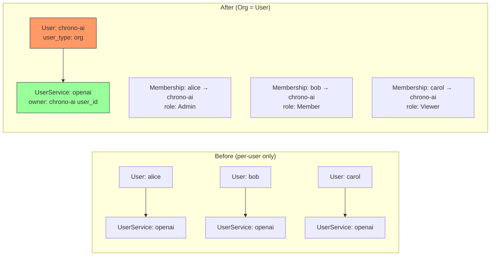
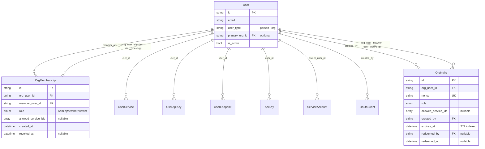
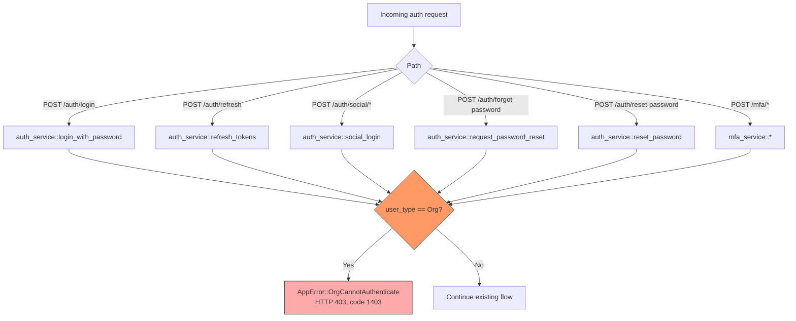
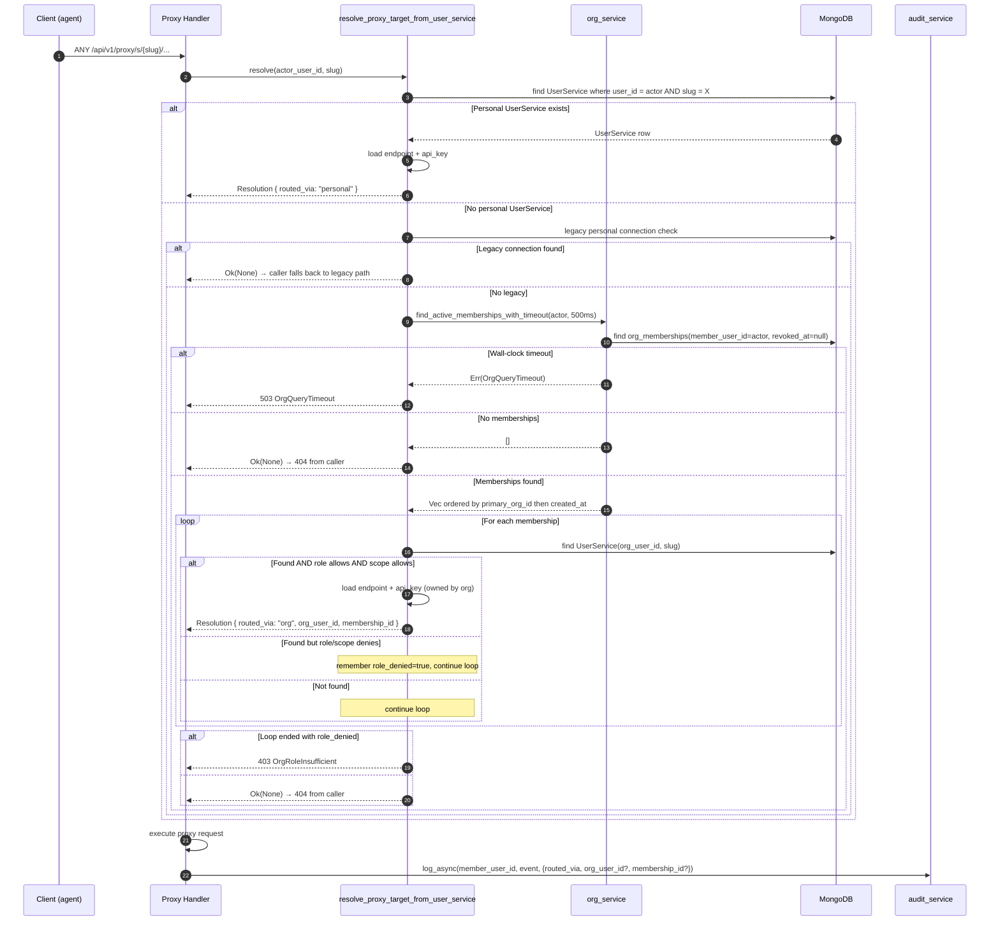

# Organizations (Org Model)

NyxID Organizations let multiple people share a single set of credentials, services, API keys, developer apps, and service accounts under one logical owner. The classic examples:

- A family that all needs to call the same Home Assistant instance.
- A company that buys one OpenAI API key for the team.
- A team whose agents all post messages through one Lark or Discord bot.

The design borrows GitHub's insight that **an organization is just a special kind of user**. There is no separate "org" model — an org is a `User` row with `user_type: "org"` that cannot log in directly. Every existing model that is owned by `user_id` (UserService, UserApiKey, UserEndpoint, ApiKey, ServiceAccount, OauthClient, ServiceApprovalConfig, ApprovalGrant) gets org support for free by having its `user_id` point at the org's user id. The only new model is `OrgMembership`, which connects person users to org users with a role and an optional service-id scope.

This is an opt-in feature. Users without org memberships continue using their personal credentials exactly as before. Users with memberships can choose to share credentials at the org level while still keeping personal ones for their own use.

---

## Table of Contents

- [Concepts](#concepts)
- [Data Model](#data-model)
- [Auth: Why Orgs Cannot Log In](#auth-why-orgs-cannot-log-in)
- [Proxy Credential Resolution](#proxy-credential-resolution)
- [Multi-Org Tiebreaker](#multi-org-tiebreaker)
- [Audit Trail](#audit-trail)
- [REST API](#rest-api)
- [CLI](#cli)
- [Frontend](#frontend)
- [Org-Owned Resources](#org-owned-resources)
- [Org-Aware Approval Cascade](#org-aware-approval-cascade)
- [Org Deletion](#org-deletion)
- [Error Codes](#error-codes)
- [Migration Notes](#migration-notes)
- [Limitations / Future Work](#limitations--future-work)

---

## Concepts



### Roles

| Role | Manage org / members / invites | Use org services through proxy | See org services in `/keys` |
|------|---|---|---|
| **Admin** | Yes | Yes | Yes |
| **Member** | No | Yes | Yes |
| **Viewer** | No | No (`allowed: false`, 403 on proxy) | Yes (read-only) |

### Scope: `allowed_service_ids`

Each membership can carry an optional list of `UserService.id`s that the member is allowed to manage or use. `None` means unrestricted (the entire org). `Some(ids)` restricts the member to that subset. The check is enforced both at proxy time (members cannot call services outside their scope) and at write time (admins cannot edit services outside their own scope).

### Org user vs. person user

Both rows live in the `users` collection. The differences:

| Field | Person user | Org user |
|---|---|---|
| `user_type` | `"person"` (default) | `"org"` |
| `password_hash`, MFA, social provider fields | meaningful | unused (always `None` / `false`) |
| `email` | unique within `user_type: "person"` (partial unique index) | freely set as a contact address; not subject to the unique index |
| Can log in directly | Yes | **No** — see [Auth: Why Orgs Cannot Log In](#auth-why-orgs-cannot-log-in) |
| Owns rows in `user_services`, `user_endpoints`, `user_api_keys`, `api_keys`, `oauth_clients`, `service_accounts`, `approval_grants`, etc. | Yes | Yes — every collection that keys off `user_id` works the same way |

---

## Data Model



### `User` fields added by this feature

```rust
pub user_type: UserType,            // serde default = Person
pub primary_org_id: Option<String>, // optional multi-org tiebreaker
```

```rust
#[derive(Debug, Clone, Serialize, Deserialize, PartialEq, Eq)]
#[serde(rename_all = "snake_case")]
pub enum UserType {
    Person,
    Org,
}
```

Existing rows without `user_type` deserialize as `Person` via serde default, so no backfill is required.

### `OrgMembership`

```rust
pub struct OrgMembership {
    pub id: String,                                 // UUID v4
    pub org_user_id: String,                        // User where user_type = Org
    pub member_user_id: String,                     // User where user_type = Person
    pub role: OrgRole,
    pub allowed_service_ids: Option<Vec<String>>,   // None = entire org
    pub created_at: DateTime<Utc>,
    pub revoked_at: Option<DateTime<Utc>>,
}

pub enum OrgRole { Admin, Member, Viewer }
```

`COLLECTION_NAME = "org_memberships"`. Soft-deletes use `revoked_at`; rows are kept so re-invites can reactivate the same row in place and audit history is preserved across revoke / rejoin cycles.

### `OrgInvite`

```rust
pub struct OrgInvite {
    pub id: String,                            // UUID v4
    pub org_user_id: String,                   // The org being joined
    pub nonce: String,                         // URL-safe one-time token
    pub role: OrgRole,                         // Role granted on redemption
    pub allowed_service_ids: Option<Vec<String>>,
    pub created_by: String,                    // Admin who issued it
    pub expires_at: DateTime<Utc>,             // TTL-indexed
    pub redeemed_by: Option<String>,
    pub redeemed_at: Option<DateTime<Utc>>,
    pub created_at: DateTime<Utc>,
}
```

`COLLECTION_NAME = "org_invites"`. Distinct from the existing `InviteCode` model (which is for new-user registration); the two have different shapes and lifecycles and never share storage.

### Indexes

Set up in `backend/src/db.rs::ensure_indexes()`:

| Collection | Keys | Type | Purpose |
|---|---|---|---|
| `users` | `{ email: 1 }` | partial unique, `{ user_type: "person" }` | preserve person-login uniqueness while allowing real contact emails on orgs |
| `org_memberships` | `{ member_user_id: 1, revoked_at: 1 }` | normal | proxy resolve walks active memberships of the actor |
| `org_memberships` | `{ org_user_id: 1, member_user_id: 1 }` | unique | one row per (org, member) pair across active+revoked |
| `org_memberships` | `{ org_user_id: 1, revoked_at: 1 }` | normal | admin-side member listing |
| `org_invites` | `{ nonce: 1 }` | unique | redeem-by-nonce lookup |
| `org_invites` | `{ expires_at: 1 }` | TTL | auto-expire pending invites |
| `org_invites` | `{ org_user_id: 1 }` | normal | admin invite listing |

The `users.email` index migration is handled by `db.rs` at startup: drop the legacy `email_1` if present, create the partial-unique replacement. Safe because every existing row has `user_type` defaulting to `"person"` and therefore satisfies the partial filter.

---

## Auth: Why Orgs Cannot Log In



`auth_service::ensure_person_user(&user)` is called immediately after every `find_one_by_email` / `find_one_by_id` in the auth paths above. Person-login email lookups also include an explicit `user_type: "person"` filter as belt-and-suspenders even though the partial unique index already guarantees uniqueness for that subset.

---

## Proxy Credential Resolution

### Explicit service selection (`?_nyxid_via=`)

Both proxy endpoints (`/api/v1/proxy/{service_id}/{path}` and `/api/v1/proxy/s/{slug}/{path}`) accept an optional query parameter `?_nyxid_via=<user_service_id>`. When present, the proxy **skips** the auto-resolution cascade and loads the specified `UserService` directly from `proxy_service::resolve_proxy_target_by_user_service_id`.

The caller gets the `UserService.id` from `GET /api/v1/user-services` or `GET /api/v1/keys`, which already list both personal and org-inherited services tagged with `credential_source`. This lets a user who has both a personal and an org credential for the same slug explicitly choose which one to use on a given request:

```bash
# List services — see both personal and org entries
nyxid service list --output json
# → id: "abc123", slug: "llm-openai", credential_source: { type: "personal" }
# → id: "def456", slug: "llm-openai", credential_source: { type: "org", org_id: "...", ... }

# Use the org credential explicitly
curl -H "Authorization: Bearer $TOKEN" \
  "https://nyx.example.com/api/v1/proxy/s/llm-openai/v1/chat/completions?_nyxid_via=def456" \
  -d '...'
```

Access check mirrors the auto-resolution: direct owners always pass, org admins must pass `allowed_service_ids` scope, org members must also have `role.can_proxy()`, and viewers are denied. If the specified `UserService.id` doesn't exist or the actor doesn't have proxy access, the endpoint returns `404`.

**Route constraint.** The selected UserService must match the service named in the URL path. The slug handler verifies `UserService.slug == {slug}` and the catalog-id handler verifies `UserService.catalog_service_id == {service_id}`. If they don't match the endpoint returns `400 BadRequest` with a clear error — this prevents a caller from using `_nyxid_via` on a `/proxy/s/llm-openai/...` URL to silently proxy through an `api-github` credential.

The `_nyxid_via` query parameter is **stripped** from the forwarded request before it reaches the downstream service (via `strip_internal_query_params` in `execute_proxy_inner`). Downstream services never see NyxID routing metadata.

**CLI support:** `nyxid proxy request <slug> <path> --via-service <USER_SERVICE_ID>` appends the query param automatically.

When `?_nyxid_via=` is absent, the auto-resolution cascade fires as usual (personal > legacy > org fallback).

### Auto-resolution cascade

The proxy runs the same resolution every request, with org fallback layered on top of the personal path:



### The 500 ms wall-clock timeout

Users with a personal `UserService` never reach the fallback path — they short-circuit at step 4. Users without one pay one extra Mongo round-trip per proxy call. If Mongo is degraded, that round-trip becomes the dominant latency for proxy 404s, so the org fallback query is wrapped in `tokio::time::timeout(Duration::from_millis(500), ...)` to bound blast radius.

`Mongo's max_time_ms` is not enough on its own — it only governs query plan execution, not connection acquisition or cursor iteration. The wall-clock timeout is the only way to guarantee bounded latency end-to-end.

Constant: `org_service::ORG_FALLBACK_TIMEOUT = Duration::from_millis(500)`. Update both this constant and this doc together if it ever changes.

### Legacy personal guard

Pre-migration personal connections (`UserServiceConnection`, `UserProviderToken`) outrank any org-shared credential the user might inherit. Joining an org must never silently retarget a user's own credentials, and must never throw a scope/role 403 at someone who already had working personal access. The legacy guard runs **between** the personal `UserService` lookup and the org fallback so that resolution is unambiguous.

---

## Multi-Org Tiebreaker

When the same actor belongs to multiple orgs that all expose the same service slug, NyxID picks a deterministic winner:

1. **Personal `UserService`** (always wins).
2. **Legacy personal connection** (wins for users not yet migrated).
3. **`User.primary_org_id`**, if set and the user is still a member of that org.
4. **Earliest active membership by `created_at`**.

`primary_org_id` is set via `nyxid org set-primary --org-id <ORG_ID>` (or unset with `--clear`).

---

## Audit Trail

Every proxy call routed through an org carries the routing context in its audit `event_data`:

```json
{
  "service_id": "...",
  "user_service_id": "...",
  "routed_via": "org",
  "org_user_id": "<org user_id>",
  "member_user_id": "<actor user_id>",
  "membership_id": "..."
}
```

Personal-routed calls record `routed_via: "personal"` and omit the org fields. Audit writes are fire-and-forget (`audit_service::log_async`) so audit failures never block the proxy request — degraded audit storage degrades observability, not availability.

---

## REST API

All routes are under `/api/v1`. Org-aware mutation handlers gate on the new `org_service::resolve_owner_access(actor, target_owner_id)` helper, which returns one of `Direct | AsOrgAdmin | AsOrgMember | Forbidden` and carries the membership's `allowed_service_ids` so per-resource scope checks compose with role checks.

### Org CRUD

| Method | Path | Auth | Purpose |
|---|---|---|---|
| `POST` | `/orgs` | session | Create an org (caller becomes the first Admin) |
| `GET` | `/orgs` | session | List orgs the caller belongs to |
| `GET` | `/orgs/{id}` | org member | Org detail |
| `PATCH` | `/orgs/{id}` | org admin | Update display name / avatar |
| `DELETE` | `/orgs/{id}` | org admin | Delete org (see [Org Deletion](#org-deletion)) |

### Members

| Method | Path | Auth | Purpose |
|---|---|---|---|
| `GET` | `/orgs/{id}/members` | org member | List members |
| `POST` | `/orgs/{id}/members` | org admin | Add member by user_id (admin add path) |
| `PATCH` | `/orgs/{id}/members/{member_user_id}` | org admin | Change role or `allowed_service_ids` |
| `DELETE` | `/orgs/{id}/members/{member_user_id}` | org admin | Revoke membership |

**Last-admin guard.** `PATCH` and `DELETE` on a member refuse to remove the last active admin. An admin who tries to demote or revoke themselves while they are the only admin gets `409 Conflict` with the message "cannot remove or demote the last active admin". The intent is to keep the org recoverable: `DELETE /orgs/{id}` also requires a current admin and would otherwise leave any owned services / keys / policies stranded. Admins who actually want to dissolve the org must `DELETE /orgs/{id}` instead, which cascades memberships once the live blockers are clear.

`POST /orgs` rejects org-owned actors with `OrgCannotAuthenticate` (an org-owned API key cannot create an org), and rolls back the org user insert if the membership-create step fails for any other reason — no matter what, no zero-admin org row is ever left behind.

### Invites

| Method | Path | Auth | Purpose |
|---|---|---|---|
| `POST` | `/orgs/{id}/invite` | org admin | Create a one-time invite (returns `nonce`) |
| `GET` | `/orgs/{id}/invites` | org admin | List pending invites |
| `DELETE` | `/orgs/{id}/invites/{invite_id}` | org admin | Cancel a pending invite |
| `POST` | `/orgs/join/{nonce}` | session | Redeem an invite — caller joins the org |

Invites carry their own `role` and optional `allowed_service_ids`. Once redeemed, the invite is marked `redeemed_by` + `redeemed_at` and the corresponding `OrgMembership` is created (or reactivated if a revoked row exists for the same pair).

**`ttl_hours` is bounded server-side** to `1..=720` (30 days, mirroring the web schema cap). The CLI enforces the same bound as a fail-fast UX. Out-of-range values get `400 ValidationError` instead of falling through to `chrono::Duration::hours`, which panics on integers that don't fit its internal representation.

### Personal multi-org tiebreaker

| Method | Path | Auth | Purpose |
|---|---|---|---|
| `PATCH` | `/users/me/primary-org` | session | Set or clear `primary_org_id` for the caller |

### Existing endpoints that became org-aware

Every endpoint listed below already accepted a single `user_id`. With the org model they additionally accept a `target_org_id` (or, for query endpoints, `?org_id=<ORG_ID>`). The caller must be an admin of the target org. There is no new endpoint surface for these — the same routes serve both personal and org modes.

| Endpoint | Org param | Notes |
|---|---|---|
| `POST /keys` | `target_org_id` body field | Auto-provisions UserEndpoint + UserApiKey + UserService under the org |
| `GET /keys` | (org-tagged via `credential_source`) | Returns personal + org-inherited keys with provenance |
| `POST /api-keys` | `target_org_id` body field | Org-owned NyxID API keys (agent identities) |
| `GET /api-keys?org_id=` | query param | List org-owned API keys |
| `POST /api-keys/{id}/bindings` | (auto: binding inherits owner) | Per-binding scope check applies for scoped admins |
| `POST /admin/service-accounts` | `target_org_id` body field | Org-owned SAs; legacy admin path still works for global SAs |
| `GET /admin/service-accounts?org_id=` | query param | List org-owned SAs |
| `POST /developer/oauth-clients` | `target_org_id` body field | Org-owned developer apps |
| `GET /developer/oauth-clients?org_id=` | query param | List org-owned developer apps |
| `POST /providers/{id}/connect` | implicit via key flow | OAuth tokens for org keys are stored under the org's user_id |
| `GET /approvals/requests?org_id=` | query param | List approval requests filed against org services |
| `GET /approvals/grants?org_id=` | query param | List active approval grants owned by the org |
| `DELETE /approvals/grants/{id}?org_id=` | query param | Revoke an org-owned grant |
| `GET /approvals/service-configs?org_id=` | query param | List org-level approval policies |
| `PUT /approvals/service-configs/{service_id}?org_id=` | query param | Set an org-level approval policy |
| `DELETE /approvals/service-configs/{service_id}?org_id=` | query param | Remove an org-level approval policy |
| `GET /llm/status` | (implicit) | Walks the actor's personal credentials *and* every non-viewer org membership; reports the best-available status (`ready` > `expired` > `not_connected`) per provider so org-shared LLM credentials surface in the dashboard |

The CredentialSource discriminator on `GET /user-services` and `GET /keys` (see [Org-Owned Resources](#org-owned-resources)) is what lets clients distinguish personal items from org-inherited ones in a single response.

---

## CLI

Every org operation has a `nyxid org *` subcommand. Other resource subcommands (`service`, `api-key`, `approval`, `service-account`, `developer-app`) take an `--org <ORG_ID>` flag wherever a personal action would otherwise default to the actor.

```bash
# Create + manage orgs
nyxid org create --display-name "Chrono AI"
nyxid org list
nyxid org show <ORG_ID>
nyxid org update <ORG_ID> --display-name "New Name"
nyxid org delete <ORG_ID> --yes

# Multi-org tiebreaker
nyxid org set-primary --org-id <ORG_ID>      # set
nyxid org set-primary --clear                # revert to earliest-joined

# Members
nyxid org member list <ORG_ID>
nyxid org member add <ORG_ID> --user-id <USER_ID> --role member
nyxid org member update <ORG_ID> <MEMBER_USER_ID> --role admin
nyxid org member update <ORG_ID> <MEMBER_USER_ID> --allowed-service-ids "<svc1>,<svc2>"
nyxid org member update <ORG_ID> <MEMBER_USER_ID> --allowed-service-ids ""    # clear scope
nyxid org member remove <ORG_ID> <MEMBER_USER_ID> --yes

# Invites
nyxid org invite create <ORG_ID> --role member
nyxid org invite create <ORG_ID> --role viewer --ttl-hours 168
nyxid org invite create <ORG_ID> --role member --allowed-service-ids "<svc1>,<svc2>"
nyxid org invite list <ORG_ID>
nyxid org invite cancel <ORG_ID> <INVITE_ID> --yes
nyxid org join ORGINV-ABCDEF12345678
nyxid org join "https://nyx.example.com/orgs/join/ORGINV-..."   # full URL also works

# Org-owned services / keys / SAs / apps (existing commands + --org)
nyxid service add llm-openai --org <ORG_ID>
nyxid service add api-google --oauth --org <ORG_ID>
nyxid service add llm-anthropic --device-code --org <ORG_ID>
nyxid service add --custom --org <ORG_ID> --label "Internal" --endpoint-url ...
nyxid service add llm-openai --org <ORG_ID> --via-node my-laptop-node

nyxid api-key create --name "shared-coding-agent" --org <ORG_ID> --platform claude-code
nyxid api-key list --org <ORG_ID>
nyxid api-key rotate <ID>           # any org admin can rotate
nyxid api-key bind <ID> --service <SLUG> --credential <LABEL>

# Org approval policies + grants
nyxid approval list --org <ORG_ID> --output json
nyxid approval service-configs --org <ORG_ID> --output json
nyxid approval set-config <SERVICE_ID> --org <ORG_ID> --require-approval true
nyxid approval set-config <SERVICE_ID> --org <ORG_ID> --require-approval true --approval-mode grant
nyxid approval grants --org <ORG_ID> --output json
nyxid approval revoke-grant <GRANT_ID> --org <ORG_ID> --yes
```

Service create with `--org X --via-node Y` is supported: the node remains personally owned by the admin (no re-registration), the org service references it, and proxy-time fallback queries use the org's user_id so failover candidates correctly reflect the org's bindings. The cross-check is actor-based — see [Org-Owned Resources](#org-owned-resources) → "Node-routed services".

---

## Frontend

| Page | Route | Purpose |
|---|---|---|
| Orgs list | `/orgs` | All orgs the caller belongs to, with role badges and a "Create org" CTA |
| Org detail | `/orgs/{id}` | Tabs: **Members**, **Invites**, **Approvals**, **Settings** (admin-only tabs hidden for non-admins) |
| Org join | `/orgs/join/{nonce}` | Redeem an invite link, then redirect to `/orgs/{id}` |
| AI Services / Keys | `/keys` | Personal vs. each org section, with viewer-role and out-of-scope items rendered read-only |

Auth-aware behavior:

- `useUpdateMember` invalidates the org detail query in addition to the members list, so if an admin self-demotes, the admin-only tabs disappear immediately (no stale UI requiring a hard refresh).
- The Approvals tab includes a per-service policy editor and an org grants list. The picker only offers services with a `catalog_service_id` (custom-only services have no per-service approval surface) and submits the `catalog_service_id` to match the backend's expected key space.
- Items with `credential_source.type === "org" && credential_source.allowed === false` are visible (so viewers see what exists) but rendered read-only and not actionable from agent flows.

---

## Org-Owned Resources

The Org=User insight means every resource that already keys off `user_id` works for orgs without a new model. The backend gates writes through `org_service::resolve_owner_access` and translates membership scopes (`UserService.id` space) to backing-resource scopes where needed.

### `credential_source` discriminator

```rust
pub enum CredentialSource {
    Personal,
    Org {
        org_user_id: String,
        org_name: String,
        role: OrgRole,
        allowed: bool,   // false for viewers / out-of-scope members
    },
}
```

`GET /user-services`, `GET /keys`, and several enrichment endpoints carry this on every item so clients can group personal vs. org credentials and gate UI affordances.

### Resources that became org-aware

| Resource | Owner field | Org-aware via |
|---|---|---|
| `UserService` / `UserEndpoint` / `UserApiKey` | `user_id` | `target_org_id` on `POST /keys`; admins of the target org can manage |
| `ApiKey` (NyxID agent identity) | `user_id` | `target_org_id` on `POST /api-keys`; ApiKey's own `allowed_service_ids` is its agent scope, *not* the membership scope |
| `AgentServiceBinding` | `user_id` | inherits the owning ApiKey's owner; per-binding scope check on `user_service_id` |
| `OauthClient` (developer app) | `created_by` | `target_org_id` on `POST /developer/oauth-clients` |
| `ServiceAccount` | `owner_user_id` (with `created_by` fallback) | `target_org_id` on `POST /admin/service-accounts` |
| `UserProviderToken` (OAuth provider tokens) | `user_id` | OAuth flows kicked off with `target_org_id` store the token under the org |
| `ServiceApprovalConfig` | `user_id` | `?org_id=X` on the service-config endpoints |
| `ApprovalGrant` | `user_id` | created under the org when an org-policy approval is decided in grant mode |

### Resource scope and `allowed_service_ids`

`OrgMembership.allowed_service_ids` is keyed by **`UserService.id`**, not by catalog id and not by ApiKey/OauthClient id. The owner-resolver helpers translate as needed:

- **`UserEndpoint`** → look up every `UserService` whose `endpoint_id` matches; gate via `allows_any_resource(&user_service_ids)`. An orphan endpoint (no backing service) is only writable by Direct owners and unscoped admins.
- **`UserApiKey` (external)** → look up every `UserService` whose `api_key_id` matches; same `allows_any_resource` gate.
- **`ApiKey` (NyxID agent identity)** → no resource scope. The membership scope governs which **services** the admin can manage, not whether they can rotate an API key. The API key has its own `allowed_service_ids` field that bounds what its bearer can call at runtime.
- **`OauthClient`** → no resource scope. OAuth clients are developer-app identities, not services.
- **`AgentServiceBinding`** → enforced per-binding: the binding's `user_service_id` is checked against the membership scope on create / list (filter) / delete.

### Approval requests and the catalog id translation

`ApprovalRequest.service_id` stores a `DownstreamService.id` (the catalog id, not the per-user service). Decide-side scope gating uses `user_service_service::user_service_ids_for_catalog(db, request.user_id, request.service_id)` to translate to the `UserService.id`(s) backing the request, then runs `OwnerAccess::allows_any_resource` against the result. If no `UserService` exists for that pair the request can only be decided by Direct owners or unscoped admins — safer than letting any scoped admin land it.

### Node-routed services

An org-shared service can route through a member's personal node. The node itself stays personally owned (no need to re-register it under the org). The check is **actor-based**, not "service owner == node owner": when an org admin creates an org-owned service with `--via-node my-laptop-node`, `node_service::ensure_node_writable_by_actor(db, actor_user_id, node_id)` validates that the actor has `OwnerAccess::can_write` on the node. The same helper is used by `sync_node_binding_for_user_service`, so `NodeServiceBinding.user_id` ends up as the org's user_id (where proxy routing looks it up) while node ownership is validated against the actor.

**Why nodes stay personal (design rationale).** A node agent runs on a specific piece of physical hardware that someone installed, has root on, and holds the auth token for. Making the database say "the org owns it" doesn't change who can `sudo systemctl stop nyxid-node`, so org ownership at the DB layer would be a fiction that doesn't match operational reality. Personal ownership also gives three concrete wins:

1. **Multi-org lending is free.** One Raspberry Pi can back a family org, a company org, and personal services simultaneously — each consumer gets its own `NodeServiceBinding` row.
2. **Admin-leaves semantics are clean.** When an admin leaves an org, their personal node keeps running for their personal services; the org's bindings to it stop being writable (the actor-based check fails on the next edit) and another admin rebinds the org service to their own node. No orphaned resources, no transfer flow.
3. **Zero re-registration.** An admin who already has a personal node can run `nyxid service add --org X --via-node my-laptop` and be done. No parallel agent, no second config file.

The trade-off: data-center / always-on corporate hardware doesn't fit the "somebody's personal laptop" shape cleanly. See [Limitations / Future Work](#limitations--future-work) → "Optional org-owned nodes" for a proposed follow-up that adds org ownership as an *opt-in* mode without removing the personal default.

---

## Org-Aware Approval Cascade

Approval policies cascade differently for org-owned services so an org admin can require approval on behalf of every member at once.

### Resolution rules (`approval_service::resolve_org_aware_approval`)

1. If the service being called is **owned by an org** (detected via `User.user_type.is_org()`, NOT by comparing actor to owner) AND the org has a `ServiceApprovalConfig` row for that service, the org's policy is **dominant**. The actor's personal gate cannot override it. `primary_owner_user_id` is set to the org's user_id and `from_org_policy = true`.
2. Otherwise, fall back to the actor's per-service config for that catalog service.
3. Otherwise, fall back to the actor's global toggle (`nyxid approval enable / disable`).

The first rule's "detect by user_type" is what makes the cascade work for **org-owned API keys and service accounts** where the actor IS the org id — comparing actor to owner would never trigger the org branch in those cases.

### Notification fan-out

When `from_org_policy = true`, the proxy / LLM / SSH handlers populate `ApprovalRequest.notify_user_ids` with the org's current admin list (`org_service::list_admin_user_ids`). Push notifications and Telegram messages fan out to every admin so any of them can decide. The first admin's notification channel drives the wall-clock timeout; the rest receive parallel notifications.

### Fail-closed for orgs with no admins

If `list_admin_user_ids` returns empty (e.g. the last admin removed themselves), the proxy / LLM / SSH handlers return `AppError::OrgApprovalNoAdmin` (HTTP 503, error code 8106) instead of routing the request to the requesting member. This prevents a member from self-approving an org-gated request after the admin set has degenerated. The org must add an admin before the gated service is usable again.

### Decide-time authorization

`ensure_caller_can_decide` is the single source of truth at decision time. The rules:

1. Literal owner match (`request.user_id == auth_user_id`) → personal request, allowed.
2. Live `resolve_owner_access(...).can_write()` → org admin, then translate `request.service_id` to `UserService.id`(s) and require `allows_any_resource` to pass.
3. Otherwise → `Forbidden`.

`notify_user_ids` is **not** consulted here. It is a routing hint captured at creation time and would otherwise let an admin who has since been removed or demoted decide outstanding requests. Live admin status is the only check.

### Service-config CRUD scope

`PUT` / `DELETE` / `GET` on `/approvals/service-configs/{service_id}?org_id=X` enforce the same per-service scope as the decide path. After confirming the actor is an admin of the target org, the handler translates the catalog id in the URL to the underlying `UserService.id`s via `user_service_service::user_service_ids_for_catalog` and checks `OwnerAccess::allows_any_resource`. A scoped admin (`allowed_service_ids = [svc-A]`) gets `OrgRoleInsufficient` when they try to set or delete a policy on `svc-B`. The list endpoint applies the same scope as a filter so a scoped admin only ever sees policies they manage.

**Orphan handling is symmetric across list and delete.** When the catalog id has no backing `UserService` (e.g. the service was already removed but the policy row lingers), `allows_any_resource(&[])` is `true` for unscoped admins and `false` for scoped admins. The list filter uses that directly, and `ensure_service_config_in_scope` matches it -- so an unscoped admin can see *and* delete a stale config, while a scoped admin sees neither. Without this symmetry, an admin could see a config they couldn't remove and the org would accumulate undeletable rows.

### Grant ownership

In grant mode, an approved org-policy request creates an `ApprovalGrant` under the **org's** `user_id`, not the requesting member's. The next call from any member of the same org reuses the same grant instead of triggering a fresh approval. Org admins can list / revoke org-owned grants via `?org_id=X` on the grants endpoints (or `nyxid approval grants --org <ORG_ID>`).

### Audit attribution

Org-policy decisions include `policy_owner_user_id: "<org_user_id>"` in the audit `event_data` alongside the existing `routed_via: "org"`, `org_user_id`, `member_user_id` fields, so it is unambiguous whose policy gated the request.

---

## Org Deletion

`DELETE /orgs/{id}` (admin only) refuses to proceed while the org still owns *live* resources, then cascade-deletes dead state.

### Live blockers (must be empty)

Each blocker filter uses the same live-state semantics as the corresponding API delete path. Soft-deleted rows (those that linger in the collection with `is_active = false` or `status = "revoked"`) are NOT counted as blockers — otherwise an org that ever held a service would be permanently undeletable.

```text
- *active* user services            ({ user_id, is_active: true })
- *active* legacy service connections ({ user_id, is_active: true })
- endpoints                         ({ user_id })                    [hard-deleted]
- external API keys (UserApiKey)    ({ user_id })                    [hard-deleted]
- *active* NyxID API keys (ApiKey)  ({ user_id, is_active: true })
- *non-revoked* provider tokens     ({ user_id, status != "revoked" })
- per-service approval configs      ({ user_id })                    [hard-deleted]
- *active* approval grants          ({ revoked: false, expires_at > now })
- *pending* approval requests       ({ status: "pending" })
- *active* service accounts         ({ owner_user_id, is_active: true })
- *active* developer OAuth clients  ({ created_by, is_active: true })
- *active* channel bots             ({ user_id, is_active: true })
- *active* channel conversations    ({ user_id, is_active: true })
- *active* credential nodes         ({ user_id, is_active: true })
- *active* custom catalog services  ({ created_by, is_active: true })
```

Legacy `user_service_connections` rows are still treated as live credentials by `proxy_service::user_has_legacy_personal_connection` during the migration window (they outrank org-shared credentials so a personal pre-migration connection never gets silently retargeted by joining an org). An org-owned API key can hit `POST /connections/{id}` because that route sits in the shared router (`api_v1_shared`) which only blocks delegated tokens, so they're a real org-deletion concern. The admin must call `DELETE /connections/{service_id}` first, which soft-deletes the row and clears the credential before the org can be deleted.

If any of these counts is non-zero, the API returns `409 Conflict` with a list (`"Cannot delete org while it still owns 3 user services, 1 NyxID API key, …"`) and the admin must clean them up first. Without this guard the org user record could disappear while orphaned resources continue to point at it, and `resolve_owner_access` would deny every read/write so nobody could clean them up.

The channel-bot block is especially important. Org-owned NyxID API keys can register bots via `POST /channel-bots` (the human-only router still allows API-key auth on those routes), and the inbound-webhook handler accepts any active bot row by id without a live owner check. If we let the org disappear while a bot was still active, the platform-side webhook would keep firing forever with no way to deregister it. The blocker forces the admin to call `DELETE /channel-bots/{id}` first, which deregisters the webhook on the platform side and soft-deletes the bot + its conversations.

Credential nodes are blocked for the same reason. `node_service::authenticate_node` consults the active node row on every WS reconnect, so a dangling org-owned node would keep accepting agent connections and proxying traffic on behalf of a non-existent org. The admin must call `DELETE /nodes/{id}` first; the node agent fails on its next heartbeat. The cascade also clears outstanding `node_registration_tokens` for the org so the WS registration path cannot mint a fresh node row out from under the about-to-be-deleted org. Bindings owned by the org are cleaned up regardless of which physical node they reference — org-shared services routed through a *personal* node create a `NodeServiceBinding` with `user_id = org_user_id` (so proxy resolution finds it under the effective owner), and those rows would otherwise leak after the org is gone.

Custom catalog services (`POST /services` rows where `created_by = org_user_id`) are also blocked. An *active* row stays visible to every other authenticated user via the normal `/services` listing -- the visibility filter does not depend on the creator being alive -- and once the org user record is gone the built-in `services_helpers::require_admin_or_creator` cleanup gate fails for everyone except a global admin. The blocker forces the admin to call `DELETE /services/{id}` first, which soft-deletes the catalog row, wipes legacy user credentials, and **also deactivates the auto-generated OIDC OAuth client** when the service was registered with `auth_method == "oidc"` (the OAuth client id is captured on `service.oauth_client_id` at registration time). The cascade then removes the soft-deleted catalog row plus its child `service_endpoints` and `service_provider_requirements` rows (joined via the org's owned downstream service ids).

Without that OAuth client deactivation, deleting the OIDC service would leave the auto-generated `oauth_clients` row `is_active = true`, which both blocks `DELETE /orgs/{id}` (active OAuth client = blocker) and lets the supposedly-deleted OIDC service keep accepting OAuth authorize / token requests until someone separately discovered and deactivated the generated app. The OAuth authorize / token paths gate purely on `oauth_clients.is_active`, not on the parent service state, so the parent → child deactivation has to be explicit on the service-delete path.

### Cascade-deleted (no admin action required)

```text
- decided approval requests (status in {approved, rejected, expired})
- dead approval grants      (revoked = true OR expires_at <= now)
- soft-deleted user services      (is_active = false)
- soft-deleted legacy connections (is_active = false)
- soft-deleted NyxID API keys     (is_active = false)
- agent_service_bindings          (all rows for the org)
- oauth_states                    (user_id OR target_user_id == org user_id, in-flight OAuth/device-code state)
- user_provider_tokens            (ALL rows for the org user_id, plus rows whose user_id is one of the org's SA ids)
- soft-deleted service accounts   (is_active = false)
- service_account_tokens          (all rows whose service_account_id belonged to the org)
- soft-deleted developer OAuth clients (is_active = false)
- refresh_tokens                  (all rows whose client_id belonged to the org)
- consents                        (all rows whose client_id belonged to the org)
- soft-deleted channel bots       (is_active = false)
- soft-deleted channel conversations (is_active = false)
- channel messages                (all rows for the org)
- channel event logs              (all rows whose conversation_id belonged to the org)
- openclaw_channel_mappings       (all rows for the org -- cascade-only, see note)
- notification_channels           (the row for the org -- cascade-only, see note)
- node_registration_tokens        (all rows for the org)
- node_service_bindings           (all rows owned by the org -- includes bindings to personal nodes)
- soft-deleted credential nodes   (is_active = false)
- soft-deleted custom catalog services (created_by == org, is_active = false)
- service_endpoints                (all rows whose service_id belonged to the org)
- service_provider_requirements    (all rows whose service_id belonged to the org)
- user_provider_credentials       (all rows for the org -- cascade-only, see note)
- org_memberships (all rows for the org)
- org_invites    (all rows for the org, redeemed or pending)
```

These rows are dead state once the org is gone — no API call could read or mutate them again. Cascading them stops the database from accumulating orphans referencing the deleted org user_id. Five collections key off something other than `user_id` and need a snapshot-then-delete pattern:

- **`channel_event_logs`** keys off `conversation_id`. The cascade snapshots the org's conversation ids first, then issues `delete_many({ conversation_id: $in: [...] })`. Without that ordering the logs would lose their only path back to the org.
- **`service_account_tokens`** keys off `service_account_id`. The cascade snapshots the org's owned `service_accounts._id` set first, then issues `delete_many({ service_account_id: $in: [...] })`. The standard `service_account_service::delete_service_account` path only marks tokens as `revoked: true` rather than deleting them, so without this cascade the token rows would outlive the org. Mirrors the same cleanup that `admin_user_service::delete_user` already does for normal person users.
- **SA-owned `user_provider_tokens`** reuse the same SA-id snapshot. `UserProviderToken.user_id` is overloaded to hold either a real user_id or a service-account id (admin-on-behalf provider connect stores tokens under `sa.id` — see `handlers/admin_sa_providers`). After the snapshot is collected, the cascade also issues `delete_many({ user_id: { $in: sa_ids } })` against `user_provider_tokens`, plus the same against `oauth_states.user_id` / `oauth_states.target_user_id` to clean up any in-flight admin-on-behalf flows.
- **`service_endpoints` and `service_provider_requirements`** key off `service_id`. The cascade snapshots the org's owned `downstream_services._id` set first, then issues `delete_many({ service_id: $in: [...] })` against both child collections. Without that ordering the children would survive the parent service tombstones forever and remain reachable via `endpoints.rs` lookups that gate on `service.created_by` (which now resolves to a deleted user).
- **`refresh_tokens` and `consents`** both key off `client_id` (the developer-app OAuth client). The cascade snapshots the org's owned `oauth_clients._id` set once and reuses it for both `delete_many({ client_id: $in: [...] })` calls. The refresh-token cascade is belt-and-suspenders on top of the live `is_active` validation in `token_service::refresh_tokens` (see "OAuth refresh-token validation" below). The consent cascade is the only path that removes them — there is no DELETE handler that targets consents by client, and otherwise the rows would remain enumerable on every user's `/consents` page and the admin listing after the issuing org is gone.

### OAuth refresh-token validation

Two paths in the OAuth subsystem need a live check on the issuing client so a deleted (or org-deleted) developer app cannot keep minting user tokens:

- **`oauth_service::exchange_authorization_code`** filters the OAuth client lookup by `is_active: true`. Auth codes already issued against a soft-deleted client cannot be exchanged, so the window for a stale code to mint a fresh token after delete is closed.
- **`token_service::refresh_tokens`** re-validates the issuing client on every refresh. After loading the stored refresh-token row, when `stored.client_id != Uuid::nil()` (the first-party login sentinel), the function looks up the `OauthClient` by id with `is_active: true` and rejects with `Unauthorized` if the client is missing or deactivated. The stored refresh row is also flipped to `revoked: true` so subsequent retries follow the existing reuse-detection path. First-party login refresh flows (`auth_service::login_with_password` / `refresh_session_with_token`) bypass this check entirely because they never had an `OauthClient` row to begin with.

Together, these two checks make refresh tokens minted by an org-owned developer app stop working **immediately** when the app is deleted (whether explicitly via `DELETE /developer/oauth-clients/{id}` or transitively via `DELETE /orgs/{id}`), instead of remaining valid for the JWT TTL.

**OAuth callback race.** Provider connect flows store an `OAuthState` row at initiation time and consume it at callback / device-code-poll time. If a callback for an org-targeted flow lands *after* `delete_org_user` started, it could otherwise mint a fresh `user_provider_tokens` row owned by the about-to-be-deleted org. We close that race in two layers:

1. The `oauth_states` cascade runs **early** (before the user record delete) so any callback arriving after that point cannot find a state row to consume, and the callback returns a clean `BadRequest`.
2. The `user_provider_tokens` cascade is now an **unfiltered** `delete_many({ user_id: org_user_id })` rather than the previous "revoked only" filter, so any token that managed to land in the small window between the `oauth_states` cascade and the user delete still gets cleaned up before the org user record disappears.

The audit log lives in its own collection and survives deletion intact.

`openclaw_channel_mappings` is intentionally **cascade-only**, not a blocker. NyxID never registers anything with OpenClaw — the user manually pastes the per-mapping webhook secret into their OpenClaw plugin, and the inbound webhook handler resolves the mapping by `(channel, channel_user_id)` plus an HMAC check against the stored secret hash. After cascade-delete, the next inbound webhook fails the lookup (or the HMAC) and the user re-creates the mapping if they still want it. There is no `DELETE /integrations/openclaw/mappings` endpoint either, so promoting this to a blocker would render any org with a mapping permanently undeletable.

`notification_channels` is also **cascade-only**. An org-owned API key can call any `/notifications/*` endpoint and trip `get_or_create_channel`, which inserts a row keyed by `auth_user.user_id` (the org user_id). The row is dead state from creation: an org cannot meaningfully receive a notification because the approval fan-out targets *person* admin user_ids, not the org itself, so any embedded Telegram link / push device token attached to an org user record never gets read. The cascade clears it on delete; there is no platform-side cleanup beyond letting FCM/APNs garbage-collect dormant subscriptions, which they do automatically.

`user_provider_credentials` is **cascade-only** by `user_id`. The collection holds per-user OAuth client overrides (encrypted client_id + client_secret) for providers that allow user-supplied app credentials. There is no DELETE handler today, so blocking would render any org with a credential row permanently undeletable, and the encrypted blobs are useless without the org user.

After cascading, the org `User` row itself is hard-deleted.

---

## Error Codes

Org-related errors live in the 8100–8199 range (8000–8099 is reserved for nodes). The `OrgCannotAuthenticate` exception sits in the 1xxx auth range for symmetry with the rest of the auth errors.

| Code | Variant | HTTP | Meaning |
|---|---|---|---|
| `1403` | `OrgCannotAuthenticate` | 403 | Tried to log in as an org user via password / refresh / social / forgot-password / MFA |
| `8100` | `OrgQueryTimeout` | 503 | Org-fallback membership query exceeded its 500 ms wall-clock budget; usually means MongoDB is degraded |
| `8101` | `OrgNotFound` | 404 | Target org id does not exist |
| `8102` | `OrgMembershipRequired` | 403 | You tried to access an org you do not belong to |
| `8103` | `OrgRoleInsufficient` | 403 | Viewer tried to proxy, or non-admin tried to manage; also surfaced when an admin's `allowed_service_ids` excludes the target |
| `8104` | `OrgInviteInvalid` | 400 | Unknown nonce or already-redeemed invite |
| `8105` | `OrgInviteExpired` | 410 | Invite TTL elapsed; ask the admin for a new one |
| `8106` | `OrgApprovalNoAdmin` | 503 | Org approval policy fired but the org has no active admins to decide; add an admin and retry |

---

## Migration Notes

This feature is purely additive at the schema level for existing rows. No data backfill is needed.

What `db.rs::ensure_indexes()` does at first start with this code deployed:

1. Drops the legacy `email_1` unique index on `users` if it exists.
2. Creates the partial-unique replacement `{ email: 1 }` filtered to `{ user_type: "person" }`. Safe because every existing row deserializes with `user_type = Person` via serde default.
3. Creates the three `org_memberships` indexes and the three `org_invites` indexes (`nonce` unique, `expires_at` TTL, `org_user_id`).

Existing users have no memberships and the `/orgs` page shows an empty state for them. The proxy resolution chain short-circuits at the personal `UserService` lookup for any user who already has one, so the new fallback path is invisible to migration users.

**Rollback:** drop the `/orgs` routes and the org fallback branch in `proxy_service.rs`. Leave the collections and indexes in place — they cost nothing if unused. No data migration to reverse.

---

## Limitations / Future Work

The following are intentionally **not** in this feature and are tracked separately:

- **Credential rotation notifications** — when a shared OAuth token expires or is rotated, members are not notified.
- **Org usage dashboard** — aggregate request counts, latency, error rates per org.
- **Org billing / quota** — per-org rate limits and spend caps.
- **Cross-org transfer of resources** — there is no "move my personal OpenAI into the org" path. New shared services should be created with `--org` from the start.
- **Nested orgs / sub-orgs** — flat membership only.
- **SSO for orgs (SAML / OIDC auto-membership)** — future RFC.
- **Optional org-owned nodes** — see below.

### Optional org-owned nodes (proposed follow-up)

Today every `Node` row has `user_id = <person user_id>`. The default is a good match for laptops and home servers (see [Node-routed services](#node-routed-services) for the rationale). It is not a good match for **data-center / always-on corporate hardware** where:

- Multiple ops people need rotate / revoke / metrics access without any one of them being "the node's owner".
- If the person who registered the node has their account deactivated, their binding should not be the only thing keeping the node usable.
- Audit / usage attribution wants to point at the org from day one, not just at a person who happens to operate corporate hardware.

**Proposal.** Add an *opt-in* `--org <ORG_ID>` flag on `nyxid node register` (and the corresponding `POST /api/v1/nodes/register-token` body field `target_org_id`). When set:

- The registration token creator must be an admin of the target org (enforced via `OwnerAccess`).
- The resulting `Node` row has `user_id = <org_user_id>`.
- Every admin of the org can rotate / revoke / view metrics on the node through the existing `/nodes/{id}` endpoints; `resolve_owner_access` already handles the "admin of the owning org" path, so no new per-handler code is needed.
- `GET /nodes?org_id=X` lists org-owned nodes (mirrors the `?org_id=` pattern used by `/keys`, `/api-keys`, and friends).
- Frontend: the Credential Nodes page gains an org filter and admins can register a node directly under an org.

**Compatibility.** The default stays personal — existing workflows are unchanged. Proxy-time routing (`resolve_node_route`) already queries `NodeServiceBinding.user_id` (which can be either a person or an org), so the org-owned case works for free once the node is registered. The per-node `ensure_node_writable_by_actor` check also already supports org ownership — it uses `resolve_owner_access` to accept either the direct owner or an admin of the owning org.

**What's NOT in this proposal.**
- Moving an existing personal node to an org (transfer flow). A re-register is acceptable for the first cut.
- Dropping personal nodes. Personal and org nodes coexist; admins choose at registration time.
- Sharing one node across multiple orgs through org ownership. Personal nodes with multiple `NodeServiceBinding` rows already cover the multi-tenant case — there is no operational reason to introduce a shared-ownership model.

**Scope estimate.** Small. Backend: one optional field on the register-token request, one `resolve_owner_access` gate in the register-token handler, one `?org_id=` filter on the list endpoint. CLI: one `--org` flag on `nyxid node register` and `nyxid node list`. Frontend: one filter + an admin-only "Register under org" control. No new models, no new indexes, no migration.

Not blocked by anything else. Fill in when the data-center case actually shows up.
