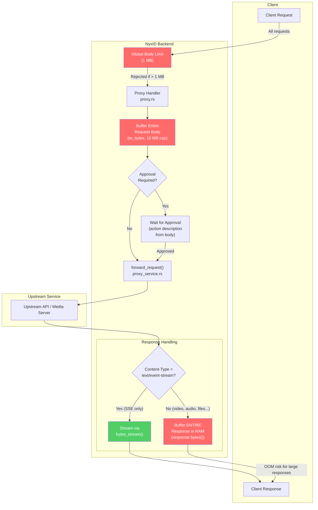
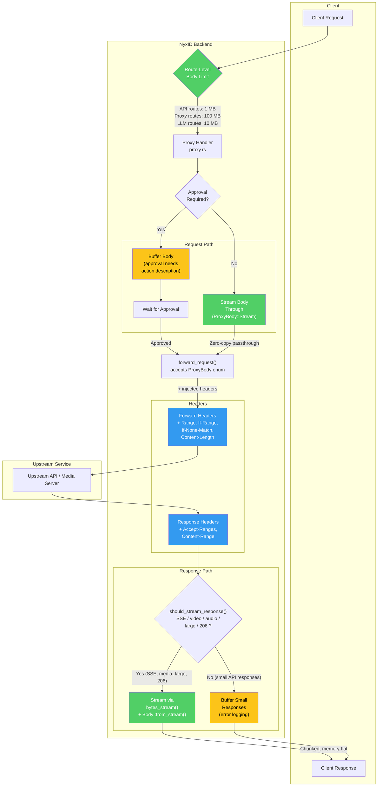
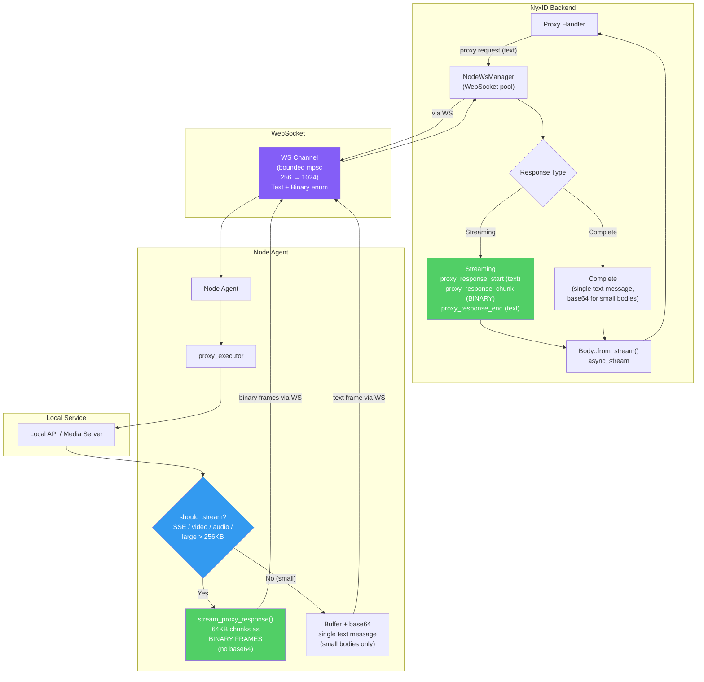

# Proxy Streaming Architecture

## Context

NyxID's proxy currently only streams `text/event-stream` (SSE) responses. All other content types -- including video, audio, and large files -- are fully buffered in memory before forwarding. Combined with a 1 MB global body limit, this means:

- Uploads > 1 MB are rejected outright
- Large downloads risk OOM since the entire response is buffered in RAM
- Video seeking (HTTP Range requests) doesn't work because `Range`/`Content-Range` headers are stripped

The proxy is pass-through (NyxID doesn't store or process media), so the fix is to stream bodies end-to-end and forward the right headers.

---

## Current Flow (Buffered)



### Current Bottlenecks

| Component | Limit | Impact |
|-----------|-------|--------|
| Global `DefaultBodyLimit` | 1 MB | Rejects all uploads > 1 MB |
| `to_bytes()` in proxy handler | 10 MB | Never reached (1 MB global limit hits first) |
| `response.bytes().await` | Unlimited | Buffers entire response in RAM before forwarding |
| `ALLOWED_FORWARD_HEADERS` | Missing `Range`, `If-Range` | No video seeking support |
| `ALLOWED_RESPONSE_HEADERS` | Missing `Accept-Ranges`, `Content-Range` | 206 headers stripped |
| Node agent SSE-only streaming | Only `text/event-stream` | All other types buffered + base64 as single WS message |

---

## Proposed Flow (Streaming)



### Key Design Decisions

1. **Approval path stays buffered** -- `action_description::build_action_description()` inspects JSON bodies for POST/PUT/PATCH. Binary uploads return just method + path. No change needed.
2. **Small responses stay buffered** -- error-body diagnostic logging (4xx/5xx with bodies < 256 KB) continues working.
3. **Per-route body limits** -- proxy routes get 100 MB, API routes keep 1 MB. Axum inner-layer takes precedence.

---

## Node Proxy Path

### Current Problem

The node proxy currently sends **all** data as base64-encoded JSON text frames over WebSocket. This has two major issues:

1. **33% bandwidth overhead** -- base64 encoding expands every 3 bytes to 4 bytes
2. **CPU overhead** -- encoding on the agent and decoding on the server for every chunk
3. **SSE-only streaming** -- only `text/event-stream` responses are chunked; everything else is buffered as a single giant base64 string

### Solution: Hybrid WebSocket Protocol (Text + Binary Frames)

WebSocket natively supports two frame types: text (opcode 0x1) and binary (opcode 0x2). Both `tokio-tungstenite` and `axum` support binary frames already. The key insight: use text frames for control messages (JSON, human-readable) and binary frames for data chunks (zero-copy, no encoding overhead).



### Wire Protocol Change

| Message | Before | After |
|---------|--------|-------|
| Control messages (auth, heartbeat, start, end, errors) | Text frame (JSON) | Text frame (JSON) -- **unchanged** |
| `proxy_response_chunk` data | Text frame with `{"data": "<base64>"}` | **Binary frame** with raw bytes, prefixed by 36-byte request_id (UUID) |
| `proxy_response` (small complete responses) | Text frame with `{"body": "<base64>"}` | Text frame with `{"body": "<base64>"}` -- **unchanged for small bodies** |

Binary frame format for streaming chunks:
```
[36 bytes: request_id as ASCII UUID] [remaining bytes: raw chunk data]
```

The 36-byte request_id prefix lets the server demux binary frames to the correct pending request without JSON parsing overhead. Control messages (`proxy_response_start`, `proxy_response_end`) remain as JSON text frames since they carry metadata (status codes, headers) and are infrequent.

### Impact

| Metric | Before (base64 text) | After (binary frames) |
|--------|---------------------|----------------------|
| Bandwidth overhead | +33% | ~0% (only WS frame header) |
| CPU per chunk | base64 encode + decode | None |
| Memory per chunk | 1.33x raw size | 1x raw size |
| Debugging | All JSON, readable in WS inspector | Control = JSON readable, data = binary (hex in inspector) |

### Implementation Changes

**Node agent side:**
- `send_ws_message` channel type: `mpsc::Sender<String>` -> `mpsc::Sender<NodeWsMessage>` (enum with Text/Binary variants)
- Writer task: dispatch `Message::Text` or `Message::Binary` based on variant
- `stream_proxy_response()`: send chunks as `NodeWsMessage::Binary(request_id_bytes + raw_chunk)` instead of JSON with base64

**Server side:**
- `NodeOutboundMessage` enum: add `Binary(Vec<u8>)` variant alongside existing `Text(String)`
- `node_ws.rs` reader: handle `Message::Binary` in addition to `Message::Text`
- `node_ws_manager.rs`: parse binary frames by extracting 36-byte request_id prefix, route raw bytes to `StreamChunk::Data`
- `STREAM_BUFFER_CAPACITY`: increase from 256 to 1024

### Other Node Proxy Improvements

- Expand streaming decision beyond SSE to include `video/*`, `audio/*`, `application/octet-stream`, and responses > 256 KB
- Preserve `content-length` for ranged/media responses (only strip for SSE)
- Small responses (< 256 KB) keep the existing base64 JSON path -- no change needed for API-sized responses

### Why Not gRPC or Separate HTTP Connections?

Evaluated alternatives per Perplexity research:

| Approach | Verdict |
|----------|---------|
| **WebSocket binary frames** | Best fit -- eliminates 33% overhead, minimal code change, `tokio-tungstenite` supports natively |
| **Separate HTTP connections** | Adds complexity (signaling, race conditions); no bandwidth gain over binary frames; may be blocked by restrictive firewalls that only allow the initial WS |
| **HTTP/2 multiplexed streams** | Requires TLS, more complex client, push model awkward for agent-initiated connections |
| **gRPC bidirectional streaming** | Substantial migration (proto files, tonic, prost); justified only at scale with many concurrent per-agent transfers; consider as future evolution |

Binary frames are the highest-ROI change: biggest improvement, smallest code change, zero new dependencies.

---

## Implementation Phases

```mermaid
gantt
    title Implementation Phases
    dateFormat X
    axisFormat %s

    section Phase 1
    Stream all response types          :p1, 0, 3

    section Phase 2
    Range header forwarding            :p2, 3, 5

    section Phase 3
    Per-route body limits              :p3, 0, 3

    section Phase 4
    Stream request bodies              :p4, 3, 7

    section Phase 5
    Node proxy streaming               :p5, 3, 6

    section Phase 6
    Timeout improvements               :p6, 7, 9
```



### Phase 1: Stream All Response Content Types

**Impact: Highest. Risk: Lowest.** Only touches the response path.

| File | Change |
|------|--------|
| `backend/src/handlers/proxy.rs` (lines 962-1003) | Replace `is_sse` branch with `should_stream_response()` check |
| `backend/src/handlers/proxy.rs` (line 36) | Add `accept-ranges`, `content-range` to `ALLOWED_RESPONSE_HEADERS` |

`should_stream_response()` returns true when:
- Content-Type is `text/event-stream`, `video/*`, `audio/*`, `application/octet-stream`, `image/*`, `application/pdf`
- Content-Length is absent or > 256 KB
- Status is 206 Partial Content

### Phase 2: Range Request Header Forwarding

Enables video/audio seeking.

| File | Change |
|------|--------|
| `backend/src/handlers/proxy.rs` (line 50) | Add `range`, `if-range`, `if-none-match`, `if-modified-since`, `content-length` to `ALLOWED_FORWARD_HEADERS` |
| `backend/src/services/proxy_service.rs` | Mirror same additions (separate allowlist) |
| `backend/src/handlers/proxy.rs` | Add range count validation (max 4 ranges, DoS prevention) |

### Phase 3: Per-Route Body Limits

Unblocks uploads > 1 MB through the proxy.

| File | Change |
|------|--------|
| `backend/src/routes.rs` | Apply `DefaultBodyLimit::max(100 MB)` to proxy routes, `10 MB` to LLM routes |
| `backend/src/handlers/proxy.rs` (line 393) | Raise `to_bytes()` limit to 100 MB to match |
| `backend/src/config.rs` | Add `PROXY_MAX_BODY_SIZE` env var (default 100 MB) |

### Phase 4: Stream Request Bodies

Stops buffering uploads in memory. Most complex phase.

| File | Change |
|------|--------|
| `backend/src/handlers/proxy.rs` | Split `execute_proxy_inner()`: buffer if approval needed, stream otherwise |
| `backend/src/services/proxy_service.rs` | Change `forward_request()` to accept `ProxyBody` enum (Buffered or Stream) |

### Phase 5: Node Proxy -- Binary Frames + Non-SSE Streaming

Two changes combined: switch data chunks to binary frames (eliminates 33% base64 overhead) and expand streaming to non-SSE content types.

| File | Change |
|------|--------|
| `cli/src/node/proxy_executor.rs` | Expand `is_streaming` to media types + large responses; send chunks as `Binary(request_id + raw_bytes)` instead of JSON+base64 |
| `cli/src/node/ws_client.rs` | Change channel from `mpsc::Sender<String>` to `mpsc::Sender<NodeWsMessage>` enum (Text/Binary); writer dispatches `Message::Text` or `Message::Binary` |
| `backend/src/handlers/node_ws.rs` | Handle `Message::Binary` alongside `Message::Text` in reader loop |
| `backend/src/services/node_ws_manager.rs` | Add `Binary(Vec<u8>)` to `NodeOutboundMessage`; parse binary frames (36-byte request_id prefix); increase `STREAM_BUFFER_CAPACITY` to 1024 |
| `backend/src/handlers/proxy.rs` (line 730) | Only strip `content-length` for SSE, preserve for media/ranged |

### Phase 6: Timeout Improvements

| File | Change |
|------|--------|
| `backend/src/config.rs` | Add `PROXY_STREAM_TIMEOUT_SECS` env var (default 3600s) |
| `backend/src/handlers/proxy.rs` | Add per-chunk idle timeout on streaming responses |
| `backend/src/services/node_ws_manager.rs` | Enforce `NODE_MAX_STREAM_DURATION_SECS` (already in config, currently unused) |

---

## Timeout Strategy

| Scenario | Connect | Response | Stream Idle | Max Duration |
|----------|---------|----------|-------------|--------------|
| Standard API proxy | 10s | 30s | N/A | N/A |
| Video/audio on-demand | 10s | 30s | 60s per chunk | 3600s |
| SSE streaming | 10s | 30s | 60s per chunk | 3600s |
| Large file upload | 10s | 300s | N/A | N/A |
| Node proxy (initial) | 10s | 30s | N/A | N/A |
| Node proxy (streaming) | 10s | 30s | 60s per chunk | 300s |

---

## Security Considerations

- Authentication happens before any streaming starts (existing behavior, unchanged)
- Body size limits still enforced via `DefaultBodyLimit` per-route (just higher for proxy)
- Multi-range DoS prevention (max 4 ranges per request)
- Error responses mid-stream: connection closed cleanly, no internal error leakage (status already sent)
- Node proxy uses binary frames for data chunks (no base64 overhead); verify any WAF/CDN in front of the WS endpoint passes binary frames correctly

---

## Diagram Legend

| Color | Meaning |
|-------|---------|
| Green | Streaming (memory-flat) |
| Yellow | Intentionally buffered (approval or error logging) |
| Red | Current bottlenecks being removed |
| Blue | New header forwarding / decision logic |
| Purple | WebSocket transport |
