> **Internal implementation spec -- see [AI_AGENT_PLAYBOOK.md](AI_AGENT_PLAYBOOK.md) for user-facing documentation.**

# Proposal: Streamline Services, Connections, and Providers

**STATUS: Implemented.** The 3 new user collections (`user_endpoints`, `user_api_keys`, `user_services`) and the unified `/api/v1/keys` orchestration endpoint are live. The frontend "AI Services" page (`/keys`) replaces the old Services/Connections/Providers pages for normal users. AgentGroup model was absorbed into ApiKey scope fields. Old collections are retained for backward-compatible migration. See `IMPLEMENTATION_SPEC.md`, `IMPLEMENTATION_SPEC_V2.md`, and `IMPLEMENTATION_SPEC_V3.md` for implementation details.

---

## Problem

The current architecture has **6 user-relevant models** scattered across **3 pages** and **4 concepts** that should be clearly separated but are tangled together:

| Concept | What it is | Currently scattered across |
|---------|-----------|---------------------------|
| **Endpoint** (where) | Target URL | `DownstreamService.base_url` + `UserProviderToken.gateway_url` |
| **API Key** (auth) | Credential | `UserProviderToken` OR `UserServiceConnection` (depends on category) |
| **Service** (path) | Proxy routing | `DownstreamService.slug` + `ServiceProviderRequirement` (admin-only) |
| **Node Route** (local) | Route via agent | `NodeServiceBinding` (hidden on node detail page) |

---

## Current Architecture: Why It's Confusing

### The OpenClaw Problem

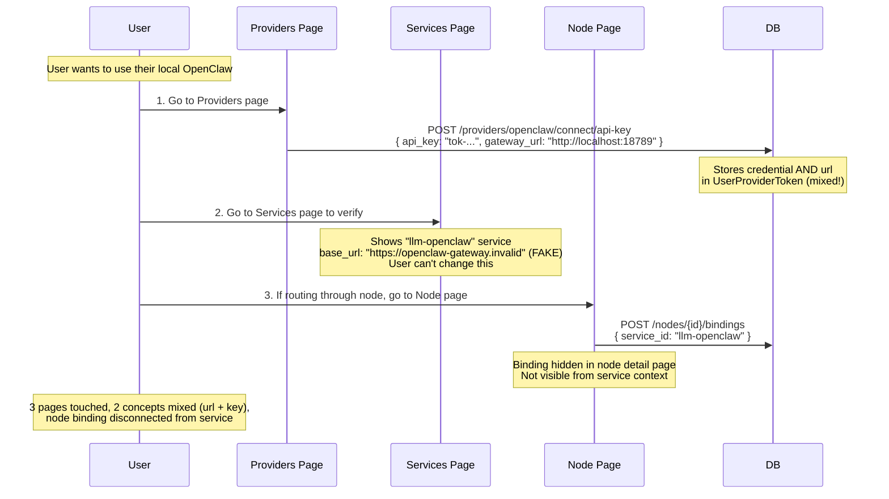

### Where Each Concept Lives Today

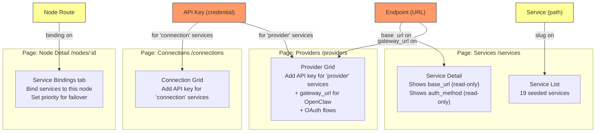

**Problems:**
1. **Endpoint URL** is split: `base_url` on service (admin-only), `gateway_url` on provider token (user can set but only for OpenClaw)
2. **API Key** stored in different collections depending on whether it's a "connection" service or a "provider" service
3. **Service path** is admin-only -- users can't customize or create their own
4. **Node routing** is buried in the node detail page, disconnected from the service it routes

---

## The 4 Concepts

These are the fundamental primitives. They should be clearly separated and manageable from one place.

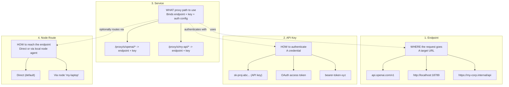

---

## Proposed Architecture

### Design Principle

**Keep admin catalog intact. Give users 4 clear concepts they control in one place.**

Admin-managed catalog (stays as-is):
- `ProviderConfig` -- OAuth/device-code plumbing (authorization_url, token_url, etc.)
- `DownstreamService` -- seeded catalog of known services (provides defaults)
- `ServiceProviderRequirement` -- links catalog services to providers

User-managed (new):
- `user_endpoints` -- target URLs (from catalog defaults or custom)
- `user_api_keys` -- credentials (API keys, OAuth tokens, bearer tokens)
- `user_services` -- proxy routing config (binds endpoint + key + auth + node)

`NodeServiceBinding` is **absorbed into `user_services`** as `node_id` + `node_priority` fields.

### Entity Relationship

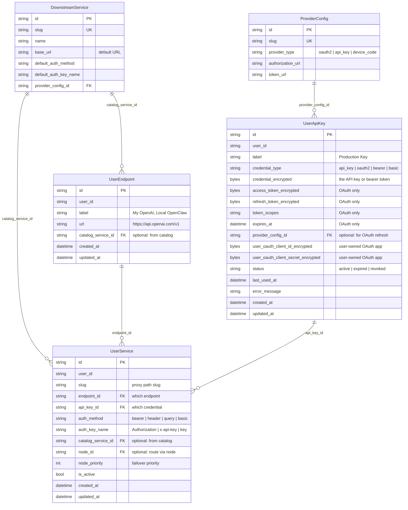

### How the 4 Concepts Map to Collections

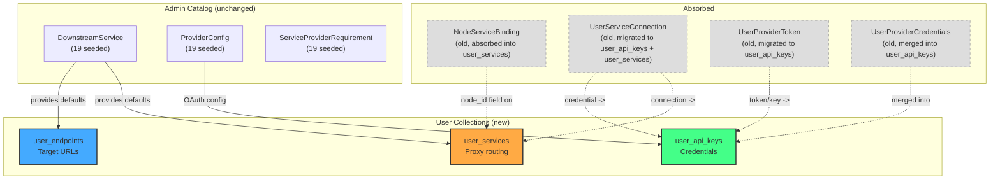

---

## User Flows

### Flow 1: Add OpenAI API Key (from catalog)

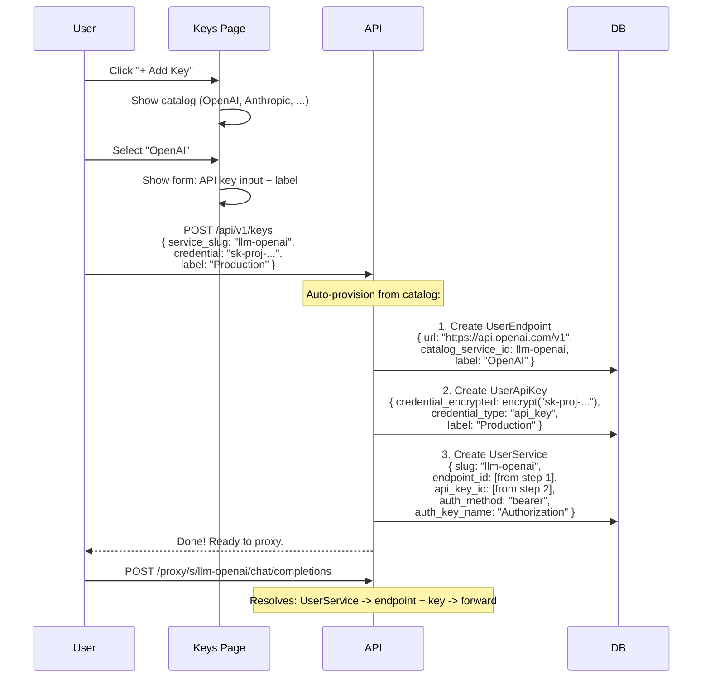

**User did 1 action** (paste key). System auto-provisioned all 3 records from catalog defaults.

### Flow 2: Add OpenClaw (endpoint required)

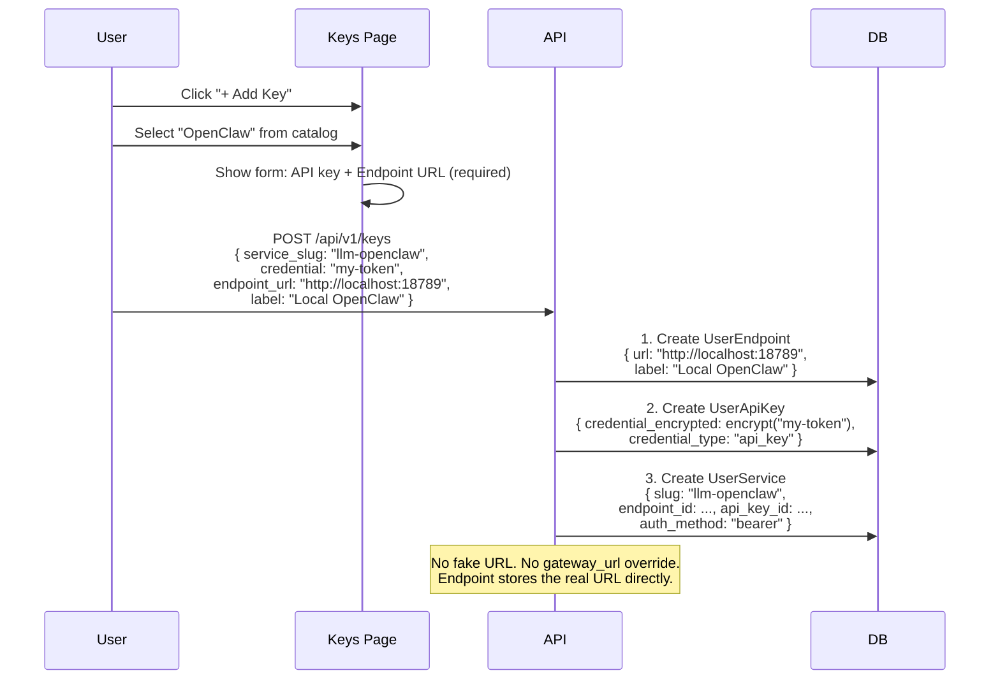

### Flow 3: Change Endpoint URL (e.g., proxy OpenAI through local gateway)

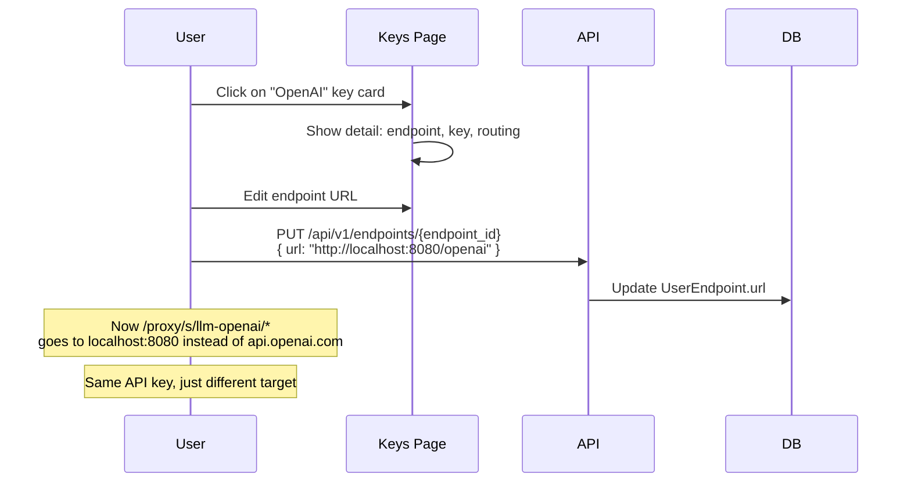

### Flow 4: Add Node Routing

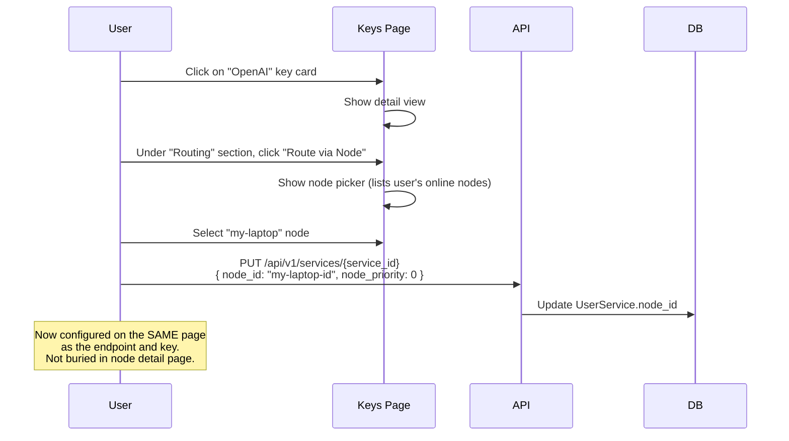

### Flow 5: Fully Custom Endpoint (no catalog)

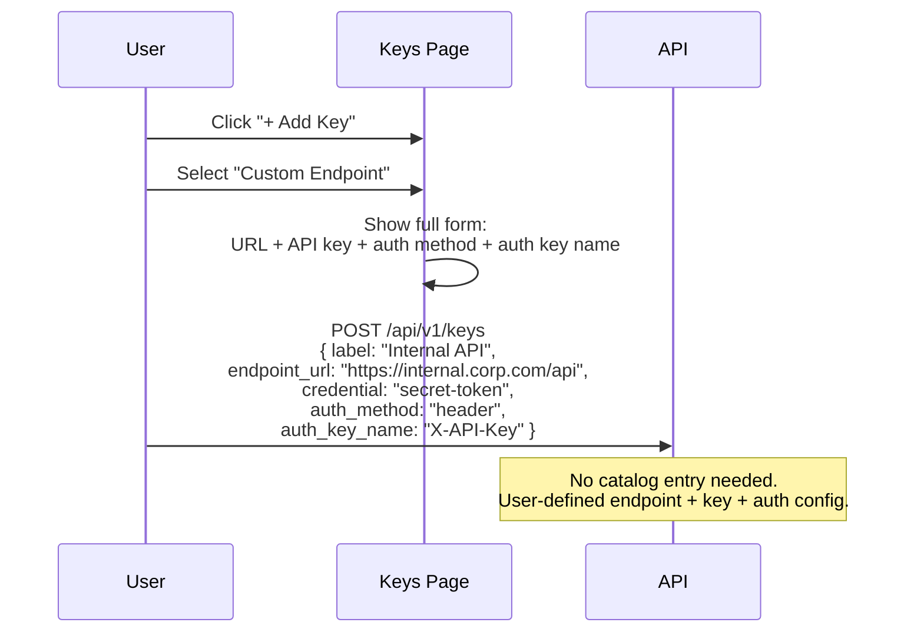

### Flow 6: Multiple Keys for Same Endpoint

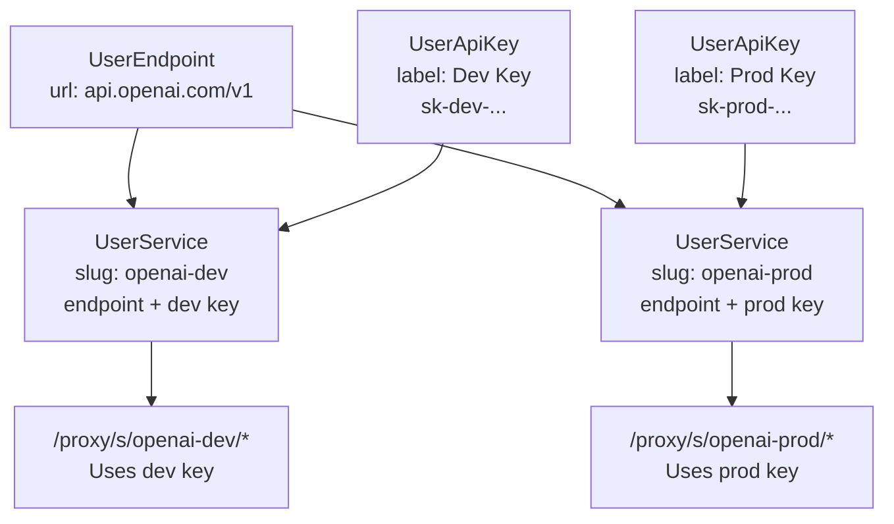

---

## Proxy Resolution: New vs Old

### New Path (clean)

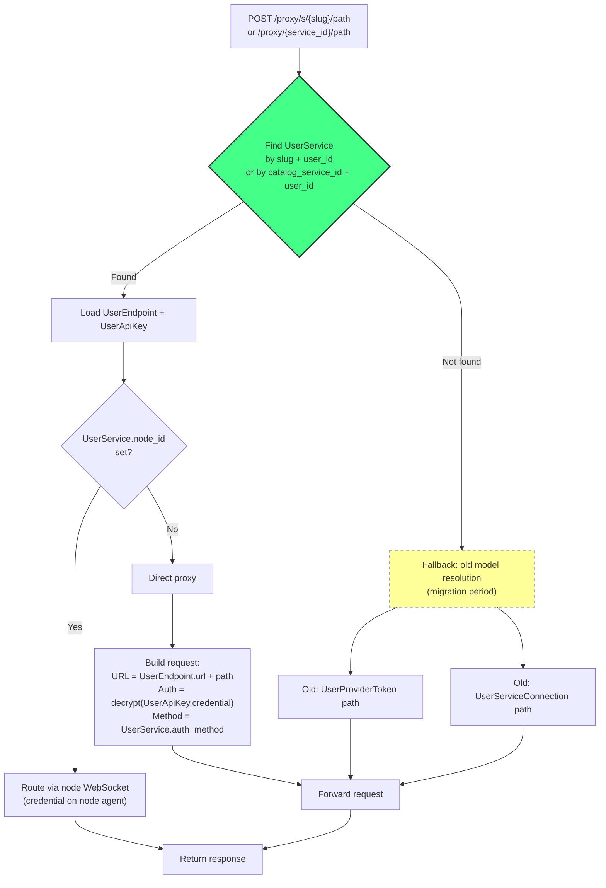

### Backward Compatibility: Proxy Slug Resolution

```mermaid
flowchart TD
    SLUG["/proxy/s/llm-openai/chat/completions"] --> CHECK_NEW{"UserService exists<br/>with slug 'llm-openai'<br/>for this user?"}

    CHECK_NEW -->|Yes| USE_NEW["Use new path:<br/>UserService -> UserEndpoint + UserApiKey"]
    CHECK_NEW -->|No| CHECK_OLD{"DownstreamService exists<br/>with slug 'llm-openai'?"}

    CHECK_OLD -->|Yes| USE_OLD["Use old path:<br/>DownstreamService + UserProviderToken"]
    CHECK_OLD -->|No| ERR["404: Service not found"]

    Note over USE_NEW: New users and migrated users
    Note over USE_OLD: Existing users not yet migrated
```

---

## Frontend: One Page, 4 Sections

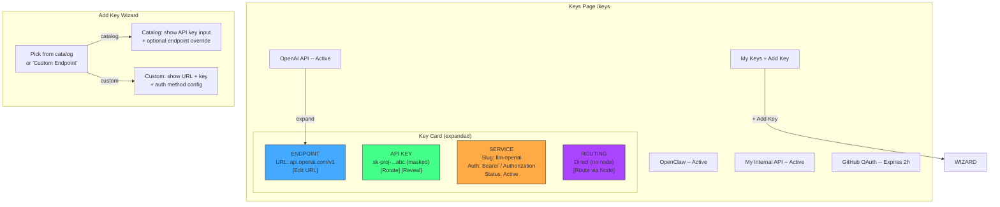

---

## API Design

### New Routes

```
# Keys (convenience: auto-provisions endpoint + api_key + service)
POST   /api/v1/keys                  Create from catalog or custom
GET    /api/v1/keys                  List all (endpoint + key + service combined view)
GET    /api/v1/keys/:id              Get combined view
DELETE /api/v1/keys/:id              Revoke (deactivates service + key)

# Endpoints (user-managed target URLs)
GET    /api/v1/endpoints             List user's endpoints
PUT    /api/v1/endpoints/:id         Update URL
DELETE /api/v1/endpoints/:id         Delete endpoint

# API Keys (credentials, like NyxID API keys)
GET    /api/v1/api-keys/external     List user's external API keys
PUT    /api/v1/api-keys/external/:id Update label, rotate credential
DELETE /api/v1/api-keys/external/:id Revoke key

# Services (proxy routing config)
GET    /api/v1/user-services         List user's service bindings
PUT    /api/v1/user-services/:id     Update auth config, node routing
DELETE /api/v1/user-services/:id     Deactivate service

# OAuth (for OAuth-type keys)
POST   /api/v1/keys/oauth/authorize  Start OAuth flow for a provider
GET    /api/v1/keys/oauth/callback   OAuth callback
POST   /api/v1/keys/:id/refresh      Force token refresh

# Catalog (read-only for users)
GET    /api/v1/catalog               List available service templates
GET    /api/v1/catalog/:slug         Get template details

# Old routes (kept as thin wrappers during migration)
*      /api/v1/connections/*         -> writes to new collections
*      /api/v1/providers/*/connect/* -> writes to new collections
```

### POST /api/v1/keys -- The Main Entry Point

This is the convenience endpoint that auto-provisions all 3 records:

```json
// From catalog (most common)
POST /api/v1/keys
{
  "service_slug": "llm-openai",
  "credential": "sk-proj-abc123",
  "label": "Production"
}
// -> Creates: UserEndpoint + UserApiKey + UserService (all defaults from catalog)

// From catalog with endpoint override (OpenClaw, or pointing OpenAI to local proxy)
POST /api/v1/keys
{
  "service_slug": "llm-openclaw",
  "credential": "my-bearer-token",
  "endpoint_url": "http://localhost:18789",
  "label": "Local OpenClaw"
}
// -> Creates: UserEndpoint (custom URL) + UserApiKey + UserService

// Fully custom (no catalog)
POST /api/v1/keys
{
  "label": "Internal API",
  "endpoint_url": "https://internal.corp.com/api",
  "credential": "secret-token",
  "auth_method": "header",
  "auth_key_name": "X-API-Key"
}
// -> Creates: UserEndpoint + UserApiKey + UserService (all user-defined)
```

---

## Migration Plan

### Phase 0: Add New Collections (no breaking changes)

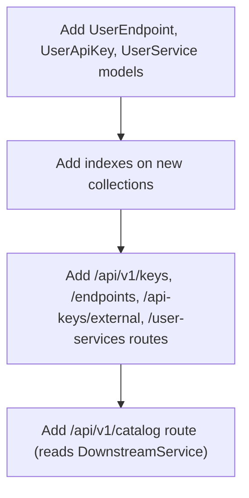

### Phase 1: Dual-Write + Migration Script

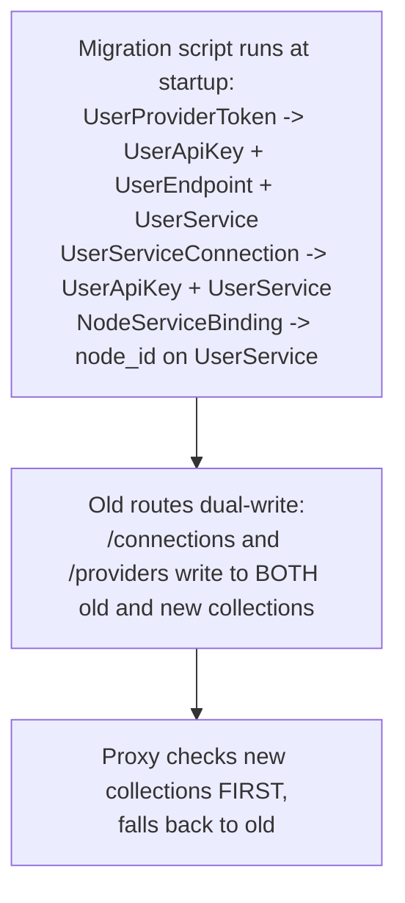

**Migration mapping:**

| Old Record | New Records |
|-----------|------------|
| `UserProviderToken` (api_key) | `UserApiKey` (credential) + `UserEndpoint` (from catalog or gateway_url) + `UserService` (binding) |
| `UserProviderToken` (oauth2) | `UserApiKey` (tokens) + `UserEndpoint` (from catalog) + `UserService` (binding) |
| `UserProviderToken` + `UserProviderCredentials` | `UserApiKey` (tokens + user OAuth app creds merged) + `UserEndpoint` + `UserService` |
| `UserServiceConnection` | `UserApiKey` (credential) + `UserService` (binding, endpoint from DownstreamService) |
| `NodeServiceBinding` | `node_id` + `node_priority` fields on `UserService` |

### Phase 2: Frontend

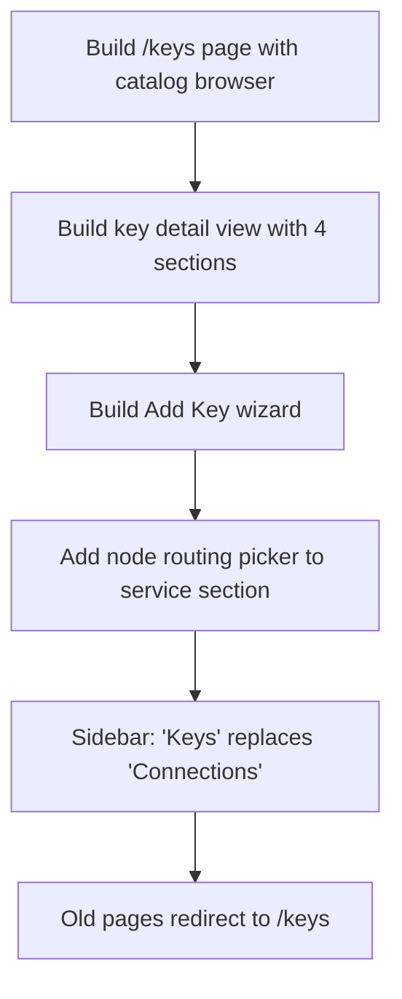

### Phase 3: Cleanup

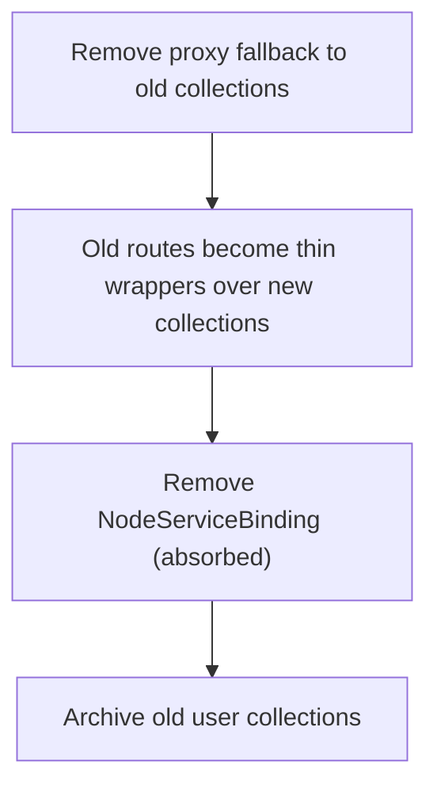

---

## What Does NOT Change

| Component | Status |
|-----------|--------|
| Proxy URL paths (`/proxy/{service_id}/*`, `/proxy/s/{slug}/*`) | Unchanged |
| DownstreamService (catalog) | Unchanged (read as catalog) |
| ProviderConfig (OAuth/device-code config) | Unchanged |
| ServiceProviderRequirement | Unchanged |
| Admin pages | Unchanged |
| Node agent WebSocket protocol | Unchanged |
| Node registration + heartbeat | Unchanged |
| SSH tunneling | Unchanged |
| MCP proxy + delegation | Unchanged |
| OAuth/device-code flow logic | Same, writes to UserApiKey instead of UserProviderToken |

## What Changes

| Component | Change |
|-----------|--------|
| User credential storage | 3 old collections -> 3 new collections (cleaner separation) |
| Node service bindings | Separate collection -> field on UserService |
| Proxy credential resolution | 2 branching paths -> 1 path (UserService -> endpoint + key) |
| `resolve_gateway_url_override()` | Eliminated (endpoint_url on UserEndpoint) |
| Frontend | 3 pages -> 1 page with 4 sections |
| API routes | New `/keys` + `/endpoints` + `/api-keys/external` + `/user-services` + `/catalog` |
| Old routes | Kept as wrappers during migration |

---

## Summary

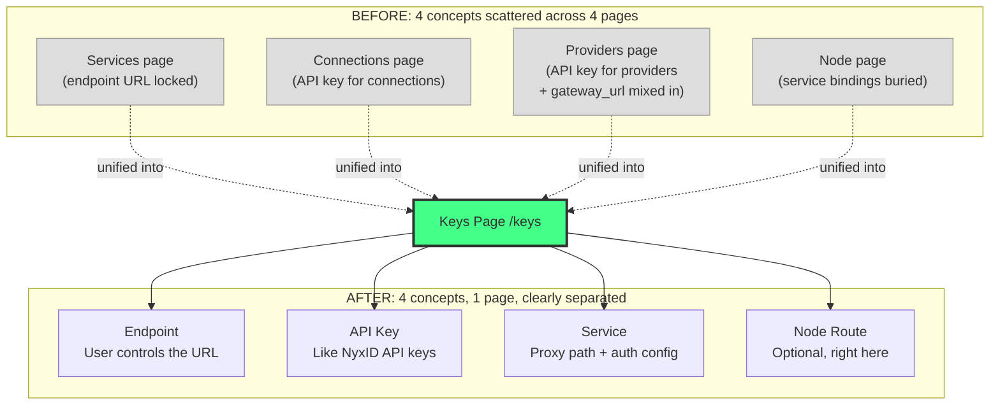

**One page. Four clear concepts. Paste a key, use it. Change the URL, add a node, rotate the key -- all in the same place.**
