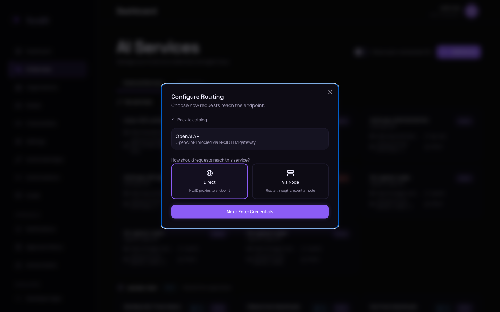
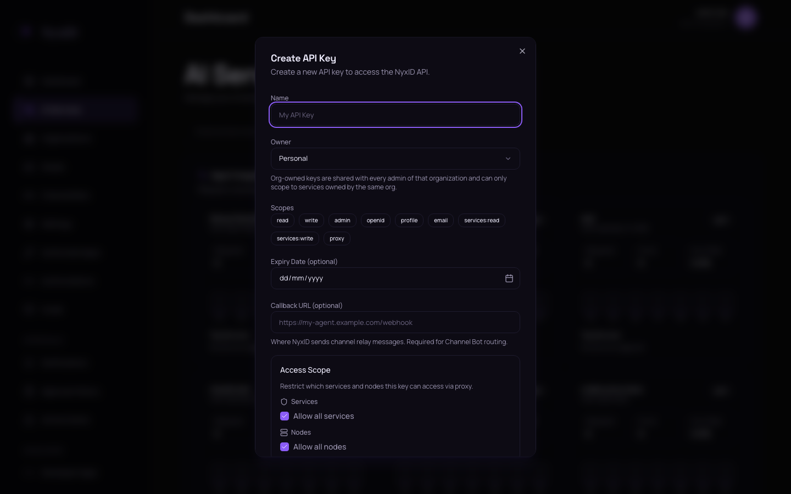

# Web UI — Connect Your First AI Service

Click-through walkthrough. End state: an `HTTP/1.1 200` response from your first proxied call.

This is the Web UI flow. If you want CLI, AI-driven, or curl instead, see the [hub](README.md).

## Hosted (recommended for first-time users)

Console URL: **https://nyx.chrono-ai.fun**

### 1. Sign in

If you don't have an account yet, register at [nyx.chrono-ai.fun/register](https://nyx.chrono-ai.fun/register) with invite code `NYX-FGNY85AF`.

### 2. Add an AI Service

1. Click `AI Services` in the left sidebar (you'll be on the `External Services` tab). The page shows your existing services and the `Add Service` button at top right.

   

2. Click `Add Service`. The `Add AI Service` dialog opens with the catalog.

   

3. Pick `OpenAI` from the catalog. (Use OpenAI for verification — its example curl works out of the box. You can add Anthropic, GitHub, etc. afterward.)

4. The `Configure Routing` step appears. Click the `Direct` card (NyxID proxies to OpenAI directly — the `Via Node` option is for self-hosted services behind a firewall). Then click `Next: Enter Credentials`.

   

5. The `Configure Service` step appears. Paste your **provider API key** in the `API Key / Credential` field — for OpenAI, an `sk-...` key. This is the **external service's** credential, **not** a NyxID `nyx_...` key. NyxID stores it encrypted.

   

6. Click `Create Service`. NyxID opens the new service's detail page automatically.

   Keep this service detail tab open. You will come back here later to copy the `API Usage` curl example.

   Before that curl can work, you need to create a NyxID Agent Key. The `nyx_...` shown in the example is only a placeholder.

### 3. Create a NyxID Agent Key

The example curl on the service detail page authenticates to NyxID with `X-API-Key: nyx_...` — that's a placeholder. You need to create the real key separately.

1. Open a new tab on `AI Services` and switch to the `Agent Keys` tab.
2. Click `Create API Key`. The `Create API Key` dialog opens.

   

3. Give it a name (anything — `quickstart-test` is fine).
4. Under `Scopes`, click the `proxy` badge so it's highlighted. The `proxy` scope is required for `/api/v1/proxy/...` requests; without it the proxy returns 403.
5. Click `Create key`. The dialog shows your `nyx_...` key **once** — copy it now.

### 4. Run the verification curl

1. Return to the service detail tab. Scroll to the `API Usage` section.

   If you lost that tab, go to `AI Services` → `External Services`, find the service you just created, and click its service card to reopen the service detail page.

   

2. Click the **copy icon** on the `Example (with API key)` curl block.
3. Paste it in your terminal. **Replace the literal `nyx_...` placeholder with the Agent Key you just copied** (the example block is a template — the placeholder won't work as-is).
4. Run it.

> **Windows users:** Run this curl from a Unix-compatible shell — WSL Ubuntu (recommended) or Git Bash both work. See [docs/WINDOWS_SETUP.md](../WINDOWS_SETUP.md) for the one-time setup.

You should see a chat-completion JSON response from OpenAI — the body has `"choices": [...]` with a generated message. That's your first proxied call. The same Agent Key works for every service you add later (as long as the key has the `proxy` scope).

## Self-host

Console URL: **http://localhost:3000** (port 3000, while the API runs on 3001).

Same steps as hosted, except you sign in with the account you registered against your local instance. If you don't have NyxID running locally yet, see [docs/QUICKSTART.md](../QUICKSTART.md) first.

## What if the curl errors?

- **401 Unauthorized from OpenAI** (downstream): the **provider** key you pasted in section 2 is wrong or revoked. Open the service's detail page and update the credential.
- **403 Forbidden from NyxID**: your Agent Key is missing the `proxy` scope. Go back to `Agent Keys`, edit the key (or create a new one), and add `proxy`.
- **401 from NyxID with `Missing API key`**: you forgot to replace the literal `nyx_...` placeholder in the copied curl with your real Agent Key.

For other failure modes, see the **Did it work?** section in the [hub](README.md#did-it-work).

## Next

- **Want your AI agent to use this service?** After the service is added, connected, and verified from `AI Services`, wire MCP — see [ai-driven.md](ai-driven.md).
- **Want to script this for more services?** See [cli.md](cli.md) or [direct-api.md](direct-api.md).
- **Want to expose a private API behind your firewall?** See [docs/NODE_PROXY.md](../NODE_PROXY.md).
