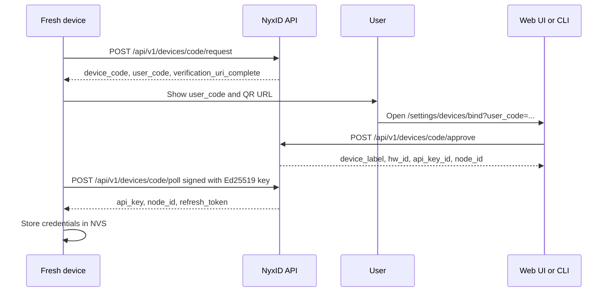
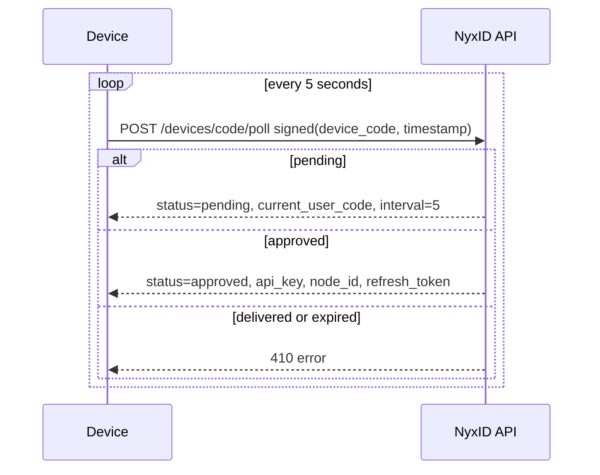

# Device Code Binding

NyxID device-code binding is an RFC 8628-flavored provisioning flow for headless devices. It borrows the device authorization pattern, but it does not issue OAuth access tokens. A fresh device receives NyxID operational credentials after a human approves a short user code:

- a scoped NyxID API key with platform `device-code`
- a NyxID node id
- a one-time refresh token for device credential refresh flows

The first server-side consumer is the ESP32-P4 Home Assistant camera work tracked in the Voice Presence repository. The original roadmap is in the Voice Presence design, section 13: https://github.com/ChronoAIProject/voice-presence/blob/feat/home-assistant-integration/docs/superpowers/specs/2026-05-13-ha-camera-node-design.md

## Flow



The poll loop can also run before approval. In that case the device receives the current rotating user code and continues polling.



## Data Model

Device-code rows live in MongoDB collection `device_codes`.

Important fields:

| Field | Stored form | Notes |
|---|---|---|
| `_id` | UUID string | Internal row id |
| `device_code_hash` | SHA-256 hex | Raw device code is returned once to the device and never stored |
| `device_pubkey` | 32 bytes | Ed25519 verifying key |
| `hw_id` | String | 1 to 256 chars, device hardware identifier |
| `suggested_label` | Optional string | Device-provided label hint |
| `user_code_history` | Up to 4 generations | Newest code is first; only the newest generation can be approved |
| `status` | `pending`, `approved`, `denied`, `expired`, `delivered` | `delivered` means credentials were already returned once |
| `approved_by_user_id` | Optional user id | Human who approved |
| `approved_org_id` | Optional org user id | Target org owner, if any |
| `issued_api_key_id` | Optional API key id | Credential id retained after delivery |
| `issued_node_id` | Optional node id | Node id retained after delivery |
| `refresh_token_hash` | Optional SHA-256 hex | Raw refresh token is returned once |
| `failed_poll_count` | Number | Consecutive signature failures |
| `locked_until` | Optional BSON datetime | Set after repeated signature failures |
| `expires_at` | BSON datetime | TTL index deletes expired rows |
| `last_polled_at` | Optional BSON datetime | Poll tracking |
| `last_rotated_at` | BSON datetime | User-code rotation anchor |

## Security Model

### Device code

`device_code` is a 32-byte random opaque value returned to the device as a 43-character base64url-unpadded string. NyxID stores only `sha256(device_code)`.

The default binding window is 15 minutes.

### User code

`user_code` is 12 characters from:

```text
ABCDEFGHJKLMNPQRSTUVWXYZ23456789
```

It is grouped as `XXXX-XXXX-XXXX`, excludes ambiguous `0/O/1/I`, and rotates every 30 seconds while pending. NyxID retains the newest 4 generations for device display continuity and audit context, but approval accepts only the newest generation to preserve the anti-shoulder-surfing property of rotation.

### Signed polling

Each poll request includes:

- the raw `device_code`
- a Unix timestamp in seconds
- a base64 Ed25519 signature

The signature is over:

```text
base64url_decode(device_code) || timestamp as signed i64 big-endian bytes
```

NyxID accepts timestamps within plus or minus 60 seconds and rejects exact timestamp replay per device-code row.

### Rate limit and lockout

Device-code endpoints use the device-code rate-limit layer:

- 5 requests per minute per source IP
- 5 requests per minute per device public key where the public key is known
- 3 consecutive invalid poll signatures locks the row for 1 hour

Behind a reverse proxy, set `TRUSTED_PROXY_IPS` to the proxy IPs that strip or overwrite client-supplied `X-Forwarded-For` and `X-Real-IP` headers. NyxID only uses forwarded headers for rate-limit keying when the TCP peer is in that allowlist; otherwise it keys on the peer IP, and if no peer is available it skips the IP bucket and relies on the per-public-key bucket.

Lockout triggers device failure notifications. Bind success triggers a notification to the approving user.

### Credential storage

The approval service creates an API key and a device-code node stub, stores only hashes for opaque refresh material, and returns raw secrets only once on the first successful approved poll. The stub carries `metadata.provisioning_source = "device-code"` and intentionally has empty node WebSocket auth fields; device-code devices authenticate with the delivered API key, not `/api/v1/nodes/ws`. After delivery, the row transitions to `delivered` and the delivery secrets are cleared.

## Endpoints

### Request a code

Unauthenticated.

```bash
curl -sS -X POST "$NYXID_BASE_URL/api/v1/devices/code/request" \
  -H "Content-Type: application/json" \
  -d '{
    "device_pubkey": "'"$DEVICE_PUBKEY_BASE64"'",
    "hw_id": "esp32-p4-aabbcc",
    "suggested_label": "Hall camera"
  }'
```

Example response:

```json
{
  "device_code": "m2zC9QEPmhtdfJoEIu5OxjcNbHYUX_ntv5qU3yD78vQ",
  "user_code": "ABCD-EFGH-JKLM",
  "verification_uri": "http://localhost:3000/settings/devices/bind",
  "verification_uri_complete": "http://localhost:3000/settings/devices/bind?user_code=ABCD-EFGH-JKLM",
  "expires_in": 900,
  "poll_interval": 5
}
```

### Poll before approval

Unauthenticated, but signature verified.

```bash
curl -sS -X POST "$NYXID_BASE_URL/api/v1/devices/code/poll" \
  -H "Content-Type: application/json" \
  -d '{
    "device_code": "'"$DEVICE_CODE"'",
    "timestamp": '"$TIMESTAMP"',
    "signature": "'"$SIGNATURE_BASE64"'"
  }'
```

Pending response:

```json
{
  "status": "pending",
  "current_user_code": "ABCD-EFGH-JKLM",
  "interval": 5
}
```

### Approve from web or CLI

Authenticated as a user. The backend accepts `org_id` only as a UUID. The CLI resolves UUID, slug, or display name before calling the API.

```bash
curl -sS -X POST "$NYXID_BASE_URL/api/v1/devices/code/approve" \
  -H "Content-Type: application/json" \
  -H "Authorization: Bearer $NYXID_ACCESS_TOKEN" \
  -d '{
    "user_code": "ABCD-EFGH-JKLM",
    "org_id": null,
    "label": "Hall camera"
  }'
```

Example response:

```json
{
  "device_label": "Hall camera",
  "hw_id": "esp32-p4-aabbcc",
  "api_key_id": "4ae1830c-45c6-4f0d-9f04-0c66c8925a73",
  "node_id": "1d16ddfe-89f1-4ec1-a316-4a5c8960d55f",
  "owner_user_id": "b7e6faee-594b-49a8-91f6-b2c2d20db741",
  "org_id": null
}
```

CLI equivalent:

```bash
nyxid device approve ABCD-EFGH-JKLM --label "Hall camera"
nyxid device approve ABCDEFGHJKLM --org my-team --label "Lab camera"
```

### Poll after approval

The device continues polling with the same signed request shape. The first successful approved poll returns credentials and marks the row delivered.

```json
{
  "status": "approved",
  "api_key": "nyxid_ag_...",
  "node_id": "1d16ddfe-89f1-4ec1-a316-4a5c8960d55f",
  "refresh_token": "1fb20ca9a1fd9b10ddfc7d2a5b7d5f54f326e2e6a2ef8e70b8a4fd9e0bd41c47",
  "expires_in": 86400
}
```

A later poll for the same row returns `410` with error code `9505`.

## Factory Provisioning

Generate one keypair:

```bash
nyxid device factory-key
```

Generate a batch as a JSON array and write it with owner-only permissions:

```bash
nyxid device factory-key --count 100 --out factory-keys.json
```

Generate newline-delimited JSON for production lines:

```bash
nyxid device factory-key --count 100 --ndjson --out factory-keys.ndjson
```

Output shape:

```json
[
  {
    "pubkey_hex": "64 lowercase hex chars",
    "privkey_hex": "64 lowercase hex chars"
  }
]
```

The public key must be sent to `/devices/code/request` as base64. Example conversion:

```bash
DEVICE_PUBKEY_BASE64=$(printf '%s' "$PUBKEY_HEX" | xxd -r -p | base64)
```

The private key should be written to the device secure provisioning path or encrypted NVS partition and never sent to NyxID.

## Error Codes

Device-code errors reserve numeric block `9500-9599`.

| Code | Key | HTTP | Meaning |
|---:|---|---:|---|
| 9500 | `device_code_not_found` | 400 | Raw device code hash was not found |
| 9501 | `device_code_expired` | 410 | Binding window expired |
| 9502 | `device_poll_signature_invalid` | 403 | Ed25519 signature failed or poll timestamp was invalid |
| 9503 | `device_user_code_invalid` | 400 | User-entered code was malformed or not found |
| 9504 | `device_code_pending` | 400 | Device is still waiting for approval |
| 9505 | `device_code_already_delivered` | 410 | Credentials were already delivered, or approval is no longer allowed |
| 9506 | `device_code_rate_limited` | 429 | Device-code rate limit exceeded |
| 9507 | `device_code_locked` | 429 | Row is locked after repeated invalid signatures |
| 9508 | `device_code_slow_down` | 429 | Poll interval must slow down |

## ESP32 Firmware Notes

On first boot, firmware should:

1. Load the factory Ed25519 private key from secure storage.
2. If NyxID credentials are absent from NVS, call `/devices/code/request`.
3. Display `user_code` and a QR for `verification_uri_complete`.
4. Poll every `poll_interval` seconds, signing each poll over `device_code || timestamp_be_bytes`.
5. Update the displayed user code if a pending poll returns a rotated `current_user_code`.
6. Store `api_key`, `node_id`, and `refresh_token` in NVS after the approved poll.
7. Enter normal node operation using the NVS-backed credentials.

Firmware should treat `device_code` and `refresh_token` as secrets. `device_code` is short lived, but it is still part of the signed poll identity during provisioning.

The firmware-facing credential interface can remain stable: code that reads NyxID credentials from NVS after provisioning does not need to know whether those credentials came from factory burn-in or device-code binding.
