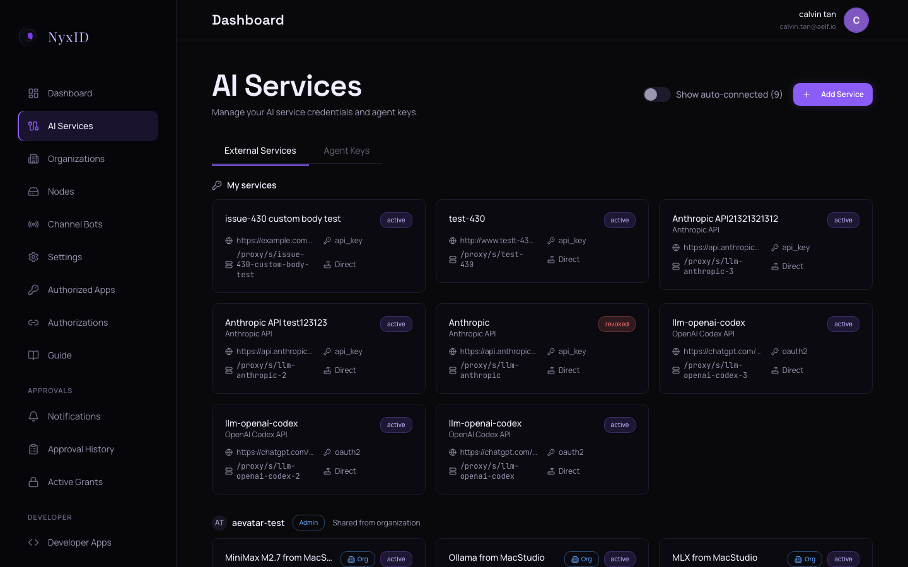
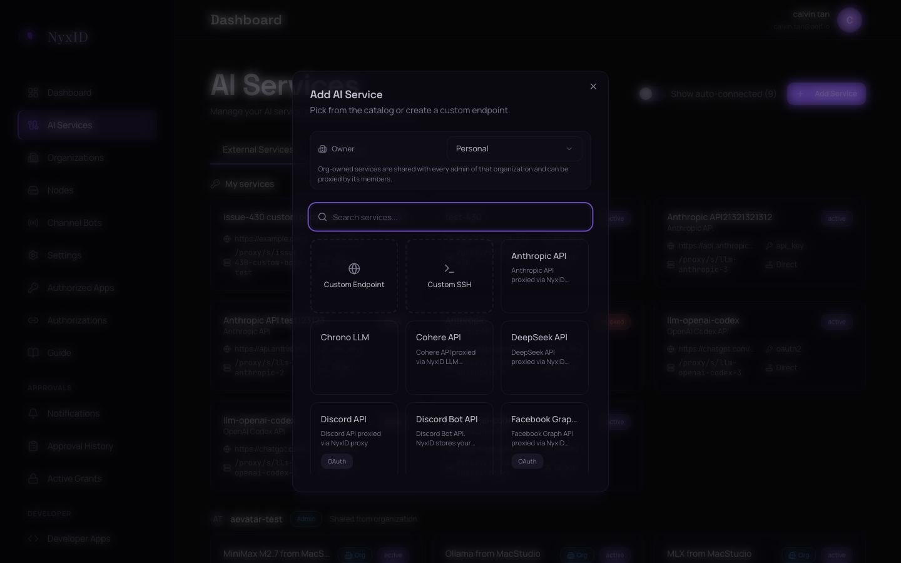
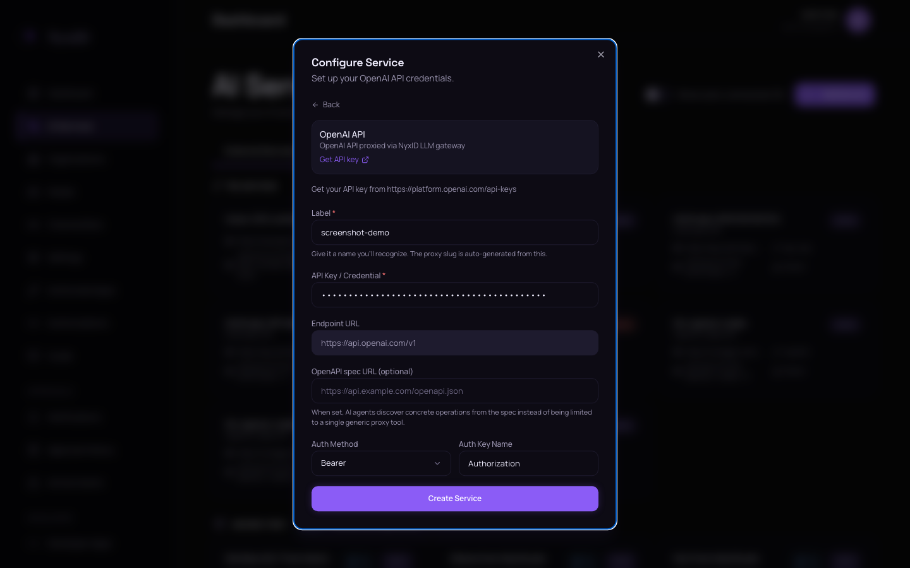
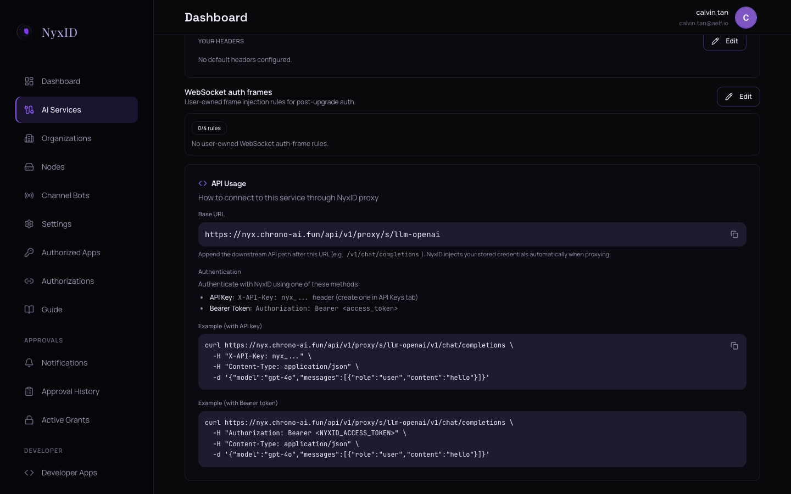

Click-through walkthrough. End state: an `HTTP/1.1 200` response from your first proxied call.

This is the web console flow. If you want the CLI instead, see [CLI: first connection](/docs/cli/getting-started/first-connection). To wire an AI agent directly via MCP, see [Connect your agent](/docs/ai/getting-started/connect-your-agent).

## Hosted (recommended for first-time users)

Console URL: **https://nyx.chrono-ai.fun**

If you don't have an account yet, see [Sign up & sign in](/docs/web/getting-started/sign-up) — you need an invite code.

### 1. Sign in

Register at [nyx.chrono-ai.fun/register](https://nyx.chrono-ai.fun/register) with invite code `NYX-FGNY85AF` if you haven't already, then sign in.

### 2. Add an AI Service

1. Click **AI Services** in the left sidebar (you will be on the **External Services** tab). The page shows your existing services and an **Add Service** button at the top right.

   

2. Click **Add Service**. The **Add AI Service** dialog opens with the catalog.

   

3. Pick **OpenAI** from the catalog. (Use OpenAI for your first verification — its example curl works out of the box. You can add Anthropic, GitHub, etc. afterward.)

4. The **Configure Routing** step appears. Click the **Direct** card (NyxID proxies to OpenAI directly — the **Via Node** option is for self-hosted services behind a firewall). Then click **Next: Enter Credentials**.

   

   :::note
   The **Via Node** option routes requests through a locally-running `nyxid node` agent. Use it when the target service is on a private network or localhost. See [Credential nodes](/docs/shared/concepts/credential-nodes) for the full setup.
   :::

5. The **Configure Service** step appears. Paste your **provider API key** in the **API Key / Credential** field — for OpenAI, an `sk-...` key. This is the external service's credential, **not** a NyxID `nyx_...` key. NyxID stores it encrypted and never returns it to your agents.

   

6. Click **Create Service**. NyxID opens the new service's detail page automatically.

   Keep this tab open — you will come back here to copy the **API Usage** curl example. The `nyx_...` shown in that example is a placeholder; you need to create a real Agent Key first.

### 3. Create a NyxID Agent Key

The example curl on the service detail page authenticates to NyxID with `X-API-Key: nyx_...` — that is a placeholder, not a working key. Create the real key now.

1. Open a new tab on **AI Services** and switch to the **Agent Keys** tab.
2. Click **Create API Key**. The **Create API Key** dialog opens.

   

3. Give it a name (anything — `quickstart-test` is fine).
4. Under **Scopes**, click the `proxy` badge so it is highlighted. The `proxy` scope is required for `/api/v1/proxy/...` requests; without it the proxy returns 403.
5. Click **Create key**. The dialog shows your `nyx_...` key **once** — copy it now.

:::warning
The key is shown only once at creation time. If you lose it, rotate the key from the Agent Keys tab to get a new one.
:::

### 4. Run the verification curl

1. Return to the service detail tab. Scroll to the **API Usage** section.

   If you closed that tab, go to **AI Services** → **External Services**, find the service you just created, and click its service card.

   

2. Click the **copy icon** on the **Example (with API key)** curl block.
3. Paste it in your terminal. **Replace the literal `nyx_...` placeholder with the Agent Key you just copied** — the example block is a template.
4. Run it.

You should see a chat-completion JSON response from OpenAI with `"choices": [...]` and a generated message. That is your first proxied call. The same Agent Key works for every service you add later (as long as it has the `proxy` scope).

:::tip
**Windows users:** Run this curl from WSL Ubuntu or Git Bash. PowerShell and CMD will not parse the JSON body correctly.
:::

## Self-host

Console URL: **http://localhost:3000** (API on port 3001).

Same steps as hosted. Sign in with the account you registered against your local instance. If NyxID is not running locally yet, start it with Docker Compose first — refer to the self-host setup in the project README before continuing.

## Troubleshooting

- **401 Unauthorized from OpenAI** (downstream): the external credential you pasted in step 2 is wrong or revoked. Open the service detail page and update the credential.
- **403 Forbidden from NyxID**: your Agent Key is missing the `proxy` scope. Go to **Agent Keys**, edit the key (or create a new one), and add `proxy`.
- **401 from NyxID with `Missing API key`**: you forgot to replace the literal `nyx_...` placeholder with your real Agent Key.
- **5xx from NyxID**: check `docker logs nyxid-backend` (self-host) or the status page (hosted).

## Next

- **Want your AI agent to use this service?** After verifying the service from **AI Services**, wire MCP — see [First agent call](/docs/ai/getting-started/first-agent-call).
- **Want to script setup for more services?** See [CLI: first connection](/docs/cli/getting-started/first-connection).
- **Want to expose a private API behind your firewall?** See [Credential nodes](/docs/shared/concepts/credential-nodes).
